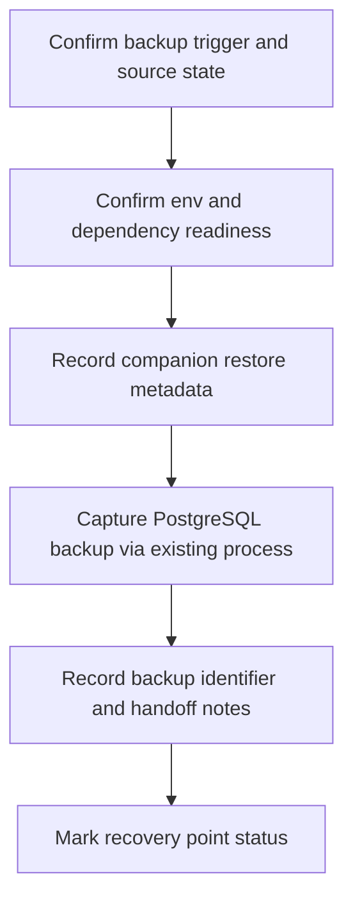
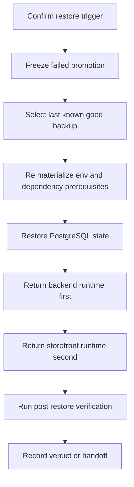

# Canonical Staging Backup and Restore Runbook — Phase 8 tranche 2

> Статус: canonical backup/restore artifact для текущего staging contour по состоянию на `2026-04-20`.
>
> Предпосылка: staging readiness contour уже materialized в [`Docs/staging_checklist.md`](./staging_checklist.md), canonical deploy order уже зафиксирован в [`Docs/staging_deploy_path.md`](./staging_deploy_path.md), а reversible candidate rollback contour уже описан в [`Docs/staging_rollback_runbook.md`](./staging_rollback_runbook.md).
>
> Назначение: формализовать **один canonical backup/restore contour для staging** до перехода к monitoring baseline, не добавляя новые infra-механизмы, не вводя CI/code changes и не подменяя собой deploy or rollback artifacts.

## 1. Цель и границы backup/restore runbook

### Цель

Этот документ фиксирует не универсальную disaster-recovery strategy и не production-grade business continuity process, а более узкий и проверяемый путь:

- определить, какой staging state действительно нужно защищать backup-контуром на базе текущих артефактов;
- зафиксировать канонический high-level порядок backup для **последнего подтвержденного working staging state**;
- зафиксировать канонический high-level порядок restore для случаев, когда rollback deployment units уже недостаточен;
- вернуть восстановленный staging к тому же минимальному verification contour, который уже зафиксирован в [`Docs/staging_checklist.md`](./staging_checklist.md);
- явно развести границы между backup/restore, deploy path и rollback path.

### Что входит в scope

В scope этого runbook входят только:

- in-scope stateful surfaces, которые можно честно обосновать текущими repository artifacts;
- assumptions и preconditions для backup и restore;
- canonical high-level порядок backup;
- canonical high-level порядок restore;
- post-restore verification, согласованная с [`Docs/staging_checklist.md`](./staging_checklist.md) и связанная с contour из [`Docs/staging_deploy_path.md`](./staging_deploy_path.md) и [`Docs/staging_rollback_runbook.md`](./staging_rollback_runbook.md);
- явные limitations, out-of-scope и manual handoff conditions.

### Что не входит в scope

Этот документ сознательно **не** покрывает:

- provider-specific backup tooling, snapshot classes, retention policies, encryption settings или point-in-time recovery specifics;
- новый CI pipeline, backup automation schedule или infra provisioning;
- восстановление через новый undocumented deployment mechanism;
- secret-manager export or restore, если такой процесс не описан текущими артефактами;
- recovery после Redis, DNS, reverse proxy, network или hosting platform outage как primary failure domain;
- recovery optional integrations `UNISENDER_*`, `MTS_EXOLVE_*`, `VK_*`, `YOOKASSA_*`, `PAYLOAD_*`, если они отдельно не утверждены для конкретного staging pass;
- monitoring, alerting и log-baseline implementation.

## 2. In-scope stateful surfaces и допустимые assumptions

### Какие surfaces считаются in-scope

| Surface | Статус в этом runbook | Основание | Canonical interpretation |
| --- | --- | --- | --- |
| PostgreSQL primary state | **Primary backup and restore surface** | [`Docs/staging_checklist.md`](./staging_checklist.md), [`Docs/staging_deploy_path.md`](./staging_deploy_path.md), [`../.env.example`](../.env.example), [`../docker-compose.yml`](../docker-compose.yml) | Это главный persistent state текущего staging contour: здесь живут Medusa data, baseline seeded state `ru`, `rub`, sales channel, publishable API key и минимальный shipping skeleton. Именно этот surface должен считаться canonical backup payload. |
| Redis runtime dependency | **Restore prerequisite, но не canonical backup payload** | [`Docs/staging_checklist.md`](./staging_checklist.md), [`../docker-compose.yml`](../docker-compose.yml) | Redis обязателен для recovered runtime, но текущие артефакты не задают canonical durable Redis backup/export mechanism. Поэтому его availability входит в recovery contour, а его data dump не объявляется обязательной частью этого runbook. |
| Backend env contract и public URL | **Restore prerequisite и manual companion metadata** | [`../.env.example`](../.env.example), [`Docs/staging_deploy_path.md`](./staging_deploy_path.md) | `DATABASE_URL`, `REDIS_URL`, `MEDUSA_BACKEND_URL`, `STORE_CORS`, `ADMIN_CORS`, `AUTH_CORS` и non-placeholder secrets должны быть materialized, но текущий repo не содержит canonical secret export/restore process. |
| Storefront publishable key wiring и stable URL | **Restore prerequisite и cross-surface consistency requirement** | [`Docs/staging_checklist.md`](./staging_checklist.md), [`Docs/staging_deploy_path.md`](./staging_deploy_path.md) | Storefront остаётся отдельной runtime surface и после restore должен быть снова подключен к canonical backend URL и валидному `NEXT_PUBLIC_MEDUSA_PUBLISHABLE_KEY`, materialized из restored baseline state. |
| Backend and storefront candidates | **Out of scope для backup payload, но обязательны для recovered contour** | [`Docs/staging_deploy_path.md`](./staging_deploy_path.md), [`Docs/staging_rollback_runbook.md`](./staging_rollback_runbook.md) | Restore не заменяет deploy or rollback candidate management. После восстановления data surface runtime всё равно должен быть приведён к last known good backend-first order. |

### Допустимые assumptions по текущим артефактам

Текущие artifacts позволяют принять только следующие assumptions:

- canonical protected state для staging today = **PostgreSQL-backed Medusa state**, а не storefront build artifact и не Redis memory state;
- baseline data, на которые опирается staging contour, уже сформулированы в [`Docs/staging_checklist.md`](./staging_checklist.md): `ru`, `rub`, sales channel, publishable API key, минимальный shipping skeleton;
- restore означает **возврат PostgreSQL-backed baseline state к last known good backup**, а не blind reseed и не ручной SQL repair;
- Redis после restore должен быть reachable как dependency, но его содержимое не поднимается в этом документе до статуса canonical protected dataset;
- staging secrets и external secret storage могут существовать вне репозитория, поэтому их preservation и rematerialization допускаются только как manual handoff или already existing operational process;
- storefront не является самодостаточной surface: после restore он зависит от recovered backend public URL и от publishable key, согласованного с восстановленным backend-side state;
- optional integrations по-прежнему могут оставаться empty or disabled для первого staging contour, если их отдельное состояние не было явно утверждено для конкретного staging pass.

### Explicit uncertainty

Ни один текущий artifact **не** задаёт canonical способ:

- хранения backup artifacts;
- выбора snapshot revision или restore point;
- выгрузки или восстановления secrets;
- data restore для optional integrations или сторонних provider systems;
- point-in-time restore либо destructive migration recovery choreography.

Если staging platform требует для этого platform-native шаги, которых нет в текущих operational artifacts, здесь должен происходить **manual handoff**, а не домысливание новой нормы.

## 3. Preconditions для backup

Backup contour начинается только если выполнены все условия ниже:

1. staging state, который планируется защищать, либо уже известен как **last known good staging state**, либо явно помечен как contingency snapshot и не выдается за canonical verified recovery point;
2. PostgreSQL reachable и доступны валидные credentials для sanctioned backup mechanism;
3. Redis reachable как обязательная runtime dependency текущего contour, даже если его data не объявляется обязательным backup payload;
4. staging env materialized с реальными `DATABASE_URL`, `REDIS_URL`, `MEDUSA_BACKEND_URL`, `STORE_CORS`, `ADMIN_CORS`, `AUTH_CORS` и non-placeholder secrets из [`../.env.example`](../.env.example);
5. baseline state подтвержден: существуют `ru` region, `rub` currency, sales channel, publishable API key и минимальный shipping skeleton;
6. operator может зафиксировать companion metadata для будущего restore:
   - какой backend candidate считался working;
   - какой storefront candidate считался working;
   - какой backend public URL считался canonical;
   - какой storefront URL участвовал в verified staging pass;
   - были ли optional integrations оставлены disabled или отдельно включены;
7. нет параллельного undocumented reseed, manual SQL repair, restore или migration choreography, который делает backup source-state неоднозначным;
8. существует already approved platform or database process, через который backup artifact реально сохраняется; если такого процесса нет, backup должен перейти в explicit manual handoff.

## 4. Preconditions для restore

Restore contour начинается только если выполнены все условия ниже:

1. trigger действительно требует **data recovery**, а не просто candidate rollback:
   - suspected data loss;
   - suspected data corruption;
   - baseline state inconsistency;
   - destructive state mutation;
   - intentional rebuild с возвратом к заранее зафиксированному backup point;
2. failed candidate больше не продвигается и deployment activity зафиксирована до завершения recovery decision;
3. выбран конкретный **last known good backup**, для которого известны хотя бы timestamp, storage identifier и companion metadata по runtime contour;
4. target PostgreSQL surface reachable и может принять restore через уже существующий sanctioned platform-native или database-native process;
5. Redis после restore может быть снова поднят и reachable как dependency recovered backend runtime;
6. staging env и secrets могут быть rematerialized в тех же обязательных значениях, что и в [`Docs/staging_deploy_path.md`](./staging_deploy_path.md);
7. operator может однозначно указать last known good backend candidate и last known good storefront candidate, которые должны сопровождать restored data contour;
8. понятно, что restore не потребует blind reseed, ad-hoc SQL edits или нового undocumented migration choreography.

### Restore decision boundary относительно rollback

Если проблема выглядит как обычная candidate regression и может быть адресована возвратом deployment units к previous working versions, нужно использовать [`Docs/staging_rollback_runbook.md`](./staging_rollback_runbook.md), а не этот document.

Backup/restore contour становится justified только тогда, когда rollback уже **не** закрывает проблему честно:

- baseline state утрачен или испорчен;
- publishable key, region, currency, sales channel или shipping skeleton больше не materialized корректно;
- recovery требует возврата PostgreSQL data, а не только redeploy runtime units.

## 5. Canonical high-level backup order

### Шаг 1. Подтвердить тип backup point

Сначала нужно честно классифицировать source state:

- **preferred case**: staging уже считается last known good state после successful pass по [`Docs/staging_checklist.md`](./staging_checklist.md);
- **allowed but weaker case**: backup снимается как pre-change contingency snapshot перед рискованным изменением, но не объявляется verified recovery point без отдельной verification evidence.

### Шаг 2. Подтвердить dependency and env readiness

До самого backup должны быть подтверждены:

- доступный PostgreSQL;
- доступный Redis как обязательная runtime dependency contour;
- materialized staging env и non-placeholder secrets;
- canonical backend public URL и storefront URL, относящиеся к тому же working contour.

Если хотя бы одна из этих предпосылок не выполнена, backup contour не должен притворяться complete.

### Шаг 3. Зафиксировать companion restore metadata

До capture backup artifact нужно отдельно записать metadata, которую сам database dump or snapshot может не описывать:

- timestamp backup point;
- identifier или location backup artifact в уже существующем platform process;
- current working backend candidate;
- current working storefront candidate;
- canonical backend public URL;
- storefront URL, который участвовал в последнем verified pass;
- status optional integrations: disabled by default или explicitly enabled;
- любые ограничения, если snapshot снят не с fully verified contour.

### Шаг 4. Снять canonical PostgreSQL backup

Canonical backup payload для текущего staging contour = **PostgreSQL state**.

Разрешено только следующее:

- использовать already approved platform-native или database-native backup mechanism, который уже существует вне этого документа;
- сохранять backup artifact так, чтобы он был однозначно сопоставим с companion metadata.

Не разрешено выдавать за canonical часть этого runbook:

- импровизированный новый backup tool;
- blind export секретов, если secret process отдельно не определен;
- manual SQL copying как замену backup;
- обязательный Redis dump, если для него нет отдельного подтвержденного механизма.

### Шаг 5. Зафиксировать recovery point verdict

После capture backup нужно зафиксировать один из двух честных вердиктов:

- `verified recovery point` — если backup соотносится с already confirmed staging contour;
- `contingency snapshot only` — если backup снят до risky mutation, но без отдельного полного verification pass.

Это различие обязательно, чтобы restore потом не возвращал staging к состоянию, которое ошибочно считалось known-good.

## 6. Canonical high-level restore order

### Шаг 1. Подтвердить restore trigger

Restore запускается только после явной квалификации, что нужен именно data recovery contour, а не просто deploy rollback.

Если после triage видно, что проблема лежит только в current candidate rollout и data plane не поврежден, нужно вернуться к [`Docs/staging_rollback_runbook.md`](./staging_rollback_runbook.md).

### Шаг 2. Остановить дальнейшее продвижение failed candidate

Сразу после restore decision нужно:

- прекратить promotion failed candidate;
- не продолжать rollout новых runtime units поверх подозрительного data state;
- зафиксировать, какой backup point выбран как last known good base.

### Шаг 3. Rematerialize prerequisites до data restore

До actual restore должны быть снова готовы:

- target PostgreSQL surface;
- reachable Redis как dependency;
- staging env с canonical URLs, CORS и secrets;
- ясный mapping к last known good backend/storefront candidates;
- companion metadata выбранного backup point.

Если любой из этих пунктов отсутствует, restore должен перейти в explicit manual handoff, а не продолжаться через предположения.

### Шаг 4. Восстановить PostgreSQL-backed baseline state

Canonical restore step = вернуть PostgreSQL data surface к выбранному last known good backup point через already existing operational process.

Здесь действуют жёсткие ограничения:

- restore не должен подменяться blind reseed;
- restore не должен смешиваться с manual SQL edits;
- restore не должен одновременно превращаться в undocumented migration choreography;
- если нужен partial table recovery, point-in-time decision или platform-native snapshot switching, это остаётся manual handoff вне канона текущего документа.

### Шаг 5. Вернуть runtime contour в backend-first order

После того как PostgreSQL data surface восстановлен, runtime нужно снова materialize в том же dependency order, который уже принят в [`Docs/staging_deploy_path.md`](./staging_deploy_path.md) и [`Docs/staging_rollback_runbook.md`](./staging_rollback_runbook.md):

1. вернуть или подтвердить **last known good backend candidate** против восстановленного data surface;
2. подтвердить, что backend снова отвечает на `GET /health`;
3. только затем вернуть или подтвердить **last known good storefront candidate**;
4. переподтвердить, что storefront использует canonical backend URL и publishable key, согласованный с restored baseline state.

Если staging platform требует для этого отдельный platform-specific switching process, он не выдумывается этим runbook и должен быть оформлен как manual handoff.

### Шаг 6. Выполнить post-restore verification

Restore считается завершенным не в момент окончания database import or snapshot attach, а только после прохождения обязательного verification contour из следующего раздела.

## 7. Post-restore verification

Verification после restore должна совпадать с уже утвержденным minimal staging contour из [`Docs/staging_checklist.md`](./staging_checklist.md), а не создавать новый release suite.

### Обязательные checks

1. Подтвердить, что PostgreSQL и Redis доступны как обязательные зависимости recovered runtime.
2. Подтвердить, что restored baseline state снова materialized:
   - `ru` region;
   - `rub` currency;
   - sales channel;
   - publishable API key;
   - минимальный shipping skeleton.
3. Подтвердить, что backend `GET /health` отвечает успешно.
4. Подтвердить, что storefront root URL отвечает успешно.
5. Подтвердить, что route `/ru/account` загружается и показывает минимальный login or account surface.
6. Подтвердить, что authenticated notification smoke снова проходит:
   - создать fresh `sk_*` admin API key;
   - выполнить `Basic auth` запрос на `POST /admin/notifications/smoke`;
   - получить успешный smoke verdict.
7. Зафиксировать, что recovered staging contour снова согласован с backend-first deploy order и не требует ad-hoc runtime drift поверх restored data state.

### Verification decision rule

- если все checks проходят, restore считается успешным для текущего staging contour;
- если data state выглядит recovered, но runtime candidate уже не проходит обязательные checks, проблема должна быть передана обратно в [`Docs/staging_rollback_runbook.md`](./staging_rollback_runbook.md) или follow-up по deploy remediation, а не в повторное домысливание restore steps;
- если baseline state остаётся неконсистентным даже после restore, выбранный backup point или сам platform restore process требуют отдельного investigation handoff.

## 8. Limitations, out-of-scope и manual handoff

### Limitations текущего runbook

- runbook определяет contour и sequence, но не доказывает наличие уже автоматизированного backup platform;
- runbook не задаёт retention, encryption, off-site replication или point-in-time guarantees;
- runbook не описывает secret export/restore mechanism;
- runbook не объявляет Redis contents обязательной частью backup payload;
- runbook не покрывает data recovery для optional integrations или внешних provider systems;
- runbook не покрывает Payload CMS recovery, потому что текущий first staging contour не делает `PAYLOAD_*` обязательной surface;
- runbook не заменяет будущий monitoring baseline и не доказывает long-term observation после restore.

### Explicit out-of-scope

Следующие темы остаются для отдельных `Phase 8` follow-up artifacts или operational processes:

- provider-native backup commands и storage-class details;
- destructive migration recovery choreography;
- restore drills и их automation;
- recovery after network or platform outage;
- production DR и business continuity contour;
- monitoring, alerting и log-baseline implementation.

### Manual handoff conditions

Нужен explicit manual handoff, если:

- отсутствует last known good backup или его identifier нельзя однозначно установить;
- target PostgreSQL недоступен для restore;
- требуется secret-store reconstruction, которого нет в текущих artifacts;
- restore требует point-in-time selection, snapshot attach, storage rollback или другой provider-specific action, не описанный существующим process;
- suspected fix требует ad-hoc data edits, blind reseed или partial table surgery;
- optional integrations or external provider state были частью staging pass и имеют собственный stateful recovery contour вне этого repo.

## 9. Concise actionable checklist

- [ ] Backup source state честно классифицирован как `verified recovery point` или `contingency snapshot only`.
- [ ] PostgreSQL определён как canonical protected stateful surface текущего staging contour.
- [ ] Redis трактуется как обязательная dependency после restore, но не как автоматически обязательный backup payload.
- [ ] Зафиксированы companion metadata: backup identifier, backend candidate, storefront candidate, canonical URLs, optional integration status.
- [ ] Для staging materialized реальные `DATABASE_URL`, `REDIS_URL`, `MEDUSA_BACKEND_URL`, `STORE_CORS`, `ADMIN_CORS`, `AUTH_CORS` и non-placeholder secrets.
- [ ] Baseline state подтвержден: `ru`, `rub`, sales channel, publishable key, минимальный shipping skeleton.
- [ ] PostgreSQL backup captured через уже существующий sanctioned process без выдумывания нового tooling.
- [ ] Restore запускается только тогда, когда rollback deployment units недостаточен или требуется intentional rebuild.
- [ ] До restore выбран last known good backup point и остановлен дальнейший promotion failed candidate.
- [ ] PostgreSQL restored без blind reseed, manual SQL edits и undocumented migration drift.
- [ ] После restore backend возвращён первым и снова проходит `GET /health`.
- [ ] После restore storefront возвращён вторым и снова проходит root URL и `/ru/account`.
- [ ] Authenticated `POST /admin/notifications/smoke` проходит через fresh `sk_*` key и `Basic auth`.
- [ ] Любой provider-specific, secret-specific или external-state recovery gap вынесен в явный manual handoff без притворства, что этот runbook уже всё покрывает.

## 10. Основание runbook

Этот backup/restore artifact опирается только на уже существующие источники истины и не вводит новую инфраструктуру:

- [`Docs/staging_checklist.md`](./staging_checklist.md);
- [`Docs/staging_deploy_path.md`](./staging_deploy_path.md);
- [`Docs/staging_rollback_runbook.md`](./staging_rollback_runbook.md);
- [`Docs/current_work.md`](./current_work.md);
- [`Docs/master_repo_plan_v2.md`](./master_repo_plan_v2.md);
- [`../.env.example`](../.env.example);
- [`../docker-compose.yml`](../docker-compose.yml);
- [`../package.json`](../package.json);
- [`../medusa-agency-boilerplate/package.json`](../medusa-agency-boilerplate/package.json);
- [`../medusa-agency-boilerplate-storefront/package.json`](../medusa-agency-boilerplate-storefront/package.json);
- [`../.github/workflows/integrity-baseline.yml`](../.github/workflows/integrity-baseline.yml).
