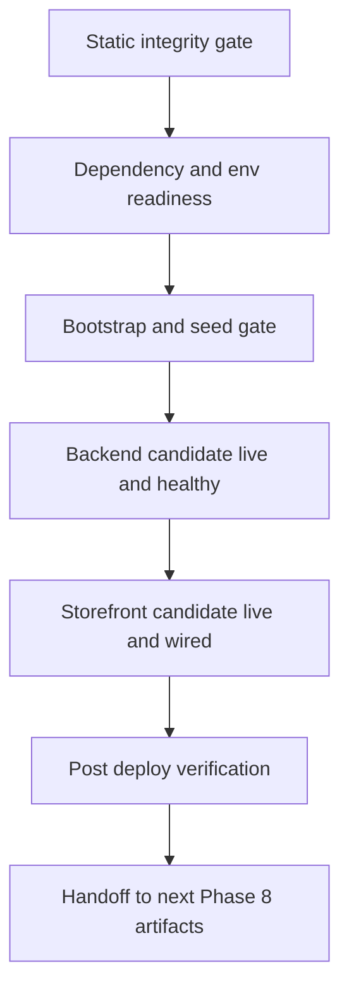

# Canonical Staging Deploy Path — Phase 8 tranche 2

> Статус: canonical deploy-path artifact для текущего staging contour по состоянию на `2026-04-20`.
>
> **Current status note (2026-05-11):** this file is a historical/generic staging contour. A concrete staging production-mode topology now exists via [`docker-compose.prod.yml`](../docker-compose.prod.yml), Caddy-only reverse proxy, Payload container, and manual GitHub Actions `Deploy Staging` workflow. Do not use older statements in this file to claim that staging packaging/proxy/deploy automation are absent. Real production is not provisioned yet. For current operations use [`production_runbook.md`](./production_runbook.md), [`architecture.md`](./architecture.md), and [`staging_runbook.md`](./staging_runbook.md).
>
>
> Предпосылка: первый шаг `Phase 8 / tranche 2` уже materialized в [Docs/staging_checklist.md](./staging_checklist.md), а baseline integrity contour подтвержден в [Docs/current_work.md](./current_work.md), [Docs/master_repo_plan_v2.md](./master_repo_plan_v2.md) и [.github/workflows/integrity-baseline.yml](../.github/workflows/integrity-baseline.yml).
>
> Назначение: зафиксировать **один canonical, reproducible staging deploy path** для backend и storefront без новых infra-решений, без CI/code changes и без преждевременного захода в rollback, backup/restore или monitoring artifacts.

## 1. Цель и границы deploy path

### Цель

Этот документ фиксирует не общую staging-архитектуру и не production-ready rollout, а более узкий и проверяемый путь:

- staging candidate проходит через тот же подтвержденный baseline contour, что и локальный runtime path `cp .env.example .env → bootstrap → preflight → dev`, но с staging-specific значениями вместо template-safe local defaults из [.env.example](../.env.example);
- backend и storefront выкатываются в воспроизводимом порядке, который не теряет их реальные зависимости;
- post-deploy verification опирается на уже materialized staging smoke surface из [Docs/staging_checklist.md](./staging_checklist.md), а не изобретает новый release process.

### Что входит в scope

В scope этого deploy path входят только:

- deployment units для backend и storefront;
- обязательные зависимости и runtime assumptions;
- canonical порядок выката staging candidate;
- допустимое место для schema or seed or runtime prep и их ограничения;
- post-deploy verification для первого staging contour;
- явные failure boundaries и handoff points.

### Что не входит в scope

Этот документ сознательно **не** покрывает:

- provisioning новой **отдельной staging** topology поверх текущих артефактов;
- новый **staging** CI pipeline или deploy automation;
- rollback steps как исполнимый runbook;
- backup strategy и restore drills;
- monitoring, alerting или log-baseline implementation;
- полный release-candidate process или обязательный end-to-end checkout gate.

## 2. Deployment units и обязательные зависимости

| Deployment unit | Что считается канонической единицей выката | Обязательные зависимости | Комментарий |
| --- | --- | --- | --- |
| Backend candidate | Medusa backend runtime и его build surface из [medusa-agency-boilerplate/package.json](../medusa-agency-boilerplate/package.json) | PostgreSQL, Redis, backend env, CORS, baseline seed state | Backend считается первым обязательным runtime surface для staging deploy path. |
| Storefront candidate | Next.js storefront runtime и его build surface из [medusa-agency-boilerplate-storefront/package.json](../medusa-agency-boilerplate-storefront/package.json) | stable backend public URL, valid publishable key, storefront env, default region `ru` | Storefront выкатывается отдельно от backend и не подразумевается автоматически. |
| Shared data baseline | persistent PostgreSQL state и reachable Redis, описанные как обязательные зависимости в [Docs/staging_checklist.md](./staging_checklist.md) и [docker-compose.yml](../docker-compose.yml) | реальные staging endpoints, non-placeholder secrets | Без этого backend candidate не является deployable независимо от способа orchestration. |
| Baseline seeded state | `ru` region, `rub` currency, sales channel, publishable API key, минимальный shipping skeleton | sanctioned bootstrap or seed path, а не ad-hoc ручные действия | Это обязательная runtime-предпосылка для storefront viability и notification smoke. |
| Root orchestration surface | aggregate naming из [package.json](../package.json) и minimal CI boundary из [.github/workflows/integrity-baseline.yml](../.github/workflows/integrity-baseline.yml) | те же backend and storefront sources | Это **не** отдельный deployable unit, а canonical reference для integrity и smoke naming. |

### Ключевой вывод по зависимостям

- backend зависит от PostgreSQL и Redis раньше, чем от storefront;
- storefront зависит от уже готового backend public URL и от publishable key, materialized на backend-side;
- поэтому canonical order не может начинаться со storefront;
- отсутствие storefront в [docker-compose.yml](../docker-compose.yml) означает, что staging deploy path обязан трактовать storefront как отдельную единицу выката, а не как неявную часть backend rollout.

## 3. Source of truth для env и runtime assumptions

### Канонические источники истины

- [.env.example](../.env.example) — source of truth по **составу** root env contract и placeholder-safe baseline;
- [docker-compose.yml](../docker-compose.yml) — baseline reference по обязательным infra-компонентам `PostgreSQL + Redis + backend`, но не по полному staging topology;
- [package.json](../package.json) — canonical naming для aggregate integrity и smoke surface;
- [medusa-agency-boilerplate/package.json](../medusa-agency-boilerplate/package.json) — backend runtime and seed-related script surface;
- [medusa-agency-boilerplate-storefront/package.json](../medusa-agency-boilerplate-storefront/package.json) — storefront build and runtime surface;
- [Docs/current_work.md](./current_work.md) — source of truth по подтвержденному baseline state и sequencing;
- [Docs/staging_checklist.md](./staging_checklist.md) — source of truth по staging-ready contour и минимальному smoke path;
- [Docs/master_repo_plan_v2.md](./master_repo_plan_v2.md) — roadmap boundary для `Phase 8` и соседних follow-up artifacts;
- [.github/workflows/integrity-baseline.yml](../.github/workflows/integrity-baseline.yml) — подтвержденный minimal CI expression того же baseline contour.

### Runtime assumptions, которые этот deploy path принимает как обязательные

- staging env не использует placeholder values для `POSTGRES_PASSWORD`, `JWT_SECRET`, `COOKIE_SECRET` и других secrets из [.env.example](../.env.example);
- `DATABASE_URL` и `REDIS_URL` указывают на реально доступные staging services;
- `MEDUSA_BACKEND_URL` — стабильный public backend URL, который используется и для verification, и как upstream для storefront;
- `STORE_CORS`, `ADMIN_CORS` и `AUTH_CORS` включают реальные staging origins;
- storefront minimum runtime assumptions остаются теми, что уже зафиксированы в [Docs/current_work.md](./current_work.md): backend URL, publishable key, base URL и default region `ru`;
- optional integrations `UNISENDER_*`, `MTS_EXOLVE_*`, `VK_*`, `YOOKASSA_*`, `PAYLOAD_*` могут оставаться empty or disabled, если конкретный staging pass их отдельно не включает;
- staging deploy path не должен зависеть от staging-only ручных обходов, которые нельзя повторить тем же sanctioned path.

### Явные assumptions и follow-up, которые нельзя выдумывать здесь

- этот исторический artifact **не** задаёт отдельную canonical staging topology для storefront hosting, reverse proxy или secret management system; текущая staging topology/source of truth уже заданы в [`docker-compose.prod.yml`](../docker-compose.prod.yml), [`docker/caddy/Caddyfile`](../docker/caddy/Caddyfile), [`architecture.md`](./architecture.md) и [`production_runbook.md`](./production_runbook.md);
- этот исторический artifact **не** задаёт отдельный documented migration orchestration flow для staging; текущий GitHub Actions staging deploy уже имеет scripted Payload migration/seed toggles через [`scripts/github-deploy-staging.sh`](../scripts/github-deploy-staging.sh);
- наличие script surface вроде `seed` или `prepare:checkout-runtime` в [medusa-agency-boilerplate/package.json](../medusa-agency-boilerplate/package.json) не делает их автоматически обязательным staging gate, если это прямо не подтверждено текущими operational artifacts.

## 4. Canonical staging deploy order

### Шаг 1. Qualify candidate до staging rollout

Сначала candidate должен не ломать уже materialized baseline static contour из [package.json](../package.json):

- `lint`;
- `typecheck`;
- `backend:build`;
- `storefront:build`.

Этот шаг идет **до** реального staging rollout, потому что `Phase 8 / tranche 1` уже зафиксировал именно такой integrity boundary в [Docs/master_repo_plan_v2.md](./master_repo_plan_v2.md) и [.github/workflows/integrity-baseline.yml](../.github/workflows/integrity-baseline.yml).

### Шаг 2. Подтвердить dependency and env readiness

До выката runtime должны быть подтверждены:

- доступный PostgreSQL;
- доступный Redis;
- materialized staging env с реальными endpoint values и secrets;
- стабильный backend public URL;
- storefront URL, который будет использоваться для post-deploy verification;
- валидный path для storefront runtime как отдельного deployment unit.

Если хотя бы одна из этих предпосылок не выполнена, canonical deploy path на этом месте **останавливается**.

### Шаг 3. Выполнить только санкционированный bootstrap or seed gate

Canonical место для schema or seed or runtime prep — **после готовности зависимостей, но до promotion backend candidate и до rollout storefront candidate**.

Что здесь разрешено:

- materialize baseline state только через уже подтвержденный bootstrap or seed path, на который ссылается [Docs/current_work.md](./current_work.md);
- подтвердить наличие `ru` region, `rub` currency, sales channel, publishable API key и минимального shipping skeleton;
- использовать этот шаг при первом bring-up staging environment или при явно объявленном intentional rebuild or reseed.

Что здесь ограничено или запрещено:

- не вводить отдельный undocumented migration choreography только ради этого документа;
- не подменять sanctioned path ручными SQL edits или разрозненными admin-side правками;
- не копировать publishable key вручную из произвольного источника без подтвержденного baseline seed state;
- не включать optional integrations только ради прохождения первого deploy path.

### Шаг 4. Выкатить backend candidate первым

Backend deployment идет раньше storefront, потому что storefront зависит от уже живого backend public URL и от backend-generated publishable key.

Backend candidate считается прошедшим deploy step, если:

- он стартует с staging env и обязательными dependency endpoints;
- endpoint `GET /health` отвечает успешно;
- baseline seeded state доступен и не требует staging-only manual repair ради самого факта readiness.

Если backend не проходит этот шаг, deploy path не продолжается на storefront.

### Шаг 5. Выкатить storefront candidate вторым

Storefront deployment выполняется только после успешного backend readiness gate.

Storefront candidate должен быть:

- поднят как отдельный runtime surface;
- подключен к canonical `MEDUSA_BACKEND_URL`;
- настроен с валидным `NEXT_PUBLIC_MEDUSA_PUBLISHABLE_KEY`, materialized из baseline state;
- ограничен текущими минимальными runtime assumptions без навязывания optional integrations.

Если storefront root не поднимается или `/ru/account` не подтверждает минимальный login or account surface, deploy path считается незавершенным.

## 5. Migrations, seed и runtime prep: где им место и какие ограничения действуют

### Canonical placement

Schema or data prep допускаются только в одном месте этого path:

- после проверки зависимостей и env;
- до backend readiness declaration;
- до storefront rollout.

### Canonical rule

Единственный подтвержденный today path для materializing baseline runtime state — это existing bootstrap or seed contour, already referenced in [Docs/current_work.md](./current_work.md) и [Docs/staging_checklist.md](./staging_checklist.md).

### Explicit restrictions

- Отдельный mandatory migration step **не стандартизирован** текущими артефактами, поэтому этот документ его не выдумывает.
- Blind rerun seed поверх already-used staging data не должен трактоваться как default remediation; он допустим только при явно объявленном rebuild or reseed scenario.
- Script `prepare:checkout-runtime` из [medusa-agency-boilerplate/package.json](../medusa-agency-boilerplate/package.json) **не поднимается** этим документом до обязательного staging gate, потому что текущие operational artifacts этого не подтверждают.
- Fresh secret admin API key нужен только для verification step и не является долгоживущим deploy prerequisite.

### Decision rule при неопределенности

Если staging candidate требует отдельного migration choreography или extra runtime-prep beyond sanctioned bootstrap or seed path, deploy path должен остановиться и зафиксировать это как explicit follow-up для следующего artifact, а не превращать предположение в канон.

## 6. Post-deploy verification

Post-deploy verification опирается на already approved contour из [Docs/staging_checklist.md](./staging_checklist.md) и не расширяется до нового release suite.

### Обязательные checks после rollout

1. Backend `GET /health` отвечает успешно.
2. Storefront root URL отвечает успешно.
3. Route `/ru/account` загружается и подтверждает минимальный login or account surface.
4. Authenticated notification smoke остается воспроизводимым runtime anchor:
   - создать fresh `sk_*` admin API key;
   - выполнить `Basic auth` запрос на `POST /admin/notifications/smoke`;
   - получить успешный smoke verdict без требования production-only provider rollout.
5. Отдельно зафиксировать verdict по candidate и не смешивать его с opt-in integration smokes.

### Что verification сознательно не доказывает

- не доказывает production readiness;
- не закрывает rollback preparedness;
- не закрывает backup or restore preparedness;
- не заменяет monitoring and alerting baseline;
- не утверждает full checkout or order E2E как обязательный staging gate.

## 7. Failure boundaries и handoff points

### Boundary A — dependency or env failure

Если не готовы PostgreSQL, Redis, canonical URLs или staging secrets, deploy path завершается **до backend rollout**. Дальше нужен follow-up по environment readiness, а не ad-hoc обход.

### Boundary B — bootstrap or seed inconsistency

Если baseline state `ru` or `rub` or sales channel or publishable key or shipping skeleton не materialized sanctioned path, deploy path завершается **до объявления backend ready**. Вопросы исправления data contour выходят за рамки этого документа.

### Boundary C — backend rollout failure

Если backend candidate не проходит `GET /health`, deploy path завершается **до storefront rollout**. Что именно делать для возврата на предыдущий state, должен определить отдельный rollback artifact, а не этот документ.

### Boundary D — storefront rollout or verification failure

Если storefront root, `/ru/account` или notification smoke fail, deploy path завершается как failed verification. Следующие действия не должны импровизироваться в рамках этого файла.

### Handoff к следующим артефактам `Phase 8`

После этого deploy path начинаются отдельные artifacts:

- rollback runbook — определяет reversible steps и safe return path после failed candidate;
- backup or restore document — определяет работу с data protection и recovery scenarios;
- monitoring artifact — определяет post-deploy observation, alerts и log baseline beyond initial smoke.

Иными словами, этот документ заканчивается в точке `candidate deployed and minimally verified`, а не в точке `operational hardening complete`.

## 8. Concise actionable checklist

- [ ] Candidate проходит baseline static contour: `lint`, `typecheck`, `backend:build`, `storefront:build`.
- [ ] Для staging materialized реальные `DATABASE_URL`, `REDIS_URL`, `MEDUSA_BACKEND_URL`, `STORE_CORS`, `ADMIN_CORS`, `AUTH_CORS` и non-placeholder secrets.
- [ ] PostgreSQL и Redis доступны до начала rollout.
- [ ] Для generic staging contour storefront трактуется как отдельный deployment unit; текущий staging production-mode stack уже включает storefront в [`docker-compose.prod.yml`](../docker-compose.prod.yml).
- [ ] Baseline state подтвержден sanctioned bootstrap or seed path: `ru`, `rub`, sales channel, publishable key, минимальный shipping skeleton.
- [ ] Отдельный undocumented migration choreography не добавлялся ad-hoc.
- [ ] Optional integrations не превращены в prerequisite для первого staging deploy path.
- [ ] Backend candidate выкачен первым и отвечает на `GET /health`.
- [ ] Storefront candidate выкачен вторым и отвечает на root URL.
- [ ] Route `/ru/account` подтверждает минимальный login or account surface.
- [ ] Notification smoke проходит через fresh `sk_*` key и `Basic auth` на `POST /admin/notifications/smoke`.
- [ ] Любой failure фиксируется на соответствующей boundary и передается в follow-up artifact, а не закрывается выдуманным process drift.

## 9. Основание документа

Этот deploy-path artifact опирается только на уже существующие источники истины и не вводит новую инфраструктуру:

- [Docs/staging_checklist.md](./staging_checklist.md);
- [Docs/current_work.md](./current_work.md);
- [Docs/master_repo_plan_v2.md](./master_repo_plan_v2.md);
- [.env.example](../.env.example);
- [docker-compose.yml](../docker-compose.yml);
- [package.json](../package.json);
- [medusa-agency-boilerplate/package.json](../medusa-agency-boilerplate/package.json);
- [medusa-agency-boilerplate-storefront/package.json](../medusa-agency-boilerplate-storefront/package.json);
- [.github/workflows/integrity-baseline.yml](../.github/workflows/integrity-baseline.yml).
