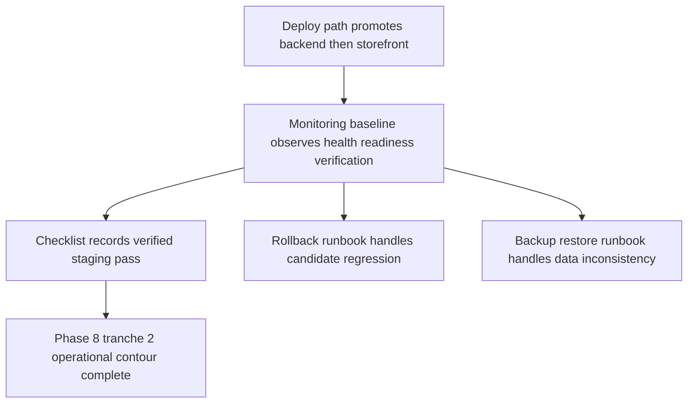

# Canonical Staging Monitoring Baseline — Phase 8 tranche 2

> Статус: canonical monitoring baseline artifact для текущего staging contour по состоянию на `2026-04-20`.
>
> Предпосылка: staging readiness contour уже materialized в [`Docs/staging_checklist.md`](./staging_checklist.md), canonical deploy order уже зафиксирован в [`Docs/staging_deploy_path.md`](./staging_deploy_path.md), reversible rollback contour уже описан в [`Docs/staging_rollback_runbook.md`](./staging_rollback_runbook.md), а backup and restore contour уже зафиксирован в [`Docs/staging_backup_restore_runbook.md`](./staging_backup_restore_runbook.md).
>
> Назначение: формализовать **один canonical monitoring baseline для staging** как последний operational artifact этого tranche без выбора observability vendor, без CI or code or infrastructure changes и без подмены собой deploy, rollback или backup and restore artifacts.

## 1. Цель и границы monitoring baseline

### Цель

Этот документ фиксирует не production-grade observability program и не готовый набор dashboards or alerts, а более узкий и проверяемый baseline:

- определить, **что именно** должно наблюдаться на staging после rollout, rollback или restore;
- зафиксировать минимальный набор health, readiness и verification signals для backend, storefront и связанных critical flows;
- сделать различимыми те failure classes, которые уже честно обоснованы текущими артефактами;
- задать канонический handoff между observation contour и соседними operational artifacts.

### Что входит в scope

В scope этого baseline входят только:

- runtime surfaces, которые уже materialized текущими staging artifacts;
- минимальные observable signals для backend, storefront и dependency contour;
- минимальный verification contour, который не выходит за пределы уже утвержденного staging smoke path;
- failure classification, достаточная для handoff в deploy, rollback или backup and restore tracks;
- assumptions, limitations и explicit manual handoff там, где в repo нет provider-specific observability stack.

### Что не входит в scope

Этот документ сознательно **не** покрывает:

- выбор observability vendor, APM, log aggregation, alerting product или dashboard system;
- реализацию probes, alerts, dashboards, synthetic jobs или uptime tooling;
- новый CI pipeline, code instrumentation или infrastructure provisioning;
- полный checkout or order end-to-end monitoring как обязательный staging gate;
- provider-specific webhook tracing и delivery analytics по умолчанию;
- production SLO, on-call process, incident command или automated remediation.

## 2. Canonical monitoring posture для текущего staging contour

### Что такое monitoring baseline в пределах этого repo

В текущем tranche monitoring baseline = **canonical observation contract**, а не tooling implementation.

Иными словами, документ отвечает на вопросы:

- какие staging surfaces считаются обязательными для наблюдения;
- какие сигналы считаются достаточными, чтобы различать healthy contour и regression;
- куда передавать failure, если оно уже вышло за пределы просто наблюдения.

### Какие источники signal truth уже существуют

Текущие repository artifacts уже задают baseline surfaces и naming, на которые этот документ опирается:

- [`Docs/staging_checklist.md`](./staging_checklist.md) — определяет минимальный staging-ready contour и canonical smoke path;
- [`Docs/staging_deploy_path.md`](./staging_deploy_path.md) — определяет rollout order, readiness boundaries и post-deploy verification;
- [`Docs/staging_rollback_runbook.md`](./staging_rollback_runbook.md) — определяет reversible failure contour для candidate regressions;
- [`Docs/staging_backup_restore_runbook.md`](./staging_backup_restore_runbook.md) — определяет recovery contour для data-state problems, когда rollback deployment units уже недостаточен;
- [`Docs/current_work.md`](./current_work.md) — фиксирует уже подтвержденный baseline state, notification smoke semantics и sequencing текущей фазы;
- [`.env.example`](../.env.example) — фиксирует env contract и optional integration boundaries;
- [`docker-compose.yml`](../docker-compose.yml) — фиксирует обязательные dependency surfaces `PostgreSQL + Redis + backend` как baseline reference;
- [`package.json`](../package.json) и [`.github/workflows/integrity-baseline.yml`](../.github/workflows/integrity-baseline.yml) — фиксируют canonical naming для static and smoke contour.

### Что этот baseline принимает как рабочую модель

- static contour `lint`, `typecheck`, `backend:build`, `storefront:build` остается **upstream qualification signal**, а не continuous staging monitor;
- monitoring baseline начинается там, где candidate уже дошел до runtime contour или post-recovery contour;
- observation может опираться на HTTP responses, existing smoke helpers, platform reachability signals и ручную фиксацию результатов;
- если внешняя observability system существует вне repo, mapping этих сигналов в конкретные dashboards or alerts считается **manual handoff**, а не частью текущего канона.

## 3. In-scope runtime surfaces и canonical signals

| Surface | Статус в baseline | Canonical signals | Как интерпретировать |
| --- | --- | --- | --- |
| PostgreSQL dependency | **Companion signal** | endpoint reachable, valid credentials, persistent baseline state сохраняется | PostgreSQL обязателен для backend readiness, но repo не задаёт отдельный metric stack для его внутренней телеметрии. |
| Redis dependency | **Companion signal** | Redis reachable из backend runtime | Redis обязателен для current Medusa runtime contour, но отдельный durable observability payload для Redis не стандартизирован текущими artifacts. |
| Backend runtime | **Primary monitored surface** | successful `GET /health`, stable backend public URL, startup без обязательных opt-in secrets | Это первый обязательный runtime anchor staging contour. |
| Storefront runtime | **Primary monitored surface** | successful storefront root URL, successful `/ru/account`, wiring к canonical backend URL и валидному publishable key | Это второй обязательный runtime anchor и основной cross-surface check для storefront viability. |
| Baseline seeded state | **Readiness companion signal** | materialized `ru` region, `rub` currency, sales channel, publishable API key, минимальный shipping skeleton | Это не отдельный monitor product, а обязательный readiness fact, без которого storefront and smoke contour нельзя считать согласованным. |
| Authenticated notification smoke | **Primary verification surface** | fresh `sk_*` key, `Basic auth`, successful `POST /admin/notifications/smoke`, различимые блоки ответа `ok`, `request`, `auth`, `provider`, `notification` | Это главный verified runtime anchor сверх simple health checks и главный способ отделить auth or provider or notification regressions от общей liveliness. |
| Optional webhook or provider integrations | **Conditional surface** | наблюдаются только если соответствующая integration явно включена для конкретного staging pass | По умолчанию эти surfaces не становятся обязательным baseline gate только потому, что env contract допускает их наличие. |

### Важное ограничение по surfaces

Текущий repo **не** даёт оснований объявить canonical monitored surfaces для:

- provider-native dashboards;
- third-party delivery logs;
- reverse proxy or CDN metrics;
- database internal performance telemetry;
- queue lag metrics;
- long-running browser synthetics.

Если такие surfaces реально существуют на staging platform, они остаются external operational context и подключаются к этому baseline только как manual mapping к уже утвержденным signals.

## 4. Минимальный набор health, readiness и verification signals

### 4.1 Health signals

Health в пределах текущего staging contour означает: обязательные runtime surfaces reachable и отвечают в своей минимальной sanctioned форме.

Минимальный health set:

1. PostgreSQL reachable как dependency для backend contour.
2. Redis reachable как dependency для backend contour.
3. Backend `GET /health` отвечает успешно на canonical backend public URL.
4. Storefront root URL отвечает успешно на canonical staging storefront URL.

### 4.2 Readiness signals

Readiness в этом baseline уже строже простого liveness и означает, что surface не только поднят, но и согласован с approved staging contour.

Минимальный readiness set:

1. backend стартует без требования обязательных opt-in integration secrets;
2. staging env materialized реальными `DATABASE_URL`, `REDIS_URL`, `MEDUSA_BACKEND_URL`, `STORE_CORS`, `ADMIN_CORS`, `AUTH_CORS` и non-placeholder secrets;
3. baseline seeded state остаётся materialized: `ru`, `rub`, sales channel, publishable API key и минимальный shipping skeleton;
4. storefront подключён к canonical backend URL и использует publishable key из текущего backend-side baseline state;
5. route `/ru/account` загружается и подтверждает тот же минимальный login or account surface, который уже принят в staging checklist как browser-equivalent readiness signal.

### 4.3 Verification signals

Verification в этом baseline отвечает на вопрос: сохраняется ли после rollout, rollback или restore минимальный approved cross-surface contour.

Минимальный verification set:

1. backend `GET /health` остаётся healthy после rollout or recovery step;
2. storefront root URL остаётся healthy после rollout or recovery step;
3. storefront `/ru/account` подтверждает minimal login or account surface;
4. authenticated `POST /admin/notifications/smoke` проходит через fresh `sk_*` key и `Basic auth`;
5. notification smoke verdict позволяет различить хотя бы:
   - auth failure;
   - provider-resolution issue;
   - notification execution issue;
   - healthy verification verdict.

### Что verification сознательно не доказывает

Этот baseline **не** делает обязательным доказательством staging health:

- полный checkout and order placement end-to-end path;
- provider-specific webhook delivery trace;
- реальную доставку письма or SMS or VK message во внешний канал по умолчанию;
- background metrics, latency percentiles или log-based anomaly detection.

Если конкретный staging pass явно включает optional integrations, их verification должна быть помечена как **explicit follow-up** поверх этого baseline, а не выдаваться за уже существующий canonical minimum.

## 5. Failure classes, которые monitoring baseline должен различать

| Failure class | Какой signal pattern должен быть различим | Canonical interpretation | Handoff |
| --- | --- | --- | --- |
| Dependency or env readiness failure | PostgreSQL or Redis unreachable, invalid canonical URLs, non-materialized secrets | staging environment не дошёл до честного runtime contour | boundary в [`Docs/staging_deploy_path.md`](./staging_deploy_path.md) или explicit environment remediation |
| Deploy failure | candidate promoted, но backend `/health` или storefront root так и не стали healthy | rollout не завершил bring-up обязательной surface | deploy-path failure, далее rollback только если candidate уже требует revert |
| Runtime readiness regression | surface была healthy, затем перестала проходить `GET /health` или storefront reachability | regression уже внутри runtime contour, а не просто delay старта | rollback-first triage по [`Docs/staging_rollback_runbook.md`](./staging_rollback_runbook.md) |
| Smoke-path regression | root может отвечать, но `/ru/account` или publishable-key wiring или baseline contour больше не подтверждаются | cross-surface wiring or readiness drift при формально живом runtime | rollback или deeper investigation по deploy contour |
| Notification issue | `POST /admin/notifications/smoke` не проходит либо возвращает failure в блоках `auth`, `provider` или `notification` | нужно отличить auth problem, provider-resolution drift и runtime notification regression | rollback, notification-specific investigation или manual follow-up в зависимости от scope pass |
| Data-state inconsistency | исчезли `ru`, `rub`, sales channel, publishable key или минимальный shipping skeleton | проблема уже лежит в data plane, а не только в deployment unit | handoff в [`Docs/staging_backup_restore_runbook.md`](./staging_backup_restore_runbook.md) |
| Conditional webhook or integration issue | core surfaces healthy, но explicitly enabled webhook or provider confirmation не сходится | optional integration-specific regression, а не default baseline failure | explicit follow-up or manual handoff; не обязательный baseline blocker по умолчанию |

### Ключевое различие между failure classes

Monitoring baseline должен явно различать:

- failure, где runtime **так и не стал healthy**;
- failure, где runtime был healthy, но **регрессировал после ready verdict**;
- failure, где runtime жив, но **ломается minimal verified contour**;
- failure, где проблема уже в **data state**, а не в deployment units;
- failure, который относится только к **optional integration scope**, если такой scope вообще был включен.

Без этого различения monitoring baseline будет смешивать deploy, rollback и restore decisions, что прямо противоречит уже созданным operational artifacts.

## 6. Handoff между monitoring baseline и предыдущими artifacts

### Handoff к staging checklist

[`Docs/staging_checklist.md`](./staging_checklist.md) определяет **что именно считается минимальным verified staging contour**.

Этот monitoring baseline не заменяет checklist, а уточняет:

- какие signals внутри checklist надо наблюдать как mandatory;
- какие failures нужно уметь различать на этих signals;
- какие surfaces остаются only-conditional, а не default gate.

### Handoff к deploy path

[`Docs/staging_deploy_path.md`](./staging_deploy_path.md) определяет:

- когда monitoring baseline вообще должен начинать observation;
- какой порядок rollout считается canonical;
- какие boundaries останавливают rollout до перехода в следующий шаг.

Monitoring baseline использует эти boundaries, но не придумывает собственный deployment choreography.

### Handoff к rollback runbook

[`Docs/staging_rollback_runbook.md`](./staging_rollback_runbook.md) начинается там, где monitoring baseline уже различил candidate regression внутри reversible deploy contour.

Если signal pattern указывает на:

- failed backend readiness после promotion;
- failed storefront readiness после promotion;
- failed notification smoke после candidate change;
- miswired storefront against otherwise recoverable backend state;

то canonical next artifact = rollback runbook, а не ad-hoc operator improvisation.

### Handoff к backup and restore runbook

[`Docs/staging_backup_restore_runbook.md`](./staging_backup_restore_runbook.md) начинается там, где monitoring baseline показывает, что проблема уже вышла за рамки simple candidate rollback:

- baseline seeded state отсутствует или поврежден;
- publishable key or region or currency contour больше не materialized корректно;
- recovery требует возврата PostgreSQL-backed state, а не просто redeploy backend or storefront candidate.

Иными словами, monitoring baseline заканчивается в точке **signal classification and handoff**, а не в точке full remediation.

## 7. Limitations, assumptions и explicit out-of-scope

### Limitations текущего baseline

- baseline определяет **что наблюдать**, но не доказывает наличие already configured monitoring platform;
- baseline не задаёт alert thresholds, escalation rules, retention или severity model;
- baseline не требует постоянного log ingestion или metric scraping;
- baseline не объявляет Redis, PostgreSQL, storefront или backend internal metrics обязательной частью repo-level observability;
- baseline не превращает optional integrations в mandatory monitored surfaces без явного staging-pass approval;
- baseline не заменяет будущие webhook monitoring и log or alert follow-up tracks из [`Docs/master_repo_plan_v2.md`](./master_repo_plan_v2.md).

### Assumptions, которые допустимы по текущим artifacts

Можно честно принять только следующие assumptions:

- staging platform или operator хотя бы способны видеть reachability HTTP surfaces и dependency availability;
- observation можно зафиксировать вручную или через уже существующие platform-native средства, если они не противоречат текущему repo contour;
- optional integrations `UNISENDER_*`, `MTS_EXOLVE_*`, `VK_*`, `YOOKASSA_*`, `PAYLOAD_*` по-прежнему могут оставаться disabled or empty для первого canonical monitoring contour, если конкретный staging pass их отдельно не включает;
- notification smoke остаётся главным baseline verification anchor для backend-side authenticated runtime path;
- storefront remains separate runtime surface и поэтому требует отдельного наблюдения, а не implicit backend-only verdict.

### Explicit out-of-scope

Следующие темы остаются вне scope этого документа:

- выбор и настройка alert channels;
- vendor-specific APM traces, log queries и dashboard layouts;
- automated webhook replay or provider-side reconciliation;
- synthetic browser monitoring beyond already approved minimal surfaces;
- long-term capacity monitoring, latency SLI or error-budget policy;
- production-grade incident response и postmortem workflow.

### Manual handoff conditions

Нужен explicit manual handoff, если:

- требуемый signal существует только во внешнем provider dashboard, которого нет в repo;
- staging platform может дать нужный verdict только через provider-native checks, не описанные текущими artifacts;
- наблюдение требует new instrumentation, code change или infra change;
- optional integration была включена для pass и теперь требует собственный provider-specific monitoring contour beyond current baseline.

## 8. Concise actionable checklist

- [ ] Зафиксировать, относится ли текущий staging pass только к core contour или также включает explicit optional integrations.
- [ ] Наблюдать PostgreSQL и Redis как обязательные companion dependency signals.
- [ ] Наблюдать backend `GET /health` на canonical backend public URL.
- [ ] Наблюдать storefront root URL на canonical staging storefront URL.
- [ ] Наблюдать storefront `/ru/account` как minimal cross-surface readiness and verification check.
- [ ] Подтверждать, что baseline state остаётся materialized: `ru`, `rub`, sales channel, publishable key, минимальный shipping skeleton.
- [ ] Выполнять или фиксировать authenticated `POST /admin/notifications/smoke` через fresh `sk_*` key и `Basic auth`.
- [ ] Уметь различать failure как dependency or env failure, deploy failure, runtime readiness regression, smoke-path regression, notification issue, data-state inconsistency или conditional integration issue.
- [ ] Передавать candidate regressions в [`Docs/staging_rollback_runbook.md`](./staging_rollback_runbook.md), а data-state failures в [`Docs/staging_backup_restore_runbook.md`](./staging_backup_restore_runbook.md) без изобретения нового recovery flow.
- [ ] Не выдавать текущий baseline за уже существующие dashboards, alerts, webhook monitoring или log-baseline implementation.

## 9. Основание baseline

Этот monitoring artifact опирается только на уже существующие источники истины и не вводит новую инфраструктуру:

- [`Docs/staging_checklist.md`](./staging_checklist.md);
- [`Docs/staging_deploy_path.md`](./staging_deploy_path.md);
- [`Docs/staging_rollback_runbook.md`](./staging_rollback_runbook.md);
- [`Docs/staging_backup_restore_runbook.md`](./staging_backup_restore_runbook.md);
- [`Docs/current_work.md`](./current_work.md);
- [`Docs/master_repo_plan_v2.md`](./master_repo_plan_v2.md);
- [`../.env.example`](../.env.example);
- [`../docker-compose.yml`](../docker-compose.yml);
- [`../package.json`](../package.json);
- [`../medusa-agency-boilerplate/package.json`](../medusa-agency-boilerplate/package.json);
- [`../medusa-agency-boilerplate-storefront/package.json`](../medusa-agency-boilerplate-storefront/package.json);
- [`../.github/workflows/integrity-baseline.yml`](../.github/workflows/integrity-baseline.yml).
