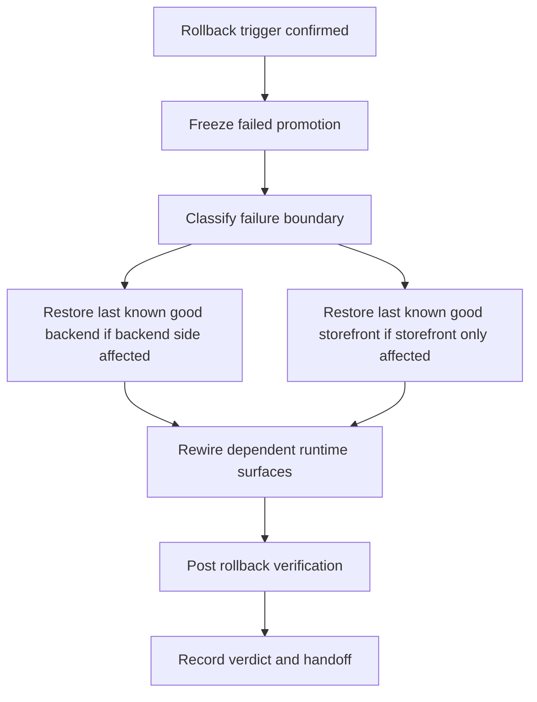

# Canonical Staging Rollback Runbook — Phase 8 tranche 2

> Статус: canonical rollback artifact для текущего staging contour по состоянию на `2026-04-20`.
>
> Предпосылка: staging readiness contour уже materialized в [Docs/staging_checklist.md](./staging_checklist.md), а canonical deploy order и failure boundaries уже зафиксированы в [Docs/staging_deploy_path.md](./staging_deploy_path.md).
>
> Назначение: формализовать **один canonical rollback contour для staging** после failed deploy or failed post-deploy verification, не добавляя новые infra-механизмы, не вводя CI/code changes и не подменяя собой backup/restore или monitoring artifacts.

## 1. Цель и границы rollback runbook

### Цель

Этот документ фиксирует не универсальную recovery strategy и не production-grade incident process, а более узкий и проверяемый путь:

- безопасно прекратить неуспешный staging rollout;
- вернуть staging к **последнему подтвержденному working state** в рамках уже описанного deploy contour;
- сделать rollback воспроизводимым для двух обязательных runtime surfaces: backend и storefront;
- подтвердить после rollback тот же минимальный smoke contour, который уже зафиксирован в [Docs/staging_checklist.md](./staging_checklist.md).

### Что входит в scope

В scope этого runbook входят только:

- rollback после failed candidate rollout для backend;
- rollback после failed candidate rollout для storefront;
- rollback после failed post-deploy verification на поверхностях `GET /health`, storefront root, `/ru/account`, `POST /admin/notifications/smoke`;
- порядок действий для backend, storefront и связанных runtime surfaces без выдумывания staging-specific topology;
- verification после rollback;
- явные handoff points, если проблема выходит за пределы reversible deploy contour.

### Что не входит в scope

Этот документ сознательно **не** покрывает:

- backup strategy и restore drills;
- recovery после потери или порчи PostgreSQL data;
- recovery после Redis, network, DNS, reverse proxy или platform outage;
- secret-management rollout, rotation или emergency credential replacement;
- monitoring, alerting, log aggregation или automated rollback;
- новый deployment mechanism, новый artifact registry flow или новую infra choreography;
- полный release or incident management process.

## 2. In-scope failure scenarios и rollback triggers

### In-scope failure scenarios

Rollback runbook применяется только к тем сценариям, которые уже обоснованы текущими staging artifacts:

1. **Backend candidate regression после rollout**
   - backend candidate уже promoted, но `GET /health` не проходит;
   - backend стартует, но verification contour больше не подтверждается;
   - regression возникла после candidate rollout и может быть адресована возвратом к предыдущему working backend candidate.

2. **Storefront candidate regression после rollout**
   - storefront root URL не отвечает успешно;
   - route `/ru/account` не подтверждает минимальный login or account surface;
   - regression возникла после storefront rollout и предполагает возврат к предыдущему working storefront candidate.

3. **Cross-surface verification failure после staging deploy**
   - backend `GET /health` отвечает, но минимальный verified contour из [Docs/staging_checklist.md](./staging_checklist.md) не проходит полностью;
   - authenticated notification smoke через `POST /admin/notifications/smoke` перестал проходить после candidate rollout;
   - failure воспроизводится как следствие текущего candidate, а не как уже существовавшая несогласованность staging environment.

4. **Miswired runtime surface после rollout**
   - storefront подключен не к тому backend public URL;
   - storefront использует невалидный publishable key относительно текущего baseline state;
   - rollout породил reversible config drift, который устраняется возвратом к последнему working candidate and sanctioned env state.

### Rollback triggers

Rollback должен считаться justified, если выполнено хотя бы одно из условий ниже:

- failed candidate не проходит boundary `backend ready` из [Docs/staging_deploy_path.md](./staging_deploy_path.md);
- failed candidate не проходит boundary `storefront live and wired` из [Docs/staging_deploy_path.md](./staging_deploy_path.md);
- обязательный post-deploy verification contour не проходит полностью;
- continuing rollout потребовал бы ad-hoc manual fixes, которые не являются частью already documented deploy path;
- проблема явно появилась после promotion текущего candidate и есть известный last known good staging state.

### Non-triggers

Следующие ситуации **не** должны автоматически запускать этот rollback runbook:

- PostgreSQL or Redis недоступны как dependency сами по себе;
- baseline seeded state отсутствует или уже был неконсистентен до rollout;
- candidate требует отдельный undocumented migration choreography;
- suspected data corruption требует restore, а не redeploy;
- optional integrations `UNISENDER_*`, `MTS_EXOLVE_*`, `VK_*`, `YOOKASSA_*`, `PAYLOAD_*` не были частью утвержденного staging pass.

Для таких случаев нужен explicit handoff в backup/restore, environment remediation или отдельный follow-up artifact.

## 3. Preconditions и assumptions для rollback

### Preconditions

Canonical rollback runbook опирается на те же базовые предпосылки, что и deploy path:

- существует **last known good staging state**, подтвержденный предыдущим successful staging pass;
- доступны обязательные runtime dependencies: PostgreSQL и Redis;
- staging env materialized с реальными `DATABASE_URL`, `REDIS_URL`, `MEDUSA_BACKEND_URL`, `STORE_CORS`, `ADMIN_CORS`, `AUTH_CORS` и non-placeholder secrets из [.env.example](../.env.example);
- baseline seeded state уже существовал до failed rollout: `ru` region, `rub` currency, sales channel, publishable API key, минимальный shipping skeleton;
- rollback выполняется через тот же sanctioned deployment mechanism, которым staging candidate был выкачен изначально;
- operator может однозначно указать, какой backend candidate и какой storefront candidate являются предыдущими working versions.

### Assumptions

Текущие артефакты позволяют принять только следующие assumptions:

- rollback означает **возврат deployment units к предыдущему working candidate**, а не произвольный ручной repair;
- backend и storefront остаются отдельными deployment units, как уже зафиксировано в [Docs/staging_deploy_path.md](./staging_deploy_path.md);
- storefront нельзя считать самодостаточной surface: он зависит от живого backend public URL и от валидного publishable key;
- rollback не должен подменяться blind reseed или ручными SQL edits;
- fresh `sk_*` admin API key для verification может создаваться заново после rollback и не считается long-lived prerequisite.

### Explicit uncertainty

Ни один текущий artifact **не** задает canonical способ хранения previous artifact versions, traffic switching, container revision pinning или platform-native revert button. Поэтому в этом runbook они не выдумываются.

Если staging platform не позволяет однозначно вернуть previous backend or storefront candidate через уже используемый sanctioned mechanism, rollback должен остановиться и перейти в **manual handoff**, а не импровизировать новый process.

## 4. Canonical rollback sequence

### Rule 1. Сначала остановить дальнейшее продвижение failed candidate

Сразу после rollback trigger нужно:

- прекратить дальнейший promotion failed candidate;
- не продолжать rollout на следующую surface, если это еще не произошло;
- зафиксировать, на какой boundary произошел failure: dependency/env, backend rollout, storefront rollout, post-deploy verification.

Если failure находится на dependency/env boundary, этот runbook **не продолжается**: нужен handoff в environment remediation.

### Rule 2. Backend rollback имеет приоритет над storefront rollback

Поскольку по [Docs/staging_deploy_path.md](./staging_deploy_path.md) storefront зависит от уже готового backend public URL и backend-side publishable key, canonical priority такая:

1. если сломан backend или есть сомнение, что проблема на backend-side, сначала вернуть previous working backend candidate;
2. только после этого оценивать, нужен ли rollback storefront;
3. storefront-only rollback допустим только если backend остается verified and healthy на current working state.

### Scenario A. Failure до rollout storefront

Если failed candidate остановился на backend boundary и storefront еще не переводился на новый candidate:

1. Прекратить promotion failed backend candidate.
2. Вернуть previous working backend candidate через тот же sanctioned deployment mechanism.
3. Убедиться, что staging env и dependency endpoints не были подменены ad-hoc во время failed attempt.
4. Не выполнять storefront rollback, если storefront не менялся.
5. Перейти к post-rollback verification.

Это наиболее узкий rollback contour и он не должен перерастать в reseed or restore без явного evidence.

### Scenario B. Failure после backend rollout и после storefront rollout

Если уже были продвинуты оба deployment units и verification contour сломан:

1. Сначала вернуть previous working backend candidate.
2. Подтвердить, что backend снова отвечает на `GET /health`.
3. Затем вернуть previous working storefront candidate.
4. Подтвердить, что storefront снова подключен к canonical backend URL и использует согласованный publishable key относительно восстановленного backend-side state.
5. Выполнить полный post-rollback verification contour.

Причина этого порядка: storefront не должен закрепляться поверх backend state, который еще не признан recovered.

### Scenario C. Storefront-only regression при healthy backend

Если все evidence указывает, что backend healthy, baseline state не затронут, а failure ограничен storefront surface:

1. Зафиксировать, что backend `GET /health` проходит и backend-side verification anchor не сломан.
2. Вернуть previous working storefront candidate.
3. Проверить storefront root и `/ru/account`.
4. Повторить notification smoke только как cross-check согласованности общего contour, а не как доказательство storefront bug fix itself.

Если во время этой проверки появляется сомнение в backend-side consistency, сценарий должен быть переклассифицирован в backend-first rollback.

### Scenario D. Verification failure, которая указывает на data or seed inconsistency

Если после failed deploy видно, что проблема связана не с candidate artifact, а с baseline state:

- отсутствуют `ru` or `rub` or sales channel or publishable key;
- требуется blind reseed поверх уже используемой staging data;
- требуется data repair, который нельзя честно описать как redeploy previous candidate;

тогда canonical rollback runbook **останавливается**.

Дальше нужен explicit handoff в будущий backup/restore or rebuild contour. Этот документ не разрешает выдавать reseed за стандартный rollback.

## 5. Runtime surfaces, которые нужно вернуть в согласованное состояние

Rollback считается завершенным не в момент revert одного artifact, а в момент восстановления согласованного минимального contour:

- **PostgreSQL и Redis** должны оставаться reachable dependencies, но их recovery не описывается этим документом;
- **backend runtime** должен быть возвращен к previous working candidate и снова отвечать на `GET /health`;
- **storefront runtime** должен либо остаться на previous working candidate, либо быть туда возвращен;
- **backend public URL** должен указывать на recovered backend surface;
- **publishable key usage** на storefront должен оставаться согласованным с recovered backend-side baseline state;
- **authenticated admin smoke surface** должен снова быть воспроизводимым через fresh `sk_*` key и `Basic auth`.

Если любой из этих пунктов требует platform-specific действия, которое не описано текущими artifacts, это становится manual handoff, а не местом для домысливания нового канона.

## 6. Post-rollback verification

Verification после rollback должна совпадать с уже утвержденным staging contour из [Docs/staging_checklist.md](./staging_checklist.md), а не вводить новый suite.

### Обязательные checks

1. Подтвердить, что PostgreSQL и Redis доступны как обязательные зависимости rollbacked runtime.
2. Подтвердить, что backend `GET /health` отвечает успешно.
3. Подтвердить, что storefront root URL отвечает успешно.
4. Подтвердить, что route `/ru/account` загружается и показывает минимальный login or account surface.
5. Подтвердить, что authenticated notification smoke снова проходит:
   - создать fresh `sk_*` admin API key;
   - выполнить `Basic auth` запрос на `POST /admin/notifications/smoke`;
   - получить успешный smoke verdict.
6. Зафиксировать, что rollback вернул staging к last known good contour без overclaim о production readiness.

### Verification decision rule

- если все checks проходят, rollback считается успешным для текущего staging contour;
- если backend or storefront still fail на тех же обязательных checks, проблема больше не трактуется как straightforward deploy rollback и требует отдельного handoff;
- если verification упирается в data inconsistency, нужно остановиться и перенести вопрос в backup/restore or rebuild track.

## 7. Limitations, out-of-scope и explicit follow-up

### Limitations текущего runbook

- runbook не доказывает, что staging защищен от data loss;
- runbook не описывает восстановление базы из backup;
- runbook не покрывает rollback после destructive migration, если rollback требует schema or data restore;
- runbook не покрывает automated health-based rollback;
- runbook не покрывает длительное наблюдение после rollback beyond initial smoke contour.

### Explicit out-of-scope

Следующие темы остаются для следующих `Phase 8` artifacts:

- backup strategy;
- restore test and drills;
- monitoring baseline;
- alerting and log-baseline implementation;
- более широкий production-readiness contour.

### Manual handoff conditions

Нужен explicit manual handoff, если:

- нет однозначного previous working candidate для backend или storefront;
- recovery требует new infra action, не описанный текущими artifacts;
- проблема связана с PostgreSQL data loss, schema drift или destructive state mutation;
- Redis, network, DNS, secret store или hosting platform сами по себе являются primary failure domain;
- suspected fix требует ad-hoc data edits, reseed или platform improvisation.

## 8. Concise actionable checklist

- [ ] Rollback trigger подтвержден: failure относится к current candidate rollout or post-deploy verification.
- [ ] Дальнейший promotion failed candidate остановлен.
- [ ] Failure классифицирован: backend-first, storefront-only или non-rollback handoff.
- [ ] Dependency or env outage исключены как primary cause либо вынесены в отдельный handoff.
- [ ] Определен last known good backend candidate.
- [ ] Определен last known good storefront candidate, если storefront rollback действительно нужен.
- [ ] При backend-related failure сначала восстановлен previous working backend candidate.
- [ ] При storefront-only failure восстановлен previous working storefront candidate без выдумывания нового process.
- [ ] Storefront снова подключен к canonical backend URL и согласованному publishable key.
- [ ] Backend `GET /health` снова отвечает успешно.
- [ ] Storefront root URL снова отвечает успешно.
- [ ] Route `/ru/account` снова подтверждает минимальный login or account surface.
- [ ] Authenticated `POST /admin/notifications/smoke` проходит через fresh `sk_*` key и `Basic auth`.
- [ ] Если rollback уперся в data repair, restore или platform-specific recovery, выполнен явный handoff без притворства, что runbook это уже покрывает.

## 9. Основание runbook

Этот rollback artifact опирается только на уже существующие источники истины и не вводит новую инфраструктуру:

- [Docs/staging_checklist.md](./staging_checklist.md);
- [Docs/staging_deploy_path.md](./staging_deploy_path.md);
- [Docs/current_work.md](./current_work.md);
- [Docs/master_repo_plan_v2.md](./master_repo_plan_v2.md);
- [.env.example](../.env.example);
- [docker-compose.yml](../docker-compose.yml);
- [package.json](../package.json);
- [medusa-agency-boilerplate/package.json](../medusa-agency-boilerplate/package.json);
- [medusa-agency-boilerplate-storefront/package.json](../medusa-agency-boilerplate-storefront/package.json);
- [.github/workflows/integrity-baseline.yml](../.github/workflows/integrity-baseline.yml).
