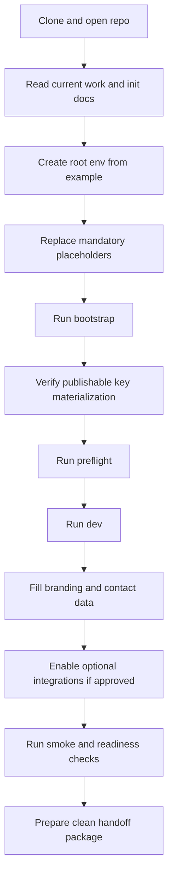

# Template Release Handoff — Phase 7 tranche 2

> Статус: `Phase 7 / tranche 2` `template release checklist + onboarding path + cleaned release-package contour` materialized как markdown-only packaging step по состоянию на `2026-04-19`.
>
> База: `Phase 7 / tranche 1` truthfully закрыт commit'ом `a96aa81adfd655ddda9b6fea03dacf61c3174737` `feat(template): add client-init contract baseline`, а канонический init contract остается в [`Docs/client_init_contract.md`](./client_init_contract.md).
>
> Назначение: превратить tranche 1 baseline в реально передаваемый template package narrative без code changes, без reopening `Фазы 6` и без захода в `Фазу 8`.
>
> Closure note `2026-04-20`: `Phase 7 / tranche 3` repeat RC smoke/closure-check теперь тоже подтвержден, так что вся `Фаза 7` truthfully закрыта; этот документ остаётся каноническим tranche 2 artifact для packaging/handoff narrative.

---

## 1. Роль этого артефакта

Этот документ теперь является каноническим source of truth для трех handoff-facing вещей:

1. единого template release checklist;
2. onboarding path для нового клиента или команды;
3. clean release-package contour — что входит в template-safe package, а что считается local, dev, demo или unrelated residue.

Границы этого tranche:

- не менять runtime или code surfaces;
- не переоткрывать `Фазу 6 storefront customization`;
- не притворяться, что уже сделаны CI, staging, prod hardening или release automation из `Фазы 8`;
- не смешивать packaging narrative с unrelated working-tree changes.

---

## 2. Канонический onboarding path

### 2.1. Step by step

1. **Clone and open repo**
   - стартовать из корня репозитория;
   - не начинать с ad-hoc подпроектов и не собирать handoff через частичные копии.

2. **Read the canonical docs in order**
   - [`Docs/current_work.md`](./current_work.md);
   - [`Docs/master_repo_plan_v2.md`](./master_repo_plan_v2.md);
   - [`Docs/client_init_contract.md`](./client_init_contract.md);
   - этот документ;
   - при необходимости [`Docs/env_contract.md`](./env_contract.md) и [`Docs/template_readiness_regression.md`](./template_readiness_regression.md).

3. **Create root env from example**
   - `cp .env.example .env`;
   - source of truth для обязательных замен остается в [`Docs/client_init_contract.md`](./client_init_contract.md).

4. **Replace mandatory placeholders**
   - заменить обязательные root secrets и client-specific branding/contact placeholders;
   - не подставлять вручную bootstrap-generated publishable key;
   - optional integrations оставлять пустыми или safe-default, пока feature не одобрен.

5. **Run canonical bootstrap**
   - `npm run bootstrap`;
   - bootstrap должен materialize bootstrap-generated state, включая storefront publishable key.

6. **Verify bootstrap-generated values**
   - storefront `.env.local` больше не должен держать `NEXT_PUBLIC_MEDUSA_PUBLISHABLE_KEY=REPLACE_WITH_ROOT_BOOTSTRAP`;
   - bootstrap-generated значения не должны копироваться из старого клиента вручную.

7. **Run preflight**
   - `npm run preflight`;
   - baseline path должен подтверждать, что clean clone поднимается без обязательных opt-in integration secrets.

8. **Run dev**
   - `npm run dev`;
   - этот шаг нужен именно как канонический local onboarding path, а не как production claim.

9. **Fill branding and contact surface before handoff**
   - storefront name, title, description, tagline, email, phone и social links должны перестать быть template placeholders до client-facing handoff.

10. **Enable optional integrations only when approved**
    - YooKassa, legacy provider, UniSender, VK, Payload preview/revalidate и другие opt-in surfaces не становятся baseline requirement автоматически;
    - пустой или disabled state остается валидным template-safe baseline, если feature не включается для конкретного handoff.

11. **Run smoke and readiness checks**
    - опираться на [`Docs/template_readiness_regression.md`](./template_readiness_regression.md);
    - минимум для handoff: bootstrap path, preflight path и связанная baseline verification;
    - opt-in smoke и runtime checks запускать только для реально включенных integration slices.

12. **Prepare clean handoff package**
    - включить только template-safe repository state;
    - исключить local state, generated outputs, secrets, dumps, temp artifacts и unrelated work.

---

## 3. Единый template release checklist

Ниже — единый checklist для markdown-only tranche 2.

### 3.1. Что заменить

- [ ] В root `.env` заменены все `Mandatory` значения из [`Docs/client_init_contract.md`](./client_init_contract.md).
- [ ] В storefront branding/contact surface заменены `storeName`, `defaultTitle`, `defaultDescription`, `tagline`, `contact.email`, `contact.phone`, `socialLinks[*].href`.
- [ ] Ни один client-facing handoff artifact не оставляет template placeholder там, где уже требуется реальное client value.

### 3.2. Что проверить

- [ ] Канонический init path остается `npm run client:init:contract` → `cp .env.example .env` → `npm run bootstrap` → `npm run preflight` → `npm run dev`.
- [ ] `NEXT_PUBLIC_MEDUSA_PUBLISHABLE_KEY` materialize'ится только bootstrap path'ом, а не ручной вставкой.
- [ ] `MEDUSA_BACKEND_URL`, `NEXT_PUBLIC_BASE_URL` и `NEXT_PUBLIC_DEFAULT_REGION` трактуются как optional runtime inputs с safe fallback semantics.
- [ ] `NEXT_PUBLIC_STOREFRONT_PRESET` остается единственным sanctioned preset switch.
- [ ] Optional integrations остаются opt-in и не объявлены baseline requirement без отдельного approval.
- [ ] Handoff package не требует вспоминать ad-hoc local steps вне канонических docs.

### 3.3. Что очистить

- [ ] Удалены или исключены local env files с реальными значениями.
- [ ] Удалены или исключены generated runtime directories и build outputs.
- [ ] Удалены или исключены временные screenshots, logs, scratch notes и одноразовые artifacts.
- [ ] Удалены или исключены workstation-specific identity markers и demo residue.
- [ ] Удалены или исключены случайные dumps и локальные export artifacts, не являющиеся частью canonical template baseline.

### 3.4. Что не включать в release package

- [ ] Реальные секреты, токены, API keys, `sk_*` ключи и credential-bearing URLs.
- [ ] Root `.env`, backend `.env`, storefront `.env.local` с локальными значениями.
- [ ] `.medusa`, `.next`, `node_modules`, build output, temp output и прочий generated state.
- [ ] Demo/admin/onboarding residue, который не относится к template-safe baseline.
- [ ] Unrelated working-tree changes вроде `payload-cms/`, backend marketing work или несвязанных storefront refactor paths, если они отдельно не approved и не синхронизированы как canonical baseline.

### 3.5. Что должно быть приложено к handoff

- [ ] [`Docs/client_init_contract.md`](./client_init_contract.md) как canonical init contract.
- [ ] Этот документ как canonical release checklist, onboarding path и package contour.
- [ ] [`Docs/env_contract.md`](./env_contract.md) как env/source-of-truth reference.
- [ ] [`Docs/template_readiness_regression.md`](./template_readiness_regression.md) как regression/readiness reference.
- [ ] Template-safe env examples и актуальные source-of-truth status docs.

---

## 4. Clean release-package contour

## 4.1. Что входит в template-safe package

| Contour class | Входит в clean package | Правило |
| --- | --- | --- |
| Canonical docs | Да | Включать только актуальные source-of-truth документы, синхронизированные с фактическим статусом tranche 1 и tranche 2. |
| Template-safe env examples | Да | Включать `.env.example`, backend `.env.template`, storefront `.env.local.example` без реальных секретов и без workstation residue. |
| Root orchestration and manifests | Да | Включать root-level orchestration, manifest и scripts как часть канонического onboarding path. |
| Backend and storefront baseline source | Да | Входит только то, что уже является canonical baseline проекта и нужно для clean clone path. |
| Optional integration surfaces | Да, условно | Входят как template-safe placeholders или disabled-by-default config, но не как обязательный handoff input. |
| Canonical status narrative | Да | Handoff должен явно видеть, что tranche 1 закрыт и tranche 2 materialized как packaging narrative. |

## 4.2. Что считается residue и не должно попадать в handoff

| Residue class | В handoff package | Почему нет |
| --- | --- | --- |
| Local env with real values | Нет | Это machine-specific и secret-bearing state, а не template baseline. |
| Generated runtime state | Нет | `.medusa`, `.next`, caches, logs и build artifacts не являются handoff-safe source artifacts. |
| Build and temp outputs | Нет | Это производные файлы, не source-of-truth и не clean-package baseline. |
| Demo and placeholder drift | Нет | Fake client data, demo contacts и accidental starter residue искажают template handoff. |
| One-off dumps and exports | Нет | Случайный local snapshot не должен подменять канонический bootstrap/template path. |
| Unrelated work | Нет | Несвязанные ветки работы не должны проникать в template package под видом tranche 2. |

## 4.3. Практическое правило контура

`Clean release-package contour` = только те файлы и narrative artifacts, которые:

1. нужны для clean clone и канонического onboarding path;
2. не содержат реальных секретов и machine-specific state;
3. не тащат demo, local или unrelated residue;
4. не подменяют tranche 2 фиктивным claim'ом о полном release automation.

Если артефакт нельзя честно отнести к template-safe source baseline, он не должен входить в handoff package.

---

## 5. Definition of ready for handoff or template release

Template release или client handoff считается truthfully готовым только когда одновременно выполняется всё ниже:

- tranche 1 остается закрытым и source of truth по init contract не противоречит runtime/docs;
- этот tranche 2 materialized отдельным canonical artifact для checklist, onboarding path и release-package contour;
- новый человек может пройти путь `clone/open → env setup → bootstrap → publishable key materialization → branding/contact → optional integrations → smoke checks` без обращения к устной памяти команды;
- package contour явно отделяет template-safe baseline от local/dev/demo/unrelated residue;
- handoff не содержит реальных секретов и generated local state;
- не делается overclaim, будто уже закрыты CI, staging, prod readiness или полная release automation из `Фазы 8`.

---

## 6. Truthful outcome этого tranche

По состоянию materialization этого документа truthful result такой:

- `Phase 7 / tranche 1` остается закрытым baseline contract slice;
- `Phase 7 / tranche 2` теперь materialized как markdown-only packaging step;
- канонический template release checklist, onboarding path и clean release-package contour теперь сосредоточены в этом документе;
- scope сознательно ограничен docs/readiness/packaging narrative и не смешивается с code changes, `Фазой 6`, `Фазой 8` или unrelated working-tree changes.
