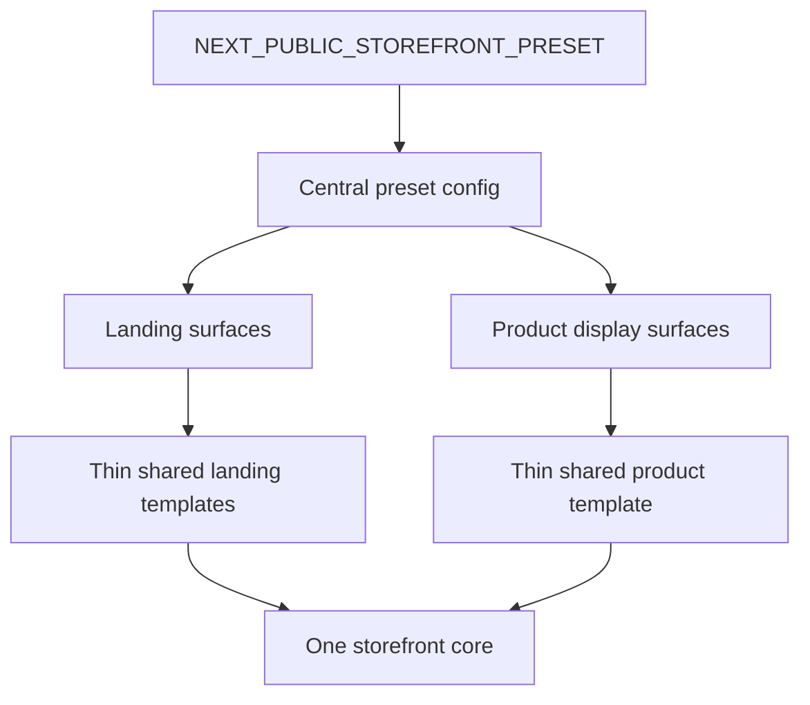

# Adjacent preset rollout and guideline step for product support highlights

Status: closed and materialized Phase 6 slice, delivered by commit [`8c5451e854c31671e088110670879f69c895e4cf`](medusa-agency-boilerplate-storefront/src/lib/storefront-client-config.ts:181) `feat(storefront): roll out typed productSurfaces supportHighlights preset contract` after [`preset-driven-landing-surface-contract-v1.md`](plans/preset-driven-landing-surface-contract-v1.md).

## Context and source of truth

This design follows the sequencing already recorded in:

- [`Docs/current_work.md`](Docs/current_work.md)
- [`Docs/master_repo_plan_v2.md`](Docs/master_repo_plan_v2.md)
- [`Docs/plan_analysis.md`](Docs/plan_analysis.md)
- [`Docs/env_contract.md`](Docs/env_contract.md)
- [`.kilocode/skills/medusa-master-repo/SKILL.md`](.kilocode/skills/medusa-master-repo/SKILL.md)
- [`plans/preset-driven-landing-surface-contract-v1.md`](plans/preset-driven-landing-surface-contract-v1.md)

Current repository reality relevant to this slice:

- Phase 6 is already started and grounded in [`medusa-agency-boilerplate-storefront/src/lib/storefront-client-config.ts`](medusa-agency-boilerplate-storefront/src/lib/storefront-client-config.ts).
- Preset switching is already sanctioned through the single public switch [`NEXT_PUBLIC_STOREFRONT_PRESET`](medusa-agency-boilerplate-storefront/src/lib/env.ts:21).
- Landing surfaces are already normalized under [`landingSurfaces`](medusa-agency-boilerplate-storefront/src/lib/storefront-client-config.ts).
- The adjacent product-page display surface already exists as [`ProductSupportHighlights`](medusa-agency-boilerplate-storefront/src/modules/storefront-customization/components/product-support-highlights/index.tsx) mounted from [`medusa-agency-boilerplate-storefront/src/modules/products/templates/index.tsx`](medusa-agency-boilerplate-storefront/src/modules/products/templates/index.tsx).
- The current product support content still lives as a simple preset-owned array at [`surfaces.product.supportHighlights`](medusa-agency-boilerplate-storefront/src/lib/storefront-client-config.ts).

## Goal of the workstream

Define the next sanctioned Phase 6 slice that extends the already-closed preset architecture from landing surfaces to the adjacent product-page support surface, using [`product.supportHighlights`](medusa-agency-boilerplate-storefront/src/lib/storefront-client-config.ts) as the approved guideline-level extension point.

In practical terms, this slice should answer one question clearly:

How should the repository roll preset-driven customization from normalized landing surfaces into the nearby product-page presentation layer without turning product templates into a new branching frontier.

## What adjacent preset rollout means here

In this repository, adjacent preset rollout does not mean broad expansion into all product-page personalization.

It means a narrow, disciplined move from the already-approved Phase 6 boundaries:

- from home and landing entry surfaces
- to the nearest already-existing display-only product surface
- while preserving the same preset selector, the same one-core storefront model, and the same anti-fork rules

The adjacency is architectural, not merely visual:

- [`landingSurfaces`](medusa-agency-boilerplate-storefront/src/lib/storefront-client-config.ts) already prove that preset-specific presentation can be centralized in config and resolved through sanctioned renderers.
- [`ProductSupportHighlights`](medusa-agency-boilerplate-storefront/src/modules/storefront-customization/components/product-support-highlights/index.tsx) sits next to that system as the next smallest presentational surface that already exists, already differs by preset content, and does not require new backend data.
- Therefore the next slice should treat product support highlights as the first non-landing extension of the same customization discipline, not as a separate customization subsystem.

## Problem statement

The repository currently has a healthy but slightly uneven state:

- landing surfaces now read as a typed and normalized preset contract in [`medusa-agency-boilerplate-storefront/src/lib/storefront-client-config.ts`](medusa-agency-boilerplate-storefront/src/lib/storefront-client-config.ts)
- product support highlights are already preset-aware in practice, but they still read more like an isolated config branch than a formally sanctioned extension pattern
- the component in [`medusa-agency-boilerplate-storefront/src/modules/storefront-customization/components/product-support-highlights/index.tsx`](medusa-agency-boilerplate-storefront/src/modules/storefront-customization/components/product-support-highlights/index.tsx) consumes raw array data directly, without an explicit guideline that explains how future adjacent product-display surfaces should be added

Without a design step, the next client rollout could drift into:

- ad hoc product-page arrays with no shared policy
- preset-specific logic pushed into [`medusa-agency-boilerplate-storefront/src/modules/products/templates/index.tsx`](medusa-agency-boilerplate-storefront/src/modules/products/templates/index.tsx)
- uncontrolled growth of one-off product display branches
- eventual pressure to fork product templates even though the current surface is still presentation-only

## Design objectives

1. Keep [`NEXT_PUBLIC_STOREFRONT_PRESET`](medusa-agency-boilerplate-storefront/src/lib/env.ts:21) as the only preset switch.
2. Keep product support highlights in the same central configuration authority as landing surfaces: [`medusa-agency-boilerplate-storefront/src/lib/storefront-client-config.ts`](medusa-agency-boilerplate-storefront/src/lib/storefront-client-config.ts).
3. Reframe [`product.supportHighlights`](medusa-agency-boilerplate-storefront/src/lib/storefront-client-config.ts) as a sanctioned guideline carrier for adjacent product-display rollout, not a loose escape hatch for arbitrary product branching.
4. Preserve the thin-template rule in [`medusa-agency-boilerplate-storefront/src/modules/products/templates/index.tsx`](medusa-agency-boilerplate-storefront/src/modules/products/templates/index.tsx).
5. Stay strictly inside display-only presentation over existing product data and current page anatomy.
6. Create an implementation guideline that future Phase 6 slices can reuse when expanding beyond landing surfaces.

## In scope

This workstream is design/spec only.

In scope for the design:

- define the purpose of adjacent preset rollout around [`product.supportHighlights`](medusa-agency-boilerplate-storefront/src/lib/storefront-client-config.ts)
- define the sanctioned contract direction for product support highlights
- define the implementation pattern and boundary rules for the future code slice
- define which storefront files are likely touchpoints for the future implementation
- define validation expectations, acceptance criteria, risks, and open questions
- optionally align naming and contract structure at design level between [`landingSurfaces`](medusa-agency-boilerplate-storefront/src/lib/storefront-client-config.ts) and product support surfaces

## Out of scope

Explicitly out of scope for this slice:

- any source-code implementation beyond this markdown artifact
- any new env flags beyond [`NEXT_PUBLIC_STOREFRONT_PRESET`](medusa-agency-boilerplate-storefront/src/lib/env.ts:21)
- changes to Store API contracts, backend routes, or Medusa modules
- product detail logic related to pricing, variants, inventory, cart, checkout, account, order, or provider integrations
- redesign of [`ProductInfo`](medusa-agency-boilerplate-storefront/src/modules/products/templates/product-info/index.tsx), [`ProductActions`](medusa-agency-boilerplate-storefront/src/modules/products/components/product-actions/index.tsx), or product tabs as commerce behavior surfaces
- expansion into arbitrary new preset variants
- turning the product page into a general slot engine
- docs sync outside this design artifact
- commit work

## Proposed architecture summary

### 1. Treat product support highlights as the first sanctioned non-landing display surface

The next slice should not absorb product support highlights into [`landingSurfaces`](medusa-agency-boilerplate-storefront/src/lib/storefront-client-config.ts), because the surface is not a landing entry surface.

Instead, it should make the Phase 6 model read as two related layers inside the same client config:

- `landingSurfaces` for entry surfaces
- a sibling preset-owned product display surface branch for adjacent product-page presentation

Recommended design direction:

```ts
landingSurfaces
productSurfaces
```

Where:

- `landingSurfaces` stays the normalized registry for home, collection, content, and post entry surfaces
- `productSurfaces` becomes the explicit sanctioned home for product-page display-only extensions
- [`supportHighlights`](medusa-agency-boilerplate-storefront/src/lib/storefront-client-config.ts) is the first concrete member of that branch

This is preferable to keeping the generic name `surfaces`, because the repository now has a clearer split between normalized landing surfaces and adjacent non-landing surfaces.

### 2. Promote support highlights from raw content array to explicit contract member

Current shape is effectively:

```ts
surfaces: {
  product: {
    supportHighlights: StorefrontTitleDescriptionItem[]
  }
}
```

Recommended design-level target:

```ts
productSurfaces: {
  supportHighlights: {
    mode: 'list'
    items: StorefrontTitleDescriptionItem[]
  }
}
```

Why this matters:

- it makes the surface read as a formal contract, not incidental data
- it matches the pattern already established by `mode` in [`landingSurfaces`](medusa-agency-boilerplate-storefront/src/lib/storefront-client-config.ts)
- it gives future adjacent product-display work a sanctioned vocabulary without forcing generalization too early

### 3. Use guideline-level normalization, not premature product-page over-engineering

This slice should deliberately stay small.

The design should not propose a universal slot registry for the whole product page.

The intended guideline is narrower:

- if the product-page customization need is display-only
- if it uses existing page context only
- if it lives outside cart, pricing, variant selection, and order state
- if it can be mounted as a thin sanctioned component from the shared product template
- then it is eligible to live beside [`supportHighlights`](medusa-agency-boilerplate-storefront/src/lib/storefront-client-config.ts) inside the same preset-owned product display branch

So the next slice is a pattern-setting step, not a product-page platform rewrite.

### 4. Preserve a single sanctioned mount point in the product template

The shared template in [`medusa-agency-boilerplate-storefront/src/modules/products/templates/index.tsx`](medusa-agency-boilerplate-storefront/src/modules/products/templates/index.tsx) should remain thin.

Recommended rule:

- shared product template mounts one or very few sanctioned customization boundaries
- those boundaries resolve preset-owned config internally
- no direct `preset === ...` checks in the product template
- no product-template branching for specific clients

The current mount in [`medusa-agency-boilerplate-storefront/src/modules/products/templates/index.tsx`](medusa-agency-boilerplate-storefront/src/modules/products/templates/index.tsx) is already the correct architectural direction and should be treated as the stable boundary to preserve.

## Proposed contract shape

### Recommended type direction

Design-level target inside [`medusa-agency-boilerplate-storefront/src/lib/storefront-client-config.ts`](medusa-agency-boilerplate-storefront/src/lib/storefront-client-config.ts):

```ts
export type StorefrontProductSupportHighlightsSurface = {
  mode: 'list'
  items: StorefrontTitleDescriptionItem[]
}

export type StorefrontProductSurfaces = {
  supportHighlights: StorefrontProductSupportHighlightsSurface
}

export type StorefrontClientConfig = {
  meta: ...
  theme: ...
  shell: ...
  landingSurfaces: ...
  productSurfaces: StorefrontProductSurfaces
  overridePolicy: ...
  guardrails: ...
}
```

### Recommended implementation pattern

The future code slice should likely introduce a small resolver pattern parallel to [`landing-surface-resolver.ts`](medusa-agency-boilerplate-storefront/src/modules/storefront-customization/components/landing-surface-resolver.ts), but lighter in scope.

Conceptually:

```ts
resolveProductSurface
resolveProductSupportHighlightsSurface
```

That resolver should:

- read from the central preset config
- return typed product display surface data
- keep product template code free from preset-specific knowledge

This does not require a complex abstraction. The point is consistency and sanctioned access, not framework-building.

## Sanctioned role of `product.supportHighlights`

[`product.supportHighlights`](medusa-agency-boilerplate-storefront/src/lib/storefront-client-config.ts) should be treated as a guideline-level extension carrier with the following policy.

### Allowed role

It is allowed to carry:

- preset-specific reassurance copy
- support or service framing copy
- operational expectation cues already implied by the existing store experience
- presentational cards that help explain the current store promise without changing store behavior

Examples of acceptable themes:

- shipping confidence messaging
- service or support reassurance
- preset tone differences between editorial and utility storefront scenarios
- explainers that reinforce existing operational contracts already implemented elsewhere

### Disallowed role

It must not become:

- a branching control point for cart behavior
- a source of conditional logic for price, stock, variant, or checkout behavior
- a trigger for new backend fetches
- a place to encode client-specific operational rules that belong in core commerce flows
- a free-form bucket for arbitrary product-page experiments

### Design rule

If a future requirement cannot be expressed as static or trivially derived presentation around the current product page, it should not extend [`product.supportHighlights`](medusa-agency-boilerplate-storefront/src/lib/storefront-client-config.ts).

It must instead be rejected, deferred, or split into another explicitly scoped workstream.

## Likely implementation touchpoints

The future implementation for this design should likely remain limited to:

- [`medusa-agency-boilerplate-storefront/src/lib/storefront-client-config.ts`](medusa-agency-boilerplate-storefront/src/lib/storefront-client-config.ts)
- [`medusa-agency-boilerplate-storefront/src/modules/storefront-customization/components/product-support-highlights/index.tsx`](medusa-agency-boilerplate-storefront/src/modules/storefront-customization/components/product-support-highlights/index.tsx)
- optionally a small resolver beside [`medusa-agency-boilerplate-storefront/src/modules/storefront-customization/components/landing-surface-resolver.ts`](medusa-agency-boilerplate-storefront/src/modules/storefront-customization/components/landing-surface-resolver.ts)
- [`medusa-agency-boilerplate-storefront/src/modules/products/templates/index.tsx`](medusa-agency-boilerplate-storefront/src/modules/products/templates/index.tsx) only if a mount-point refinement is actually needed

Files that should stay untouched by the future implementation:

- checkout surfaces under [`medusa-agency-boilerplate-storefront/src/modules/checkout`](medusa-agency-boilerplate-storefront/src/modules/checkout)
- cart data helpers under [`medusa-agency-boilerplate-storefront/src/lib/data`](medusa-agency-boilerplate-storefront/src/lib/data)
- account and order templates
- backend modules and routes
- [`medusa-agency-boilerplate-storefront/src/lib/env.ts`](medusa-agency-boilerplate-storefront/src/lib/env.ts) except for possible comments or documentation alignment, if any

## Anti-fork guardrails to strengthen

### Guardrail 1. One preset switch only

The only sanctioned runtime selector remains [`NEXT_PUBLIC_STOREFRONT_PRESET`](medusa-agency-boilerplate-storefront/src/lib/env.ts:21).

No product-specific env flags.
No client-specific product flags.
No separate switch for support highlights.

### Guardrail 2. Shared product template stays branch-free

[`medusa-agency-boilerplate-storefront/src/modules/products/templates/index.tsx`](medusa-agency-boilerplate-storefront/src/modules/products/templates/index.tsx) must not accumulate direct preset conditionals.

Bad pattern:

- `if preset is atelier render block A else render block B` inside the shared template

Good pattern:

- template mounts [`ProductSupportHighlights`](medusa-agency-boilerplate-storefront/src/modules/storefront-customization/components/product-support-highlights/index.tsx)
- the component or resolver reads typed preset config internally

### Guardrail 3. Display-only means display-only

The surface must not change:

- variant selection
- price display logic
- cart mutations
- checkout state
- region selection
- inventory logic
- provider-aware flow behavior

### Guardrail 4. No new data-contract demand

The surface must be satisfiable through current preset config and existing page context.

If a future product-surface request needs new API data, that is a separate scope decision and not part of adjacent preset rollout guidance.

### Guardrail 5. No uncontrolled product-surface explosion

This slice should establish a disciplined rule:

- one adjacent product display surface is normalized now
- any further product display additions require explicit naming, type, and rationale in the central config
- do not append miscellaneous arrays under generic `product` objects without a sanctioned contract shape

### Guardrail 6. Keep landing and product surface boundaries conceptually distinct

Do not collapse everything into one mega-registry.

The anti-fork goal is not maximum abstraction.
The anti-fork goal is clear sanctioned extension boundaries.

## Suggested implementation order

1. Rename or reshape the current generic product branch in [`medusa-agency-boilerplate-storefront/src/lib/storefront-client-config.ts`](medusa-agency-boilerplate-storefront/src/lib/storefront-client-config.ts) into an explicit product display surface contract such as `productSurfaces.supportHighlights`.
2. Introduce a small typed resolver for product display surfaces near [`landing-surface-resolver.ts`](medusa-agency-boilerplate-storefront/src/modules/storefront-customization/components/landing-surface-resolver.ts), but keep it intentionally lightweight.
3. Update [`ProductSupportHighlights`](medusa-agency-boilerplate-storefront/src/modules/storefront-customization/components/product-support-highlights/index.tsx) to consume the typed surface contract instead of a raw nested array.
4. Keep [`medusa-agency-boilerplate-storefront/src/modules/products/templates/index.tsx`](medusa-agency-boilerplate-storefront/src/modules/products/templates/index.tsx) as a thin mount point and avoid any new preset branching there.
5. Re-check override policy and guardrail copy in [`medusa-agency-boilerplate-storefront/src/lib/storefront-client-config.ts`](medusa-agency-boilerplate-storefront/src/lib/storefront-client-config.ts) so the sanctioned extension path explicitly covers landing surfaces plus adjacent product display surfaces.

## Validation plan for the future implementation slice

### Contract validation

- both presets in [`medusa-agency-boilerplate-storefront/src/lib/storefront-client-config.ts`](medusa-agency-boilerplate-storefront/src/lib/storefront-client-config.ts) satisfy the same typed product support surface contract
- no new env variables are introduced beyond [`NEXT_PUBLIC_STOREFRONT_PRESET`](medusa-agency-boilerplate-storefront/src/lib/env.ts:21)
- the config vocabulary makes the product display surface read as sanctioned and explicit, not incidental

### Boundary validation

- diff stays limited to storefront customization config, customization components, and at most the shared product template mount boundary
- no changes are made under checkout, cart, account, order, or provider integrations
- no backend changes are required

### Runtime and build validation

- storefront typecheck PASS
- storefront build PASS
- current build-safe static-params fallback behavior remains unchanged

### Functional validation

Validate both presets on the same storefront core:

- `atelier` renders the editorial-style support highlight messaging
- `market` renders the utility-style support highlight messaging
- the support highlight area remains optional and safely renders nothing if configured empty
- the product page layout still works without changes to cart, pricing, or actions

### Review validation

Manual review should confirm:

- no preset branching inside the shared product template
- no new public env knobs
- no drift into commerce logic
- no generic product-page override bucket with undefined boundaries

## Acceptance criteria

The future implementation should be considered accepted when all of the following are true:

1. [`product.supportHighlights`](medusa-agency-boilerplate-storefront/src/lib/storefront-client-config.ts) or its explicit successor contract is documented and materialized as a sanctioned preset-owned product display surface.
2. Both `atelier` and `market` satisfy that contract through the same shared component path.
3. [`medusa-agency-boilerplate-storefront/src/modules/products/templates/index.tsx`](medusa-agency-boilerplate-storefront/src/modules/products/templates/index.tsx) remains a thin mount point and does not gain client-specific branches.
4. No new env flags are added.
5. No Store API, backend, checkout, cart, account, order, or provider integration code is touched.
6. Storefront typecheck and build remain green.
7. The resulting pattern clearly documents how future adjacent product-display extensions should be evaluated without forking storefront core.

## Risks

### Risk 1. Over-generalizing product customization too early

Trying to invent a full product-page slot engine now would overshoot the need.

Mitigation:

- normalize only the current support highlight surface
- keep the contract small and typed
- treat broader product-page customization as a later explicit scope decision

### Risk 2. Keeping a vague `surfaces` bucket

If the implementation only moves names around but keeps a generic and weakly governed `surfaces` branch, future drift remains likely.

Mitigation:

- use explicit naming such as `productSurfaces`
- make `supportHighlights` a typed contract member rather than a naked array

### Risk 3. Product display scope creep into commerce behavior

Because product pages sit close to actions and pricing, seemingly harmless changes can drift into core behavior.

Mitigation:

- repeat the display-only rule in config guardrails and review criteria
- reject any implementation that couples support highlights with cart or pricing state changes

### Risk 4. Adjacent rollout gets mistaken for unlimited rollout

Once a non-landing surface is normalized, there may be pressure to add many more without discipline.

Mitigation:

- document that this slice is the first adjacent extension, not blanket approval for arbitrary product-page customization
- require separate scope review for each additional product display surface

## Open questions

1. Should the future implementation keep the field path literally as [`surfaces.product.supportHighlights`](medusa-agency-boilerplate-storefront/src/lib/storefront-client-config.ts) for minimal churn, or rename it to a clearer explicit branch such as `productSurfaces.supportHighlights`. Recommended answer: prefer the clearer explicit branch if the implementation remains localized and low-risk.
2. Should a small product-surface resolver be added now, or is direct typed access from [`ProductSupportHighlights`](medusa-agency-boilerplate-storefront/src/modules/storefront-customization/components/product-support-highlights/index.tsx) sufficient. Recommended answer: add only a minimal resolver if it improves consistency with landing surfaces without introducing abstraction overhead.
3. Should future adjacent product surfaces share one `mode` vocabulary with landing surfaces. Recommended answer: yes at a lightweight conceptual level such as `list`, but no attempt should be made to merge landing and product registries into one universal engine.
4. Should empty support-highlight lists be a valid preset state. Recommended answer: yes, as a safe degrade path for constrained client scenarios.

## Suggested rollout logic inside Phase 6

This workstream develops Phase 6 in the intended order:

- first prove normalized preset architecture on landing surfaces
- then extend the same discipline to the nearest existing product display surface
- then use that result as guidance for future sanctioned adjacent surfaces

That progression strengthens the repository without forking the storefront core, because each step:

- reuses the same preset selector
- reuses the same central config authority
- keeps shared templates thin
- keeps commerce logic locked
- treats customization as presentation policy, not business-logic branching

## Mermaid overview



## Decision

Proceed with the next implementation slice only as a narrow adjacent preset rollout around [`product.supportHighlights`](medusa-agency-boilerplate-storefront/src/lib/storefront-client-config.ts), treating it as a sanctioned product display extension path and not as permission to fork or freely branch product-page core behavior.
