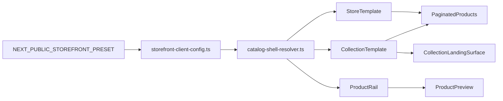

# Design Spec: preset-driven catalog-shell contract v1

## Status
- Proposed Phase 6 design/spec only
- This artifact does **not** implement storefront code changes
- Preset selection must remain driven only by [`NEXT_PUBLIC_STOREFRONT_PRESET`](../medusa-agency-boilerplate-storefront/src/lib/env.ts:21)
- This slice follows already-closed Phase 6 boundaries in [`StorefrontShellConfig`](../medusa-agency-boilerplate-storefront/src/lib/storefront-client-config.ts:74), [`landingSurfaces`](../medusa-agency-boilerplate-storefront/src/lib/storefront-client-config.ts:273), [`productSurfaces.supportHighlights`](../medusa-agency-boilerplate-storefront/src/lib/storefront-client-config.ts:231), and [`listingSurfaces.productCard`](../medusa-agency-boilerplate-storefront/src/lib/storefront-client-config.ts:258)
- Latest closed predecessor commit in user context: `4ffc410180bf6d7084d8616713e62b1d51ed7779`

## Problem statement

Phase 6 already formalized preset-driven customization for global shell, landing surfaces, product support highlights, and product-card presentation. The remaining browse-facing gap is the **catalog shell**: the framing around listing pages and featured catalog rails.

Current storefront behavior shows three separate hardcoded framing zones:

1. [`StoreTemplate`](../medusa-agency-boilerplate-storefront/src/modules/store/templates/index.tsx:9) owns the all-products page wrapper, sidebar placement, and hardcoded page title.
2. [`CollectionTemplate`](../medusa-agency-boilerplate-storefront/src/modules/collections/templates/index.tsx:10) owns the collection browse wrapper and composes [`CollectionLandingSurface`](../medusa-agency-boilerplate-storefront/src/modules/storefront-customization/components/collection-landing-surface/index.tsx:44) directly above the listing results.
3. [`ProductRail`](../medusa-agency-boilerplate-storefront/src/modules/home/components/featured-products/product-rail/index.tsx:9) owns its own heading, link row, spacing, and rail framing for catalog-facing merchandising on home.

At the same time, core browse mechanics remain intentionally shared:

- [`PaginatedProducts`](../medusa-agency-boilerplate-storefront/src/modules/store/templates/paginated-products.tsx:17) owns product fetching, pagination mapping, region lookup, and result grid composition.
- [`RefinementList`](../medusa-agency-boilerplate-storefront/src/modules/store/components/refinement-list/index.tsx:14) owns query-string mutations for sorting UI.
- [`Pagination`](../medusa-agency-boilerplate-storefront/src/modules/store/components/pagination/index.tsx:6) owns page navigation behavior.
- [`ProductPreview`](../medusa-agency-boilerplate-storefront/src/modules/products/components/product-preview/index.tsx:9) already delegates card presentation to the listing-surface contract.

Without a sanctioned catalog-shell boundary, the next client-specific browse request is likely to push teams toward:

- forking [`StoreTemplate`](../medusa-agency-boilerplate-storefront/src/modules/store/templates/index.tsx:9) or [`CollectionTemplate`](../medusa-agency-boilerplate-storefront/src/modules/collections/templates/index.tsx:10) per client;
- mixing page-framing changes into [`listingSurfaces.productCard`](../medusa-agency-boilerplate-storefront/src/lib/storefront-client-config.ts:258);
- leaking preset-specific markup into shared listing/query templates.

This slice should close that gap while keeping query logic, product-card internals, and existing landing surfaces separate.

## Current-state inventory

### Observed browse framing surfaces

#### 1. All-products store page shell
- Entry route: [`StorePage`](../medusa-agency-boilerplate-storefront/src/app/[countryCode]/(main)/store/page.tsx:22)
- Shared template: [`StoreTemplate`](../medusa-agency-boilerplate-storefront/src/modules/store/templates/index.tsx:9)
- Current responsibilities:
  - outer catalog layout wrapper;
  - placement of [`RefinementList`](../medusa-agency-boilerplate-storefront/src/modules/store/components/refinement-list/index.tsx:14);
  - hardcoded `All products` header;
  - suspense boundary placement for [`PaginatedProducts`](../medusa-agency-boilerplate-storefront/src/modules/store/templates/paginated-products.tsx:17).

#### 2. Collection browse page shell
- Entry route: [`CollectionPage`](../medusa-agency-boilerplate-storefront/src/app/[countryCode]/(main)/collections/[handle]/page.tsx:75)
- Shared template: [`CollectionTemplate`](../medusa-agency-boilerplate-storefront/src/modules/collections/templates/index.tsx:10)
- Current responsibilities:
  - same outer browse layout pattern as store page;
  - placement of [`CollectionLandingSurface`](../medusa-agency-boilerplate-storefront/src/modules/storefront-customization/components/collection-landing-surface/index.tsx:44);
  - spacing between landing surface and shared results grid;
  - suspense boundary placement for [`PaginatedProducts`](../medusa-agency-boilerplate-storefront/src/modules/store/templates/paginated-products.tsx:17).

#### 3. Home featured catalog rail shell
- Surface renderer path: [`HomeSectionRenderer`](../medusa-agency-boilerplate-storefront/src/modules/storefront-customization/components/home-section-renderer/index.tsx:327) -> [`ProductRail`](../medusa-agency-boilerplate-storefront/src/modules/home/components/featured-products/product-rail/index.tsx:9)
- Current responsibilities:
  - rail section spacing;
  - heading and action-link row;
  - framing around a collection-backed product list.

### What is explicitly not the catalog-shell boundary
- [`CollectionLandingSurface`](../medusa-agency-boilerplate-storefront/src/modules/storefront-customization/components/collection-landing-surface/index.tsx:44) is already covered by the landing-surface contract and should stay there.
- [`ProductPreview`](../medusa-agency-boilerplate-storefront/src/modules/products/components/product-preview/index.tsx:9) is already the listing-card boundary and should stay there.
- [`PaginatedProducts`](../medusa-agency-boilerplate-storefront/src/modules/store/templates/paginated-products.tsx:17), [`RefinementList`](../medusa-agency-boilerplate-storefront/src/modules/store/components/refinement-list/index.tsx:14), and [`Pagination`](../medusa-agency-boilerplate-storefront/src/modules/store/components/pagination/index.tsx:6) remain shared commerce/query mechanics.

## Scope

### In scope
- Define the next sanctioned Phase 6 browse boundary for **catalog shell / listing-page framing**.
- Identify which browse framing surfaces should become preset-owned in v1.
- Propose a typed contract shape near [`storefront-client-config.ts`](../medusa-agency-boilerplate-storefront/src/lib/storefront-client-config.ts:265).
- Recommend a minimal resolver and composition strategy consistent with existing Phase 6 surface resolvers.
- Document anti-fork guardrails and acceptance criteria for future implementation work.
- Briefly identify likely future implementation files only.

### Out of scope
- Any storefront implementation changes.
- Any validation, review, commit, or docs sync beyond this artifact.
- New env flags beyond [`NEXT_PUBLIC_STOREFRONT_PRESET`](../medusa-agency-boilerplate-storefront/src/lib/env.ts:21).
- Checkout, account, order, provider, backend, or Store API changes.
- Sorting, pagination, filtering, region lookup, or query behavior.
- Product-card internals already covered by [`listingSurfaces.productCard`](../medusa-agency-boilerplate-storefront/src/lib/storefront-client-config.ts:258).
- Reopening collection header/content composition already covered by [`landingSurfaces.collectionLanding`](../medusa-agency-boilerplate-storefront/src/lib/storefront-client-config.ts:275).
- Turning browse pages into an open-ended section builder.

## Recommended minimal v1 target

Recommended v1 scope: **formalize only the page and rail framing around browse results**, without touching query logic or card internals.

### Recommended sanctioned v1 boundary

1. **Store catalog intro shell**
   - Preset-owned intro/header framing for the all-products page.
   - Covers tone and presentation of the store page heading area.
   - Replaces the current hardcoded `All products` block in [`StoreTemplate`](../medusa-agency-boilerplate-storefront/src/modules/store/templates/index.tsx:28).

2. **Browse results frame shell**
   - Preset-owned framing around the existing store and collection browse result stack.
   - Covers wrapper treatment for the shared layout that contains [`RefinementList`](../medusa-agency-boilerplate-storefront/src/modules/store/components/refinement-list/index.tsx:14), the optional landing surface on collection pages, [`PaginatedProducts`](../medusa-agency-boilerplate-storefront/src/modules/store/templates/paginated-products.tsx:17), and [`Pagination`](../medusa-agency-boilerplate-storefront/src/modules/store/components/pagination/index.tsx:6).
   - Remains presentation-only.

3. **Featured collection rail shell**
   - Preset-owned framing for [`ProductRail`](../medusa-agency-boilerplate-storefront/src/modules/home/components/featured-products/product-rail/index.tsx:9).
   - Covers rail heading row, spacing, and wrapper tone.
   - Does **not** change product-card rendering or collection query behavior.

### Why this is the right v1 cut
- It closes the remaining high-visibility browse framing gap after landing and card contracts are already in place.
- It keeps ownership boundaries clean:
  - landing content stays in [`landingSurfaces`](../medusa-agency-boilerplate-storefront/src/lib/storefront-client-config.ts:273);
  - card presentation stays in [`listingSurfaces.productCard`](../medusa-agency-boilerplate-storefront/src/lib/storefront-client-config.ts:258);
  - query and business logic stay in shared store templates.
- It gives enough preset differentiation for browse architecture without turning catalog pages into a generic layout engine.

## What should become the sanctioned customization boundary in v1

### 1. `catalogShell.store.intro`
This surface should own:
- heading variant;
- optional eyebrow;
- title and supporting description copy;
- visual framing tone for the all-products intro block.

This surface should **not** own:
- store route metadata loading;
- sorting controls;
- product count query behavior;
- fetch behavior in [`PaginatedProducts`](../medusa-agency-boilerplate-storefront/src/modules/store/templates/paginated-products.tsx:17).

### 2. `catalogShell.store.results` and `catalogShell.collection.results`
These surfaces should own:
- browse wrapper frame treatment;
- browse wrapper tone;
- spacing density for the shell around existing child content.

These surfaces should **not** own:
- actual grid columns or gaps inside [`PaginatedProducts`](../medusa-agency-boilerplate-storefront/src/modules/store/templates/paginated-products.tsx:72);
- sort option definitions in [`SortProducts`](../medusa-agency-boilerplate-storefront/src/modules/store/components/refinement-list/sort-products/index.tsx:13);
- query-string behavior in [`RefinementList`](../medusa-agency-boilerplate-storefront/src/modules/store/components/refinement-list/index.tsx:19);
- collection landing section composition already resolved by [`resolveCollectionLandingSurface`](../medusa-agency-boilerplate-storefront/src/modules/storefront-customization/components/landing-surface-resolver.ts:18).

### 3. `catalogShell.featuredRail`
This surface should own:
- rail wrapper variant;
- heading-row layout style;
- section spacing density.

This surface should **not** own:
- which collection is loaded;
- `maxProducts` semantics;
- card internals delegated to [`ProductPreview`](../medusa-agency-boilerplate-storefront/src/modules/products/components/product-preview/index.tsx:22);
- shared copy source in [`storefrontConfig.copy.common.viewAll`](../medusa-agency-boilerplate-storefront/src/lib/storefront-config.ts:33), unless a future slice deliberately opens preset-owned browse copy.

## Proposed typed contract shape

Recommendation: add a new top-level config branch named `catalogShell` in [`StorefrontClientConfig`](../medusa-agency-boilerplate-storefront/src/lib/storefront-client-config.ts:265).

Rationale:
- `shell` is already reserved for global chrome in [`StorefrontShellConfig`](../medusa-agency-boilerplate-storefront/src/lib/storefront-client-config.ts:74).
- `landingSurfaces` already owns collection/content/post landing sections.
- `listingSurfaces` already owns product-card presentation.
- `catalogShell` clearly names the missing browse-frame layer without overloading the other contracts.

### Suggested type shape

```ts
export type StorefrontCatalogShellTone = "surface" | "muted"

export type StorefrontCatalogFrameVariant = "plain" | "panel"

export type StorefrontCatalogSpacing = "compact" | "comfortable"

export type StorefrontCatalogIntroVariant = "simple" | "editorial"

export type StorefrontFeaturedRailVariant = "split" | "stacked"

export type StorefrontStoreCatalogIntroSurface = {
  mode: "intro"
  variant: StorefrontCatalogIntroVariant
  eyebrow?: string
  title: string
  description?: string
  tone: StorefrontCatalogShellTone
}

export type StorefrontCatalogResultsShellSurface = {
  mode: "frame"
  variant: StorefrontCatalogFrameVariant
  tone: StorefrontCatalogShellTone
  spacing: StorefrontCatalogSpacing
}

export type StorefrontFeaturedRailShellSurface = {
  mode: "rail"
  variant: StorefrontFeaturedRailVariant
  tone: StorefrontCatalogShellTone
  spacing: StorefrontCatalogSpacing
}

export type StorefrontCatalogShellConfig = {
  store: {
    intro: StorefrontStoreCatalogIntroSurface
    results: StorefrontCatalogResultsShellSurface
  }
  collection: {
    results: StorefrontCatalogResultsShellSurface
  }
  featuredRail: StorefrontFeaturedRailShellSurface
}
```

### Suggested `StorefrontClientConfig` expansion

```ts
export type StorefrontClientConfig = {
  meta: { ... }
  theme: StorefrontTheme
  shell: StorefrontShellConfig
  landingSurfaces: { ... }
  productSurfaces: StorefrontProductSurfaces
  listingSurfaces: StorefrontListingSurfaces
  catalogShell: StorefrontCatalogShellConfig
  overridePolicy: { ... }
  guardrails: { ... }
}
```

### Contract notes
- `tone`, `variant`, and `spacing` are intentionally semantic and bounded.
- The contract should stay free of raw Tailwind classes, JSX, arbitrary slots, or callback injection.
- `collection` gets only `results`, because collection hero/content composition is already the responsibility of [`landingSurfaces.collectionLanding`](../medusa-agency-boilerplate-storefront/src/lib/storefront-client-config.ts:275).
- `store` gets an `intro` surface because the all-products page currently has no sanctioned intro boundary.
- `featuredRail` is separate because it is a catalog-facing merchandising shell, but not a full listing page.

## Recommended boundary pattern and resolver strategy

Follow the established Phase 6 resolver style from [`landing-surface-resolver.ts`](../medusa-agency-boilerplate-storefront/src/modules/storefront-customization/components/landing-surface-resolver.ts:12), [`listing-surface-resolver.ts`](../medusa-agency-boilerplate-storefront/src/modules/storefront-customization/components/listing-surface-resolver.ts:10), and [`shell-surface-resolver.ts`](../medusa-agency-boilerplate-storefront/src/modules/storefront-customization/components/shell-surface-resolver.ts:11).

### Recommended resolver exports
- `resolveStoreCatalogIntroSurface()`
- `resolveStoreCatalogResultsSurface()`
- `resolveCollectionCatalogResultsSurface()`
- `resolveFeaturedRailCatalogShellSurface()`

The resolver layer should do only one thing: return typed objects from `storefrontClientConfig.catalogShell`.

### Recommended composition pattern
- Shared templates continue to own orchestration and data loading.
- Preset-owned browse framing is resolved in thin storefront-customization presenters or thin shared-template adapters.
- No preset-name branching should appear in [`StoreTemplate`](../medusa-agency-boilerplate-storefront/src/modules/store/templates/index.tsx:9), [`CollectionTemplate`](../medusa-agency-boilerplate-storefront/src/modules/collections/templates/index.tsx:10), or [`ProductRail`](../medusa-agency-boilerplate-storefront/src/modules/home/components/featured-products/product-rail/index.tsx:9).

### Preferred future implementation pattern
1. Add one thin resolver file for `catalogShell`.
2. Add one or two small presentational wrappers for catalog intro/frame consumption if needed.
3. Let shared templates pass existing children into those wrappers.
4. Keep [`PaginatedProducts`](../medusa-agency-boilerplate-storefront/src/modules/store/templates/paginated-products.tsx:17), [`RefinementList`](../medusa-agency-boilerplate-storefront/src/modules/store/components/refinement-list/index.tsx:14), and [`Pagination`](../medusa-agency-boilerplate-storefront/src/modules/store/components/pagination/index.tsx:6) unchanged in responsibility.

### Explicitly avoid abstraction creep
- Do **not** create a universal surface registry engine for all future browse contexts.
- Do **not** create per-preset template trees for store, collection, or home catalog rails.
- Do **not** reopen landing-section composition inside this slice.
- Do **not** treat product-grid columns, sort models, or pagination logic as `catalogShell` concerns.

## Intended ownership split

### Shared storefront core remains owner of
- route entry points such as [`StorePage`](../medusa-agency-boilerplate-storefront/src/app/[countryCode]/(main)/store/page.tsx:22) and [`CollectionPage`](../medusa-agency-boilerplate-storefront/src/app/[countryCode]/(main)/collections/[handle]/page.tsx:75);
- collection and product fetching;
- region lookup;
- sorting and pagination behavior;
- suspense boundaries;
- query-string mutation behavior;
- product-card resolution through [`listingSurfaces.productCard`](../medusa-agency-boilerplate-storefront/src/lib/storefront-client-config.ts:258).

### Preset-driven catalog shell becomes owner of
- all-products intro framing;
- browse results wrapper treatment for store and collection pages;
- featured collection rail shell framing.

## Anti-fork guardrails

1. Do not fork [`StoreTemplate`](../medusa-agency-boilerplate-storefront/src/modules/store/templates/index.tsx:9), [`CollectionTemplate`](../medusa-agency-boilerplate-storefront/src/modules/collections/templates/index.tsx:10), or [`ProductRail`](../medusa-agency-boilerplate-storefront/src/modules/home/components/featured-products/product-rail/index.tsx:9) per preset.
2. Do not branch on concrete preset names inside shared browse templates.
3. Do not add new env switches beyond [`NEXT_PUBLIC_STOREFRONT_PRESET`](../medusa-agency-boilerplate-storefront/src/lib/env.ts:21).
4. Do not move collection hero/content responsibilities out of [`landingSurfaces.collectionLanding`](../medusa-agency-boilerplate-storefront/src/lib/storefront-client-config.ts:275).
5. Do not move product-card responsibilities out of [`listingSurfaces.productCard`](../medusa-agency-boilerplate-storefront/src/lib/storefront-client-config.ts:258).
6. Do not place sorting, filtering, pagination, region lookup, or product queries under `catalogShell`.
7. Do not introduce backend contracts, Store API shape changes, or Payload schema drift for browse framing.
8. Do not allow arbitrary JSX, slot injection, or class-string config inside the contract.
9. Do not extend this slice into checkout, account, order, provider, or operational flows.
10. Do not convert catalog shell into an open-ended page-builder abstraction.

## Acceptance criteria for future implementation, validation, and review

### Implementation acceptance criteria
- [`StorefrontClientConfig`](../medusa-agency-boilerplate-storefront/src/lib/storefront-client-config.ts:265) includes a typed `catalogShell` branch.
- Both existing presets in [`storefrontPresetCatalog`](../medusa-agency-boilerplate-storefront/src/lib/storefront-client-config.ts:325) provide full `catalogShell` values.
- The all-products page consumes a preset-resolved store intro shell instead of a hardcoded header block.
- Store and collection browse wrappers consume preset-resolved results-frame surfaces without changing fetch/query logic.
- [`ProductRail`](../medusa-agency-boilerplate-storefront/src/modules/home/components/featured-products/product-rail/index.tsx:9) consumes a preset-resolved featured-rail shell.
- [`CollectionLandingSurface`](../medusa-agency-boilerplate-storefront/src/modules/storefront-customization/components/collection-landing-surface/index.tsx:44) remains a separate landing contract and is only composed inside the collection browse shell.
- [`ProductPreview`](../medusa-agency-boilerplate-storefront/src/modules/products/components/product-preview/index.tsx:9) continues to own card-level presentation via the existing listing-surface contract.

### Validation acceptance criteria
- TypeScript passes with the new config branch populated for all presets.
- No new env variables are introduced.
- No Store API, backend, or provider contracts change.
- Query params for sorting and pagination behave the same as before.
- Product counts, pricing, pagination, and region-aware listing behavior remain unchanged.

### Review acceptance criteria
- Reviewer can point to a single sanctioned browse-framing boundary in config and resolver code.
- Reviewer can verify that landing surfaces, card surfaces, and query/business logic remain cleanly separated.
- Reviewer can verify there is no preset-specific branching spread across shared templates.
- Reviewer can verify no implementation spills into checkout/account/order/provider areas.

## Probable future implementation files

These files are the most likely touchpoints for a later implementation slice:

- [`medusa-agency-boilerplate-storefront/src/lib/storefront-client-config.ts`](../medusa-agency-boilerplate-storefront/src/lib/storefront-client-config.ts)
- [`medusa-agency-boilerplate-storefront/src/modules/storefront-customization/components`](../medusa-agency-boilerplate-storefront/src/modules/storefront-customization/components)
- likely new resolver file such as `catalog-shell-resolver.ts` under [`src/modules/storefront-customization/components`](../medusa-agency-boilerplate-storefront/src/modules/storefront-customization/components)
- possible thin presenters such as `catalog-results-shell.tsx` or `store-catalog-intro.tsx` under [`src/modules/storefront-customization/components`](../medusa-agency-boilerplate-storefront/src/modules/storefront-customization/components)
- [`medusa-agency-boilerplate-storefront/src/modules/store/templates/index.tsx`](../medusa-agency-boilerplate-storefront/src/modules/store/templates/index.tsx:9)
- [`medusa-agency-boilerplate-storefront/src/modules/collections/templates/index.tsx`](../medusa-agency-boilerplate-storefront/src/modules/collections/templates/index.tsx:10)
- [`medusa-agency-boilerplate-storefront/src/modules/home/components/featured-products/product-rail/index.tsx`](../medusa-agency-boilerplate-storefront/src/modules/home/components/featured-products/product-rail/index.tsx:9)

## Decision summary

### Recommended v1 scope
Use **`catalogShell.store.intro` + `catalogShell.store.results` + `catalogShell.collection.results` + `catalogShell.featuredRail`** as the sanctioned catalog-shell contract v1 boundary.

### Recommended typed contract
Add a new top-level `catalogShell` config branch with bounded semantic surface objects for:
- store intro;
- store results frame;
- collection results frame;
- featured rail shell.

### Recommended architectural rule
Keep browse framing preset-driven, while query logic, pagination, sorting, collection landing composition, and product-card internals remain in their existing dedicated boundaries.

## Mermaid overview


