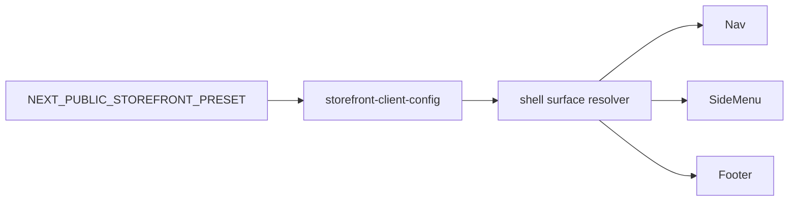

# Design Spec: preset-driven global-shell contract v1

## Status
- Closed and materialized Phase 6 slice
- Implementation delivered by commit [`4ffc410180bf6d7084d8616713e62b1d51ed7779`](../medusa-agency-boilerplate-storefront/src/lib/storefront-client-config.ts:74) `feat(storefront): roll out typed preset-driven global shell contract`
- Preset selector remains driven only by [`NEXT_PUBLIC_STOREFRONT_PRESET`](../medusa-agency-boilerplate-storefront/src/lib/env.ts:21)
- Validation closure: [`npx tsc --noEmit`](../medusa-agency-boilerplate-storefront/package.json) PASS, [`npm run build`](../medusa-agency-boilerplate-storefront/package.json:12) PASS, [`git diff --check`](../.gitignore) PASS
- Review closure: APPROVE, blocking issues = none, non-blocking observations = none

## Context and current state

Current global shell already has partial preset awareness, but the boundary is not yet formalized as a sanctioned typed contract.

Observed current behavior:
- [`RootLayout`](../medusa-agency-boilerplate-storefront/src/app/layout.tsx) exposes `data-storefront-preset`, `data-nav-variant`, and `data-footer-variant` from [`storefrontClientConfig`](../medusa-agency-boilerplate-storefront/src/lib/storefront-client-config.ts).
- [`PageLayout`](../medusa-agency-boilerplate-storefront/src/app/[countryCode]/(main)/layout.tsx) always renders [`Nav`](../medusa-agency-boilerplate-storefront/src/modules/layout/templates/nav/index.tsx) and [`Footer`](../medusa-agency-boilerplate-storefront/src/modules/layout/templates/footer/index.tsx) around the main page content.
- [`Nav`](../medusa-agency-boilerplate-storefront/src/modules/layout/templates/nav/index.tsx) already branches on `shell.nav.variant`, but it still owns both data-fetching and surface composition.
- [`Footer`](../medusa-agency-boilerplate-storefront/src/modules/layout/templates/footer/index.tsx) already branches on `shell.footer.variant`, but footer information density and composition are still effectively hardcoded.
- [`SideMenu`](../medusa-agency-boilerplate-storefront/src/modules/layout/components/side-menu/index.tsx) is a major shell surface, but it is not yet represented as a preset-owned contract surface.
- Phase 6 already established the resolver pattern for landing, listing, and adjacent product surfaces via [`landing-surface-resolver.ts`](../medusa-agency-boilerplate-storefront/src/modules/storefront-customization/components/landing-surface-resolver.ts), [`listing-surface-resolver.ts`](../medusa-agency-boilerplate-storefront/src/modules/storefront-customization/components/listing-surface-resolver.ts), and [`product-surface-resolver.ts`](../medusa-agency-boilerplate-storefront/src/modules/storefront-customization/components/product-surface-resolver.ts).

## Problem statement

Phase 6 has already sanctioned preset-driven overrides for landing surfaces, product support highlights, and listing card presentation. The remaining visible client-specific layer is the global storefront chrome: the shell around all merchandising and content pages.

Right now the shell is only partially preset-aware through coarse `nav` and `footer` variants. That leaves three risks:
1. teams may start forking [`Nav`](../medusa-agency-boilerplate-storefront/src/modules/layout/templates/nav/index.tsx), [`Footer`](../medusa-agency-boilerplate-storefront/src/modules/layout/templates/footer/index.tsx), or [`SideMenu`](../medusa-agency-boilerplate-storefront/src/modules/layout/components/side-menu/index.tsx) per client;
2. the side menu remains outside the sanctioned contract even though it is part of the storefront chrome;
3. future shell customization could spread as ad hoc branching inside shared templates instead of being resolved from a typed preset boundary.

The goal of this slice is to close that gap without expanding into account, checkout, order, provider, backend, or content-model redesign work.

## Scope

### In scope
- Formalize a preset-driven typed contract for global shell surfaces in [`storefront-client-config.ts`](../medusa-agency-boilerplate-storefront/src/lib/storefront-client-config.ts).
- Define the sanctioned v1 customization boundary for:
  - top navigation chrome;
  - mobile side menu chrome;
  - footer chrome.
- Define a minimal resolver strategy consistent with existing Phase 6 surface resolvers.
- Define anti-fork guardrails and future acceptance criteria.

### Out of scope
- Any implementation changes in storefront source files.
- New environment flags beyond `NEXT_PUBLIC_STOREFRONT_PRESET`.
- Checkout, account, order, payment, provider, backend, or Store API changes.
- New CMS schemas or new payload contracts.
- New announcement bars, promo ribbons, loyalty widgets, account-specific shell variants, or checkout shell divergence.
- Reworking locale and region data flow.
- Converting the entire shell into an open-ended section builder.

## Recommended minimal v1 target

Recommended v1 scope: **formalize exactly three global shell surfaces** and keep the contract presentation-only.

1. **Nav surface**
   - preset-owned chrome variant and desktop merchandising density;
   - preserves brand link, account entry, cart entry, region and locale integration, and existing navigation/content data sources.

2. **Side-menu surface**
   - preset-owned mobile/overlay chrome variant and optional display of supplemental content links;
   - preserves the mandatory core links and locale/region selectors.

3. **Footer surface**
   - preset-owned footer chrome variant and limited merchandising density knobs for categories and collections;
   - preserves existing contact, customer-care, social, and legal/core CTA responsibilities.

### Why this is the right v1 cut
- It closes the most visible remaining client-facing shell gap in Phase 6.
- It matches the already-established pattern of typed, display-oriented, preset-resolved surfaces.
- It avoids abstraction creep into generic layout composition, data contracts, or client-specific branching across shared core.
- It gives enough controlled flexibility to differentiate presets without enabling shell rewrites.

## Sanctioned customization boundary in v1

### 1. Nav as a sanctioned boundary
Allowed in v1:
- nav chrome variant;
- nav container treatment and shell tone;
- limit for how many existing content links appear in the desktop nav.

Locked in v1:
- data fetching in [`Nav`](../medusa-agency-boilerplate-storefront/src/modules/layout/templates/nav/index.tsx);
- brand-home link responsibility;
- account and cart entry points;
- region and locale plumbing;
- Medusa commerce state dependencies.

### 2. Side menu as a sanctioned boundary
Allowed in v1:
- side-menu visual variant;
- side-menu panel tone and shell styling;
- whether supplemental content items are rendered in the menu.

Locked in v1:
- mandatory core links to home, catalog, account, and cart;
- locale selector integration;
- region selector integration;
- close behavior and overlay semantics.

### 3. Footer as a sanctioned boundary
Allowed in v1:
- footer chrome variant;
- footer wrapper style;
- bounded limits for category and collection link density.

Locked in v1:
- existing data sources for footer payload, site settings, categories, and collections;
- customer care block responsibilities;
- social/contact/legal sections as part of shared shell responsibility;
- Medusa CTA placement as shared shell baseline unless a future slice explicitly reopens it.

## Proposed typed contract shape

Recommendation: **extend the existing `shell` contract instead of introducing a new top-level abstraction**. This keeps call sites stable, minimizes naming churn, and preserves the current mental model already used by [`RootLayout`](../medusa-agency-boilerplate-storefront/src/app/layout.tsx).

Suggested shape in [`storefront-client-config.ts`](../medusa-agency-boilerplate-storefront/src/lib/storefront-client-config.ts):

```ts
export type StorefrontShellTone = "surface" | "inverse"

export type StorefrontNavShellSurface = {
  variant: "bordered" | "floating"
  tone: StorefrontShellTone
  content: {
    desktopContentItemsLimit: number
  }
}

export type StorefrontSideMenuShellSurface = {
  variant: "drawer" | "glass"
  tone: StorefrontShellTone
  content: {
    showSupplementalContentItems: boolean
  }
}

export type StorefrontFooterShellSurface = {
  variant: "default" | "editorial"
  tone: StorefrontShellTone
  content: {
    categoryLinksLimit: number
    collectionLinksLimit: number
  }
}

export type StorefrontShellConfig = {
  nav: StorefrontNavShellSurface
  sideMenu: StorefrontSideMenuShellSurface
  footer: StorefrontFooterShellSurface
}
```

### Contract notes
- `variant` remains the main presentation discriminator.
- `tone` allows a small controlled visual switch without requiring custom branching throughout templates.
- `content.desktopContentItemsLimit` formalizes the already-implicit nav density decision now represented by `slice(0, 3)`.
- `content.showSupplementalContentItems` formalizes whether payload-driven content links appear in the mobile shell surface.
- `content.categoryLinksLimit` and `content.collectionLinksLimit` formalize existing footer density decisions now represented by `slice(0, 6)`.

### Explicit non-goals for the contract
The contract should **not** include:
- arbitrary shell slots;
- custom React component injection;
- alternate data sources;
- ability to remove core account/cart/region/locale responsibilities;
- preset-owned checkout or account shell branches.

## Recommended boundary pattern and resolver strategy

Recommendation: mirror the existing Phase 6 resolver pattern, but keep it extremely small.

### Resolver strategy
Introduce a dedicated shell resolver in storefront customization, conceptually similar to the existing landing/listing/product resolvers:
- `resolveNavShellSurface()`
- `resolveSideMenuShellSurface()`
- `resolveFooterShellSurface()`

The resolver should do only one thing: return typed surfaces from `storefrontClientConfig.shell`.

### Boundary pattern
- Shared layout templates remain responsible for data fetching and orchestration.
- Shared layout templates stop owning preset-specific surface decisions directly.
- Shared templates read resolved shell surfaces and pass them into small preset-aware shell surface renderers or use them to drive bounded class/style differences.
- Preset ownership stays at the surface contract and resolver layer, not in scattered inline branches.

### Recommended implementation shape later
Two acceptable future implementation patterns exist, but v1 should strongly prefer the first:

1. **Preferred**: keep [`Nav`](../medusa-agency-boilerplate-storefront/src/modules/layout/templates/nav/index.tsx), [`Footer`](../medusa-agency-boilerplate-storefront/src/modules/layout/templates/footer/index.tsx), and [`SideMenu`](../medusa-agency-boilerplate-storefront/src/modules/layout/components/side-menu/index.tsx) as shared templates and let them consume resolved shell surface objects.
2. **Fallback only if needed**: introduce tiny preset-aware wrapper presenters under storefront customization, but keep data-fetching in shared layout templates.

The following pattern should be avoided:
- per-preset component trees for full nav/footer/menu implementations;
- branching by preset name inside shared templates;
- generic plugin systems for shell composition.

## Decision summary

### Recommended v1 scope
Use **`shell.nav` + `shell.sideMenu` + `shell.footer`** as the sanctioned global-shell contract v1 boundary.

### Recommended ownership split
- [`storefront-client-config.ts`](../medusa-agency-boilerplate-storefront/src/lib/storefront-client-config.ts): typed shell contract and preset values.
- shared layout files: data orchestration and stable core responsibilities.
- storefront customization resolver: typed access to shell surfaces.
- optional preset-aware presentation helpers: only if needed to keep shared templates clean.

## Anti-fork guardrails

1. Do not fork [`Nav`](../medusa-agency-boilerplate-storefront/src/modules/layout/templates/nav/index.tsx), [`Footer`](../medusa-agency-boilerplate-storefront/src/modules/layout/templates/footer/index.tsx), or [`SideMenu`](../medusa-agency-boilerplate-storefront/src/modules/layout/components/side-menu/index.tsx) per client.
2. Do not branch on concrete preset names inside shared layout templates.
3. Do not add new env flags, runtime selectors, or backend contracts for shell presentation.
4. Do not turn shell customization into an unbounded slot system or section-builder abstraction.
5. Do not move account, cart, locale, or region responsibilities out of shared shell core.
6. Do not let shell customization spill into checkout, account, order, payment, or provider areas.
7. Do not change data ownership for navigation/footer payload fetching as part of this slice.
8. Keep shell contract display-oriented and bounded by typed enums, booleans, and small numeric limits.

## Acceptance criteria for future implementation, validation, and review

### Contract acceptance
- [`StorefrontShellConfig`](../medusa-agency-boilerplate-storefront/src/lib/storefront-client-config.ts) is extended to include typed `nav`, `sideMenu`, and `footer` shell surfaces.
- Both sanctioned presets define values for all three shell surfaces.
- Existing `nav.variant` and `footer.variant` behavior is preserved through the new typed shape.

### Boundary acceptance
- [`RootLayout`](../medusa-agency-boilerplate-storefront/src/app/layout.tsx) continues to expose shell-related data attributes from preset config without direct preset branching.
- [`Nav`](../medusa-agency-boilerplate-storefront/src/modules/layout/templates/nav/index.tsx), [`Footer`](../medusa-agency-boilerplate-storefront/src/modules/layout/templates/footer/index.tsx), and [`SideMenu`](../medusa-agency-boilerplate-storefront/src/modules/layout/components/side-menu/index.tsx) consume resolved shell surfaces rather than inventing new preset-specific branches.
- No new shell behavior depends on additional env flags or backend/API changes.

### Core-preservation acceptance
- Account, cart, locale, and region entry points remain present and functional.
- Checkout, account, order, provider, and backend areas remain untouched.
- Data fetching for navigation, footer payload, categories, collections, locales, and regions stays in shared core paths.

### Review acceptance
- Review can verify that shell customization is bounded to typed preset config and resolver usage.
- Review can verify that no new client fork path was introduced.
- Review can verify that the slice remains presentation-only and does not widen Phase 6 beyond storefront chrome.

## Likely future implementation files

Most likely files for a later implementation slice:
- [`medusa-agency-boilerplate-storefront/src/lib/storefront-client-config.ts`](../medusa-agency-boilerplate-storefront/src/lib/storefront-client-config.ts)
- [`medusa-agency-boilerplate-storefront/src/app/layout.tsx`](../medusa-agency-boilerplate-storefront/src/app/layout.tsx)
- [`medusa-agency-boilerplate-storefront/src/modules/layout/templates/nav/index.tsx`](../medusa-agency-boilerplate-storefront/src/modules/layout/templates/nav/index.tsx)
- [`medusa-agency-boilerplate-storefront/src/modules/layout/templates/footer/index.tsx`](../medusa-agency-boilerplate-storefront/src/modules/layout/templates/footer/index.tsx)
- [`medusa-agency-boilerplate-storefront/src/modules/layout/components/side-menu/index.tsx`](../medusa-agency-boilerplate-storefront/src/modules/layout/components/side-menu/index.tsx)
- probable new file: `medusa-agency-boilerplate-storefront/src/modules/storefront-customization/components/shell-surface-resolver.ts`
- possible small presentation helpers under `medusa-agency-boilerplate-storefront/src/modules/storefront-customization/components/`

## Minimal rollout sketch



## Final recommendation

Phase 6 should treat global shell closure as a **bounded presentation contract** for nav, side menu, and footer. The v1 slice should stop at typed shell surfaces plus a small resolver layer. That is enough to make storefront chrome a sanctioned preset boundary without opening a new abstraction layer or encouraging client forks.
