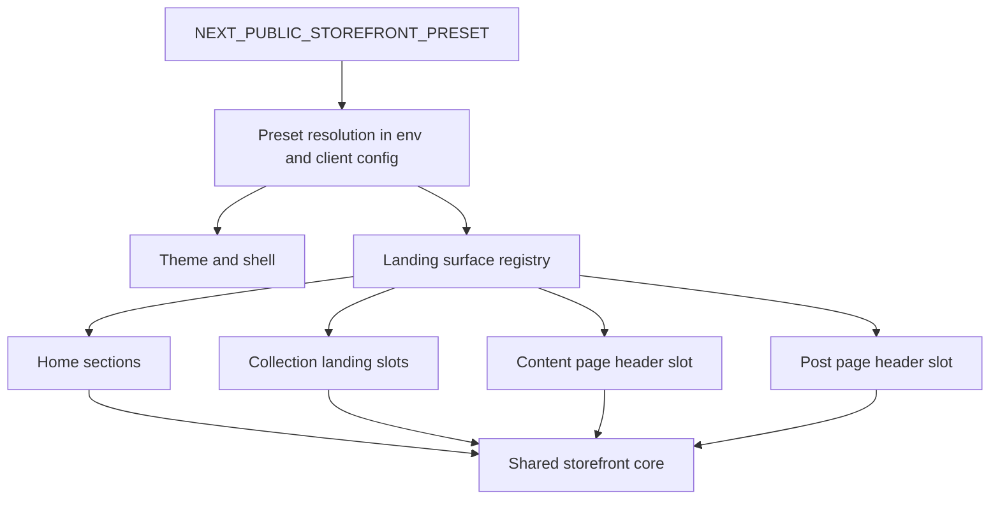

# Preset-driven landing-surface contract v1

Status: proposed design/spec for the next Phase 6 slice.

## Context and baseline

This design builds on the already materialized Phase 6 foundation documented in [`Docs/current_work.md`](Docs/current_work.md), [`Docs/master_repo_plan_v2.md`](Docs/master_repo_plan_v2.md), [`Docs/plan_analysis.md`](Docs/plan_analysis.md), [`Docs/env_contract.md`](Docs/env_contract.md), and [`.kilocode/skills/medusa-master-repo/SKILL.md`](.kilocode/skills/medusa-master-repo/SKILL.md).

The current storefront baseline is already established in:

- [`medusa-agency-boilerplate-storefront/src/lib/env.ts`](medusa-agency-boilerplate-storefront/src/lib/env.ts)
- [`medusa-agency-boilerplate-storefront/src/lib/storefront-client-config.ts`](medusa-agency-boilerplate-storefront/src/lib/storefront-client-config.ts)
- [`medusa-agency-boilerplate-storefront/src/app/layout.tsx`](medusa-agency-boilerplate-storefront/src/app/layout.tsx)
- [`medusa-agency-boilerplate-storefront/src/modules/storefront-customization/components/home-section-renderer/index.tsx`](medusa-agency-boilerplate-storefront/src/modules/storefront-customization/components/home-section-renderer/index.tsx)
- [`medusa-agency-boilerplate-storefront/src/modules/storefront-customization/components/collection-landing-header/index.tsx`](medusa-agency-boilerplate-storefront/src/modules/storefront-customization/components/collection-landing-header/index.tsx)
- [`medusa-agency-boilerplate-storefront/src/modules/storefront-customization/components/content-page-header/index.tsx`](medusa-agency-boilerplate-storefront/src/modules/storefront-customization/components/content-page-header/index.tsx)
- [`medusa-agency-boilerplate-storefront/src/modules/collections/templates/index.tsx`](medusa-agency-boilerplate-storefront/src/modules/collections/templates/index.tsx)
- [`medusa-agency-boilerplate-storefront/src/modules/content/templates/content-page.tsx`](medusa-agency-boilerplate-storefront/src/modules/content/templates/content-page.tsx)
- [`medusa-agency-boilerplate-storefront/src/modules/content/templates/post-page.tsx`](medusa-agency-boilerplate-storefront/src/modules/content/templates/post-page.tsx)

Current reality:

- sanctioned preset switching already exists via [`medusa-agency-boilerplate-storefront/src/lib/env.ts`](medusa-agency-boilerplate-storefront/src/lib/env.ts)
- homepage already uses a typed registry through [`medusa-agency-boilerplate-storefront/src/modules/storefront-customization/components/home-section-renderer/index.tsx`](medusa-agency-boilerplate-storefront/src/modules/storefront-customization/components/home-section-renderer/index.tsx)
- collection and informational/editorial pages already have preset-aware display surfaces, but they are still represented as dedicated flat config branches rather than one generalized landing-surface contract in [`medusa-agency-boilerplate-storefront/src/lib/storefront-client-config.ts`](medusa-agency-boilerplate-storefront/src/lib/storefront-client-config.ts)

## Workstream goal

Define a reusable, typed landing-surface contract that extends the preset-driven customization model from homepage-only sections to collection and informational/editorial entry surfaces, while preserving one shared storefront core and avoiding client-specific template forks.

In practical terms, v1 should make the current override zones read as one system rather than three unrelated exceptions:

- homepage section stack
- collection landing top surface
- content page top surface
- editorial post top surface

## Problem statement

Today the repository already proves that preset-driven presentation can reach beyond homepage, but the contract is uneven:

- homepage is modeled as a section registry in [`medusa-agency-boilerplate-storefront/src/modules/storefront-customization/components/home-section-renderer/index.tsx`](medusa-agency-boilerplate-storefront/src/modules/storefront-customization/components/home-section-renderer/index.tsx)
- collection landing and content headers are modeled as dedicated config fields in [`medusa-agency-boilerplate-storefront/src/lib/storefront-client-config.ts`](medusa-agency-boilerplate-storefront/src/lib/storefront-client-config.ts)
- shared templates already mount preset-aware components, but the repository does not yet define one normalized policy for which landing surfaces may vary, how they are typed, and where preset logic is allowed to live

Without a normalized contract, the next client rollout risks drifting into:

- special-case per-template conditionals
- ad hoc config growth by surface
- hidden template forks disguised as harmless UI tweaks

## Design objectives

1. Preserve the current single-switch preset model through [`medusa-agency-boilerplate-storefront/src/lib/env.ts`](medusa-agency-boilerplate-storefront/src/lib/env.ts) and [`medusa-agency-boilerplate-storefront/.env.local.example`](medusa-agency-boilerplate-storefront/.env.local.example).
2. Normalize landing customization as a single contract inside [`medusa-agency-boilerplate-storefront/src/lib/storefront-client-config.ts`](medusa-agency-boilerplate-storefront/src/lib/storefront-client-config.ts).
3. Keep all preset awareness behind dedicated customization boundaries, not inside commerce templates and flows.
4. Treat collection and content surfaces as display-only framing layers over existing data contracts.
5. Design the contract so a future third preset can plug into the same structure, but do not make the third preset itself part of this slice.

## In scope for v1

This workstream is only about landing-surface contract definition for these preset-driven surfaces:

- homepage section stack currently rendered through [`medusa-agency-boilerplate-storefront/src/modules/storefront-customization/components/home-section-renderer/index.tsx`](medusa-agency-boilerplate-storefront/src/modules/storefront-customization/components/home-section-renderer/index.tsx)
- collection landing entry surface mounted from [`medusa-agency-boilerplate-storefront/src/modules/collections/templates/index.tsx`](medusa-agency-boilerplate-storefront/src/modules/collections/templates/index.tsx)
- informational content-page entry surface mounted from [`medusa-agency-boilerplate-storefront/src/modules/content/templates/content-page.tsx`](medusa-agency-boilerplate-storefront/src/modules/content/templates/content-page.tsx)
- editorial post entry surface mounted from [`medusa-agency-boilerplate-storefront/src/modules/content/templates/post-page.tsx`](medusa-agency-boilerplate-storefront/src/modules/content/templates/post-page.tsx)

V1 should define:

- the normalized config shape
- sanctioned surface keys
- typed slot or section model per surface
- renderer boundary pattern
- anti-fork implementation rules
- validation and acceptance expectations for the later implementation slice

## Out of scope for v1

The following stay explicitly outside this workstream:

- any code implementation beyond design/spec
- any new env flags beyond [`medusa-agency-boilerplate-storefront/src/lib/env.ts`](medusa-agency-boilerplate-storefront/src/lib/env.ts)
- checkout, cart, account, order, payment, shipping, and provider integrations
- Store API contract changes
- Payload block-schema redesign or content-model redesign
- a third preset rollout
- global template automation and client init tooling from later roadmap phases
- reworking product-page support surfaces unless needed only as a future alignment note

## Proposed architecture

### 1. Normalize surfaces under one landing registry

Recommended direction: evolve the current `surfaces` branch in [`medusa-agency-boilerplate-storefront/src/lib/storefront-client-config.ts`](medusa-agency-boilerplate-storefront/src/lib/storefront-client-config.ts) into an explicit landing-surface registry with named surfaces and typed entries.

Conceptually:

- `home` remains a section-stack surface
- `collectionLanding` becomes a slot-driven landing surface
- `contentPage` becomes a slot-driven landing surface
- `postPage` becomes a slot-driven landing surface

Recommended shape at design level:

```ts
landingSurfaces: {
  home: {
    mode: 'sections'
    sections: [...]
  }
  collectionLanding: {
    mode: 'slots'
    slots: [...]
  }
  contentPage: {
    mode: 'slots'
    slots: [...]
  }
  postPage: {
    mode: 'slots'
    slots: [...]
  }
}
```

This keeps homepage compatible with the existing pattern while giving collection and content pages a contract that is conceptually equivalent instead of bespoke.

### 2. Use section stacks where full ordering matters, slots where template anchors matter

Not every landing surface needs a free-form ordered list.

Recommended modeling rule:

- use `sections` for homepage because reordering and stacking are the main customization axis
- use `slots` for collection and content surfaces because shared templates already define fixed page anatomy and only allow preset-aware framing at explicit anchors

This yields a practical implementation-level contract:

- homepage = ordered stack of sections
- collection landing = fixed anchor set such as top header and supporting pill area
- content page = fixed top header anchor
- editorial post = fixed top header anchor

### 3. Keep templates thin and mount one sanctioned customization boundary per surface

Shared templates in:

- [`medusa-agency-boilerplate-storefront/src/modules/collections/templates/index.tsx`](medusa-agency-boilerplate-storefront/src/modules/collections/templates/index.tsx)
- [`medusa-agency-boilerplate-storefront/src/modules/content/templates/content-page.tsx`](medusa-agency-boilerplate-storefront/src/modules/content/templates/content-page.tsx)
- [`medusa-agency-boilerplate-storefront/src/modules/content/templates/post-page.tsx`](medusa-agency-boilerplate-storefront/src/modules/content/templates/post-page.tsx)

should not grow preset conditionals. They should only mount a sanctioned renderer boundary near the existing override point.

Recommended pattern:

- templates pass existing page data into a surface renderer
- surface renderer resolves the active preset contract from [`medusa-agency-boilerplate-storefront/src/lib/storefront-client-config.ts`](medusa-agency-boilerplate-storefront/src/lib/storefront-client-config.ts)
- individual section or slot components remain in [`medusa-agency-boilerplate-storefront/src/modules/storefront-customization/components`](medusa-agency-boilerplate-storefront/src/modules/storefront-customization/components)
- all preset branching stays inside customization components or config resolution helpers

### 4. Keep the contract display-only and data-contract-neutral

The registry may consume only data that templates already have or can trivially derive from existing data.

Allowed examples:

- collection title
- collection product count already available in the template context
- content title and excerpt
- post title, excerpt, and published date
- existing static copy and preset labels from config

Disallowed examples:

- introducing a new backend query just to populate preset-only marketing chrome
- mutating cart, pricing, sort, pagination, or order state from landing-surface components
- requiring CMS schema changes only to support a preset-specific decorative surface

## Proposed contract shape

### Surface keys

Recommended sanctioned surface keys for v1:

- `home`
- `collectionLanding`
- `contentPage`
- `postPage`

### Homepage contract

Homepage keeps the current section-oriented model from [`medusa-agency-boilerplate-storefront/src/modules/storefront-customization/components/home-section-renderer/index.tsx`](medusa-agency-boilerplate-storefront/src/modules/storefront-customization/components/home-section-renderer/index.tsx).

No major conceptual rewrite is needed here. The main spec requirement is to reclassify homepage as one member of the generalized landing-surface registry rather than a one-off branch.

### Collection landing contract

Recommended slots for v1:

- `header`
- `supportPillars`

Recommended intent:

- `header` controls visual framing, eyebrow, variant, and preset copy shell
- `supportPillars` controls the supporting card rail already rendered inside [`medusa-agency-boilerplate-storefront/src/modules/storefront-customization/components/collection-landing-header/index.tsx`](medusa-agency-boilerplate-storefront/src/modules/storefront-customization/components/collection-landing-header/index.tsx)

Recommended data boundary:

- collection entity remains the only commerce object consumed by the top surface
- product grid, sort, pagination, and refinement stay outside the landing surface contract

### Informational content-page contract

Recommended slots for v1:

- `header`

Recommended header fields:

- variant
- eyebrow
- label mapping by page type

The existing behavior in [`medusa-agency-boilerplate-storefront/src/modules/content/templates/content-page.tsx`](medusa-agency-boilerplate-storefront/src/modules/content/templates/content-page.tsx) where the default header is skipped when the first content block is a hero should remain part of the contract, not an accidental implementation detail.

That means the contract must support:

- template-level gate remains shared
- preset-aware header renders only when the shared page anatomy says the default header should exist

### Editorial post contract

Recommended slots for v1:

- `header`

Recommended header fields:

- variant
- eyebrow
- label
- meta formatting policy based on existing published date

The cover image frame in [`medusa-agency-boilerplate-storefront/src/modules/content/templates/post-page.tsx`](medusa-agency-boilerplate-storefront/src/modules/content/templates/post-page.tsx) should remain out of scope for v1 normalization. It is adjacent to the header, but not necessary to prove the contract.

### Recommended config anatomy

Recommended design-level anatomy inside [`medusa-agency-boilerplate-storefront/src/lib/storefront-client-config.ts`](medusa-agency-boilerplate-storefront/src/lib/storefront-client-config.ts):

```ts
meta
theme
shell
landingSurfaces
overridePolicy
guardrails
```

Where `landingSurfaces` contains the sanctioned per-surface definitions and replaces the current mixed representation of homepage sections plus dedicated flat header branches.

## Likely implementation touchpoints for the future code slice

The eventual implementation would likely touch only these storefront areas:

- [`medusa-agency-boilerplate-storefront/src/lib/storefront-client-config.ts`](medusa-agency-boilerplate-storefront/src/lib/storefront-client-config.ts)
- [`medusa-agency-boilerplate-storefront/src/modules/storefront-customization/components/home-section-renderer/index.tsx`](medusa-agency-boilerplate-storefront/src/modules/storefront-customization/components/home-section-renderer/index.tsx)
- [`medusa-agency-boilerplate-storefront/src/modules/storefront-customization/components/collection-landing-header/index.tsx`](medusa-agency-boilerplate-storefront/src/modules/storefront-customization/components/collection-landing-header/index.tsx)
- [`medusa-agency-boilerplate-storefront/src/modules/storefront-customization/components/content-page-header/index.tsx`](medusa-agency-boilerplate-storefront/src/modules/storefront-customization/components/content-page-header/index.tsx)
- optionally a new shared landing-surface resolver under [`medusa-agency-boilerplate-storefront/src/modules/storefront-customization/components`](medusa-agency-boilerplate-storefront/src/modules/storefront-customization/components)
- [`medusa-agency-boilerplate-storefront/src/modules/collections/templates/index.tsx`](medusa-agency-boilerplate-storefront/src/modules/collections/templates/index.tsx)
- [`medusa-agency-boilerplate-storefront/src/modules/content/templates/content-page.tsx`](medusa-agency-boilerplate-storefront/src/modules/content/templates/content-page.tsx)
- [`medusa-agency-boilerplate-storefront/src/modules/content/templates/post-page.tsx`](medusa-agency-boilerplate-storefront/src/modules/content/templates/post-page.tsx)

These files should be the main implementation boundary. The slice should not require touching:

- checkout modules
- cart data layer
- account templates
- order templates
- backend modules
- env parsing in [`medusa-agency-boilerplate-storefront/src/lib/env.ts`](medusa-agency-boilerplate-storefront/src/lib/env.ts) unless only type-level comments or docstrings are needed

## Anti-fork implementation rules

The later implementation should follow these rules strictly.

### Rule 1. One preset switch only

The only sanctioned runtime selector remains [`medusa-agency-boilerplate-storefront/src/lib/env.ts`](medusa-agency-boilerplate-storefront/src/lib/env.ts) with `NEXT_PUBLIC_STOREFRONT_PRESET` documented in [`medusa-agency-boilerplate-storefront/.env.local.example`](medusa-agency-boilerplate-storefront/.env.local.example).

No per-surface env flags.
No collection-specific env flags.
No editorial-page env flags.

### Rule 2. No preset branching inside shared commerce templates

Shared templates may mount preset-aware renderers, but they must not accumulate direct `preset === ...` branches.

Bad pattern:

- preset checks scattered across collection or content templates

Good pattern:

- template imports one sanctioned customization renderer
- renderer resolves active surface config and renders display-only slots

### Rule 3. No backend drift for presentation

Landing-surface slots must consume existing template data only.

If a proposed slot needs new Store API fields or a new backend route, that slot is out of scope for this slice unless separately approved.

### Rule 4. Shared anatomy stays shared

Collection product grid, sorting, pagination, and refinement remain shared anatomy.
Content block rendering remains shared anatomy.
The contract only frames entry surfaces around those shared bodies.

### Rule 5. Slots must degrade safely

If slot data is absent, the slot should render nothing or a shared-safe fallback.

Examples:

- no support pillars means no support-pillar rail
- no excerpt means header renders title-only
- hero-first content page still skips default preset header

### Rule 6. Preset extension goes through config plus sanctioned components

Any future client-specific landing variation must be introduced by:

- extending the central config in [`medusa-agency-boilerplate-storefront/src/lib/storefront-client-config.ts`](medusa-agency-boilerplate-storefront/src/lib/storefront-client-config.ts)
- adding or adapting renderer components under [`medusa-agency-boilerplate-storefront/src/modules/storefront-customization/components`](medusa-agency-boilerplate-storefront/src/modules/storefront-customization/components)

It must not begin as a direct divergence in a shared template.

## Suggested implementation order

1. Reclassify current homepage, collection, and content presentation branches under one normalized landing-surface contract in [`medusa-agency-boilerplate-storefront/src/lib/storefront-client-config.ts`](medusa-agency-boilerplate-storefront/src/lib/storefront-client-config.ts).
2. Introduce a small shared resolver or renderer boundary in [`medusa-agency-boilerplate-storefront/src/modules/storefront-customization/components`](medusa-agency-boilerplate-storefront/src/modules/storefront-customization/components) for slot-based landing surfaces.
3. Migrate [`medusa-agency-boilerplate-storefront/src/modules/storefront-customization/components/collection-landing-header/index.tsx`](medusa-agency-boilerplate-storefront/src/modules/storefront-customization/components/collection-landing-header/index.tsx) to consume registry-driven slots rather than a bespoke branch.
4. Migrate [`medusa-agency-boilerplate-storefront/src/modules/storefront-customization/components/content-page-header/index.tsx`](medusa-agency-boilerplate-storefront/src/modules/storefront-customization/components/content-page-header/index.tsx) to consume registry-driven slots for `contentPage` and `postPage`.
5. Keep template edits limited to mounting the sanctioned renderer boundaries in [`medusa-agency-boilerplate-storefront/src/modules/collections/templates/index.tsx`](medusa-agency-boilerplate-storefront/src/modules/collections/templates/index.tsx), [`medusa-agency-boilerplate-storefront/src/modules/content/templates/content-page.tsx`](medusa-agency-boilerplate-storefront/src/modules/content/templates/content-page.tsx), and [`medusa-agency-boilerplate-storefront/src/modules/content/templates/post-page.tsx`](medusa-agency-boilerplate-storefront/src/modules/content/templates/post-page.tsx).
6. Re-run build and scope validation to confirm no drift into locked core.

## Validation plan for the later implementation slice

### Contract validation

- preset config remains type-safe and exhaustive for both existing presets in [`medusa-agency-boilerplate-storefront/src/lib/storefront-client-config.ts`](medusa-agency-boilerplate-storefront/src/lib/storefront-client-config.ts)
- all sanctioned surfaces have an explicit v1 definition for both `atelier` and `market`
- no new public env variables are introduced beyond [`medusa-agency-boilerplate-storefront/src/lib/env.ts`](medusa-agency-boilerplate-storefront/src/lib/env.ts)

### Boundary validation

- diffs stay confined to customization config, customization renderers, and the three landing templates
- no changes land under checkout, cart, account, order, or provider integration areas
- no backend changes are required

### Runtime and build validation

- storefront typecheck PASS
- storefront build PASS
- existing controlled static-param fallback behavior remains unchanged when Store API is unavailable

### Functional validation

Validate both presets on the same storefront core:

- homepage renders through the existing section model
- collection landing renders preset-specific framing while product grid and refinement remain shared
- informational page renders preset-specific header only when not already hero-led by content blocks
- editorial post renders preset-specific header with published-date meta while leaving content body unchanged

### Review validation

Manual review should confirm:

- no scattered preset conditionals in shared templates
- no new env knobs
- no hidden surface-specific fork path
- display-only framing remains separate from commerce behavior

## Acceptance criteria

The future implementation should be considered accepted when all of the following are true:

1. There is one documented landing-surface contract in [`medusa-agency-boilerplate-storefront/src/lib/storefront-client-config.ts`](medusa-agency-boilerplate-storefront/src/lib/storefront-client-config.ts) that covers homepage, collection landing, informational page header, and editorial post header.
2. `atelier` and `market` both satisfy that contract without bespoke per-template branching.
3. Shared templates only mount sanctioned customization boundaries and do not accumulate client-specific logic.
4. Collection and content customizations remain display-only and reuse existing data contracts.
5. No new env flag is added beyond [`medusa-agency-boilerplate-storefront/src/lib/env.ts`](medusa-agency-boilerplate-storefront/src/lib/env.ts).
6. Storefront build stays green and existing controlled fallback behavior remains intact.
7. Locked commerce core remains untouched.

## Risks

### Risk 1. Over-generalizing too early

Trying to create a universal CMS-like layout engine for all pages would overshoot the current need.

Mitigation:

- keep v1 small
- use sections only where ordering matters
- use slots where page anatomy is fixed

### Risk 2. Contract duplication under a new name

A superficial rename from `surfaces` to `landingSurfaces` without removing bespoke per-surface logic would not actually reduce fork risk.

Mitigation:

- require collection and content headers to consume the same registry philosophy as homepage
- keep one sanctioned rendering path

### Risk 3. Hidden data-scope creep

A tempting future request may try to enrich landing surfaces with new API-driven metadata.

Mitigation:

- enforce display-only rule for v1
- treat new data requirements as a separate scope decision

### Risk 4. Hero-first content pages create inconsistent assumptions

Content templates already skip the default header when the first block is a hero.

Mitigation:

- document this as part of the contract
- preserve that shared gating behavior in implementation

## Open questions

1. Should `collectionLanding` v1 formally treat `supportPillars` as a distinct slot or as part of the header composite surface. Recommended answer: distinct slot for clearer future evolution without forcing extra template branching.
2. Should the editorial post cover-image frame eventually join the contract. Recommended answer: no for v1; keep focus on top-of-page framing only.
3. Should `product.supportHighlights` be normalized under the same registry in a later slice. Recommended answer: later, after landing surfaces are stable, because product surfaces are adjacent but not part of this specific workstream.
4. Should the registry live as a rename of the current `surfaces` branch or as a nested `landingSurfaces` branch beside other non-landing overrides. Recommended answer: use a dedicated `landingSurfaces` branch if product surfaces remain outside this workstream, because it keeps the new contract semantically clean.

## Recommended architecture summary

Recommended architecture for v1:

- keep one preset switch in [`medusa-agency-boilerplate-storefront/src/lib/env.ts`](medusa-agency-boilerplate-storefront/src/lib/env.ts)
- centralize landing presentation under one typed registry in [`medusa-agency-boilerplate-storefront/src/lib/storefront-client-config.ts`](medusa-agency-boilerplate-storefront/src/lib/storefront-client-config.ts)
- represent homepage as ordered sections and collection or content surfaces as fixed slots
- let shared templates mount only sanctioned renderer boundaries
- keep all landing customization display-only and data-contract-neutral

## Mermaid overview



## Decision

Proceed with implementation only after using this document as the contract baseline for the next code slice. The purpose of the next slice is not to invent new presets or new data flows, but to normalize already sanctioned landing overrides into one reusable anti-fork system.
