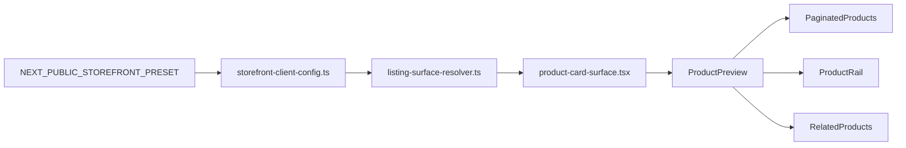

# preset-driven listing-surface contract v1

Status: closed and materialized Phase 6 slice, delivered by commit [`9b378f5af3d84a76545413a34c45d68b1bab8286`](medusa-agency-boilerplate-storefront/src/lib/storefront-client-config.ts:235) `feat(storefront): roll out typed preset-driven listing surface contract`.

## Цель slice

Спроектировать следующий sanctioned customization boundary для listing/card layer в storefront, продолжая траекторию:

- runtime selector через [`NEXT_PUBLIC_STOREFRONT_PRESET`](medusa-agency-boilerplate-storefront/src/lib/env.ts:21)
- landing layer через [`landingSurfaces`](medusa-agency-boilerplate-storefront/src/lib/storefront-client-config.ts:219)
- adjacent product detail layer через [`productSurfaces.supportHighlights`](medusa-agency-boilerplate-storefront/src/lib/storefront-client-config.ts:207)

Следующий шаг для Phase 6 — типизированный preset-driven contract для product listing/card presentation без форка shared commerce templates.

## Problem statement

Сейчас storefront уже допускает preset-driven кастомизацию для landing surfaces и adjacent product detail copy, но catalog/listing layer остаётся по сути shared hardcoded presentation:

- [`ProductPreview`](medusa-agency-boilerplate-storefront/src/modules/products/components/product-preview/index.tsx:9) — единый card renderer для catalog-facing списков
- [`PaginatedProducts`](medusa-agency-boilerplate-storefront/src/modules/store/templates/paginated-products.tsx:17) — shared grid и pagination mapping для store и collection listing
- [`ProductRail`](medusa-agency-boilerplate-storefront/src/modules/home/components/featured-products/product-rail/index.tsx:9) — featured listing rail на home
- [`RelatedProducts`](medusa-agency-boilerplate-storefront/src/modules/products/components/related-products/index.tsx:11) — adjacent listing на PDP

Из-за этого следующий клиентский шаг в catalog presentation почти неизбежно толкает к ad-hoc edits внутри shared template tree. Это противоречит Phase 6 trajectory: preset должен владеть display surface, а shared commerce core должен продолжать владеть data access, pagination, sorting, region-aware pricing и navigation behavior.

## Current-state inventory

### Наблюдаемые listing surfaces

1. **Reusable product card renderer**
   - [`ProductPreview`](medusa-agency-boilerplate-storefront/src/modules/products/components/product-preview/index.tsx:9)
   - Внутри использует [`Thumbnail`](medusa-agency-boilerplate-storefront/src/modules/products/components/thumbnail/index.tsx:17) и [`PreviewPrice`](medusa-agency-boilerplate-storefront/src/modules/products/components/product-preview/price.tsx:4)
   - Уже имеет минимальный встроенный variant hook через `isFeatured`, что указывает на существующую потребность в sanctioned card variant boundary

2. **Catalog grid container**
   - [`PaginatedProducts`](medusa-agency-boilerplate-storefront/src/modules/store/templates/paginated-products.tsx:17)
   - Владеет grid columns, gaps, product mapping и pagination
   - Используется как shared catalog core для store и collection flows

3. **Featured rail listing**
   - [`ProductRail`](medusa-agency-boilerplate-storefront/src/modules/home/components/featured-products/product-rail/index.tsx:9)
   - Владеет section framing, heading и grid layout
   - Использует тот же [`ProductPreview`](medusa-agency-boilerplate-storefront/src/modules/products/components/product-preview/index.tsx:9) с `isFeatured`

4. **Related-products listing**
   - [`RelatedProducts`](medusa-agency-boilerplate-storefront/src/modules/products/components/related-products/index.tsx:11)
   - Содержит adjacent heading/copy и product grid
   - Тоже использует тот же shared card renderer

5. **Loading state**
   - [`SkeletonProductPreview`](medusa-agency-boilerplate-storefront/src/modules/skeletons/components/skeleton-product-preview/index.tsx:3)
   - Повторяет assumptions о card geometry, но не должен становиться первым customization target

### Что уже выглядит как natural sanctioned boundary

Самая естественная boundary для следующего slice — **visual product card surface**, потому что:

- это уже централизованная точка reuse
- она покрывает store grid, collection grid, home featured rail и related products без дублирования data logic
- текущий `isFeatured` уже фактически является неформальным variant contract
- перенос card presentation под preset можно сделать без изменения backend contracts

## Candidate listing surfaces

### Candidate A — product card surface

**Что включает:**
- image ratio / visual frame
- spacing density
- title and price treatment
- featured vs default card variant

**Почему подходит:**
- минимальный blast radius
- reuse across all major listing entry points
- не требует менять pagination, sorting или query layer

**Риск:**
- если контракт сделать слишком granular, он начнёт протекать Tailwind/class-level деталями в config

### Candidate B — listing grid container surface

**Что включает:**
- columns / gap / density для store, collection, related, featured contexts
- возможно section-level wrappers

**Почему пока не рекомендуется для v1:**
- быстро превращается в context matrix
- затрагивает shared templates [`PaginatedProducts`](medusa-agency-boilerplate-storefront/src/modules/store/templates/paginated-products.tsx:17), [`ProductRail`](medusa-agency-boilerplate-storefront/src/modules/home/components/featured-products/product-rail/index.tsx:9), [`RelatedProducts`](medusa-agency-boilerplate-storefront/src/modules/products/components/related-products/index.tsx:11)
- высокий риск abstraction creep и preset-specific branching в commerce templates

### Candidate C — adjacent listing framing copy

**Что включает:**
- related products heading / description
- possibly store or collection list headings

**Почему не v1:**
- это уже ближе к surface framing, чем к core listing card
- часть таких задач логичнее переносить позже как отдельные informational or adjacent listing surfaces

### Candidate D — skeleton/loading surface

**Почему не v1:**
- слишком ранняя оптимизация
- должен следовать за финальным card contract, а не определять его

## Recommended minimal target for v1

Рекомендуемый minimal v1 scope:

- добавить новый typed contract `listingSurfaces.productCard`
- внутри него поддержать **две sanctioned card variants**:
  - `default` — для store grid, collection grid и related products
  - `featured` — для home featured rail
- ограничить scope только display-only card presentation
- **не** включать в v1:
  - grid columns and gap policy
  - pagination behavior
  - sorting behavior
  - collection/store template headings
  - related-products query logic
  - skeleton customization

Это даёт measurable Phase 6 progress без раздувания surface map и без форка shared templates.

## Why this v1 scope is the right cut

1. Он напрямую продолжает уже принятую архитектурную модель surface-by-surface preset rollout.
2. Он использует уже существующий reuse center — [`ProductPreview`](medusa-agency-boilerplate-storefront/src/modules/products/components/product-preview/index.tsx:9).
3. Он покрывает сразу несколько user-facing listing contexts.
4. Он избегает периметра, где commerce templates начинают ветвиться по preset.
5. Он сохраняет возможность позже добавить `listingSurfaces.grid` или `listingSurfaces.relatedProductsHeader`, если реально появится необходимость.

## Proposed typed contract shape

Рекомендуемая форма в районе [`storefront-client-config.ts`](medusa-agency-boilerplate-storefront/src/lib/storefront-client-config.ts):

```ts
export type StorefrontListingCardAspectRatio = "portrait" | "feature"

export type StorefrontListingCardFrame = "subtle" | "elevated"

export type StorefrontListingCardDensity = "compact" | "comfortable"

export type StorefrontListingCardTitleTone = "subtle" | "default"

export type StorefrontListingCardPriceTone = "muted" | "accent"

export type StorefrontListingCardSurface = {
  mode: "card"
  image: {
    aspectRatio: StorefrontListingCardAspectRatio
    frame: StorefrontListingCardFrame
  }
  content: {
    density: StorefrontListingCardDensity
    titleTone: StorefrontListingCardTitleTone
    priceTone: StorefrontListingCardPriceTone
  }
}

export type StorefrontListingSurfaces = {
  productCard: {
    default: StorefrontListingCardSurface
    featured: StorefrontListingCardSurface
  }
}
```

И затем расширить основной config shape:

```ts
export type StorefrontClientConfig = {
  meta: { ... }
  theme: StorefrontTheme
  shell: StorefrontShellConfig
  landingSurfaces: { ... }
  productSurfaces: StorefrontProductSurfaces
  listingSurfaces: StorefrontListingSurfaces
  overridePolicy: { ... }
  guardrails: { ... }
}
```

### Design notes по contract shape

- Контракт intentionally semantic, а не class-driven.
- В config не должны попадать raw Tailwind strings или JSX fragments.
- `default` и `featured` достаточно для v1, потому что это уже совпадает с текущей реальной usage model.
- Если future slice потребует context-specific divergence, её можно наращивать поверх `productCard` без ломки v1.

## Recommended resolver and template boundary pattern

Следовать текущему pattern из [`landing-surface-resolver.ts`](medusa-agency-boilerplate-storefront/src/modules/storefront-customization/components/landing-surface-resolver.ts:12) и [`product-surface-resolver.ts`](medusa-agency-boilerplate-storefront/src/modules/storefront-customization/components/product-surface-resolver.ts:10), но не уходить в generic registry engine.

### Recommended boundary

1. Ввести [`listing-surface-resolver.ts`](medusa-agency-boilerplate-storefront/src/modules/storefront-customization/components/listing-surface-resolver.ts) как тонкий resolver
2. Дать ему только narrow exports:
   - `resolveDefaultProductCardSurface()`
   - `resolveFeaturedProductCardSurface()`
3. Добавить один preset-owned presentational wrapper, например [`product-card-surface.tsx`](medusa-agency-boilerplate-storefront/src/modules/storefront-customization/components/product-card-surface.tsx)
4. Оставить [`ProductPreview`](medusa-agency-boilerplate-storefront/src/modules/products/components/product-preview/index.tsx:9) shared entry point для data-ready product card composition
5. Использовать resolver внутри thin customization wrapper или внутри [`ProductPreview`](medusa-agency-boilerplate-storefront/src/modules/products/components/product-preview/index.tsx:9), но не размазывать preset branching по [`PaginatedProducts`](medusa-agency-boilerplate-storefront/src/modules/store/templates/paginated-products.tsx:17), [`ProductRail`](medusa-agency-boilerplate-storefront/src/modules/home/components/featured-products/product-rail/index.tsx:9) и [`RelatedProducts`](medusa-agency-boilerplate-storefront/src/modules/products/components/related-products/index.tsx:11)

### Intended control flow



### What to avoid

- не создавать универсальный `resolveSurface` framework для всех будущих surfaces
- не добавлять preset-specific branching напрямую в listing templates
- не делать per-context resolver map, если на практике хватает `default` и `featured`
- не вытаскивать query, pricing или navigation decisions в customization layer

## Recommended ownership split

### Shared core remains owner of

- product fetching
- sorting
- pagination
- region lookup
- price calculation via [`getProductPrice`](medusa-agency-boilerplate-storefront/src/lib/util/get-product-price.ts)
- link routing via [`LocalizedClientLink`](medusa-agency-boilerplate-storefront/src/modules/common/components/localized-client-link/index.tsx)

### Preset-driven listing surface becomes owner of

- card visual shell
- image presentation ratio choice
- title/price tone and density
- sanctioned distinction between `default` and `featured` card presentation

## Anti-fork guardrails

1. **No new env switches** beyond [`NEXT_PUBLIC_STOREFRONT_PRESET`](medusa-agency-boilerplate-storefront/src/lib/env.ts:21).
2. **No preset branches inside shared commerce templates** except the sanctioned handoff to resolved card surface.
3. **No raw CSS/Tailwind in config**; only semantic enums or structured tokens.
4. **No backend or Store API drift** for listing customization.
5. **No changes to sorting, pagination, pricing, region or link behavior** as part of this slice.
6. **No expansion into checkout, account, order, provider or backend areas**.
7. **No full template forks** for store page, collection page, featured rail or related products.
8. **No abstraction creep** such as generic registries, plugin engines or nested context override graphs.
9. **Keep `ProductPreview` as the shared composition seam** instead of duplicating multiple preset-specific card components across templates.
10. **If skeleton geometry becomes mismatched later, treat it as follow-up**, not as required scope for v1.

## Scope

### In scope

- design a typed contract for preset-driven listing card presentation
- identify current listing/card surfaces and choose sanctioned v1 boundary
- specify resolver pattern and future implementation seam
- define acceptance criteria and guardrails

### Out of scope

- implementation of new types or components
- validation or review execution
- grid layout customization for every listing context
- new copy surfaces for store or related-products headers
- backend/API changes
- checkout/account/order/provider changes
- new env variables
- docs sync beyond this design artifact

## Acceptance criteria for future implementation step

Будущий implementation step можно считать корректным, если выполнены все условия:

1. В [`storefront-client-config.ts`](medusa-agency-boilerplate-storefront/src/lib/storefront-client-config.ts) появляется typed `listingSurfaces.productCard` contract.
2. Каждый preset в catalog содержит значения для `productCard.default` и `productCard.featured`.
3. Появляется thin resolver file по образцу [`product-surface-resolver.ts`](medusa-agency-boilerplate-storefront/src/modules/storefront-customization/components/product-surface-resolver.ts:10).
4. [`ProductPreview`](medusa-agency-boilerplate-storefront/src/modules/products/components/product-preview/index.tsx:9) начинает использовать sanctioned card surface boundary вместо hardcoded presentation assumptions.
5. [`PaginatedProducts`](medusa-agency-boilerplate-storefront/src/modules/store/templates/paginated-products.tsx:17), [`ProductRail`](medusa-agency-boilerplate-storefront/src/modules/home/components/featured-products/product-rail/index.tsx:9) и [`RelatedProducts`](medusa-agency-boilerplate-storefront/src/modules/products/components/related-products/index.tsx:11) продолжают работать без preset-specific template forks.
6. Sorting, pagination, query params, region resolution и price calculation не меняют поведение.
7. Не вводятся новые env flags.
8. Не затрагиваются backend/API/checkout/account/order/provider areas.
9. Override policy и guardrails обновлены так, чтобы listing surfaces были явно sanctioned, а full template fork оставался запрещённым.
10. Изменения остаются ограничены display-only listing/card layer.

## Likely future implementation files

Наиболее вероятный набор файлов для будущего implementation step:

- [`medusa-agency-boilerplate-storefront/src/lib/storefront-client-config.ts`](medusa-agency-boilerplate-storefront/src/lib/storefront-client-config.ts)
- [`medusa-agency-boilerplate-storefront/src/modules/storefront-customization/components/listing-surface-resolver.ts`](medusa-agency-boilerplate-storefront/src/modules/storefront-customization/components/listing-surface-resolver.ts)
- [`medusa-agency-boilerplate-storefront/src/modules/storefront-customization/components/product-card-surface.tsx`](medusa-agency-boilerplate-storefront/src/modules/storefront-customization/components/product-card-surface.tsx)
- [`medusa-agency-boilerplate-storefront/src/modules/products/components/product-preview/index.tsx`](medusa-agency-boilerplate-storefront/src/modules/products/components/product-preview/index.tsx)

Возможные, но не обязательные touchpoints:

- [`medusa-agency-boilerplate-storefront/src/modules/products/components/thumbnail/index.tsx`](medusa-agency-boilerplate-storefront/src/modules/products/components/thumbnail/index.tsx)
- [`medusa-agency-boilerplate-storefront/src/modules/products/components/product-preview/price.tsx`](medusa-agency-boilerplate-storefront/src/modules/products/components/product-preview/price.tsx)
- [`medusa-agency-boilerplate-storefront/src/modules/skeletons/components/skeleton-product-preview/index.tsx`](medusa-agency-boilerplate-storefront/src/modules/skeletons/components/skeleton-product-preview/index.tsx)

## Closure summary

Design intent этого slice теперь materialized в code scope:

- typed contract [`listingSurfaces.productCard`](medusa-agency-boilerplate-storefront/src/lib/storefront-client-config.ts:235) закрыт как sanctioned listing/card boundary с variants `default|featured`;
- thin resolver boundary materialized в [`resolveDefaultProductCardSurface()`](medusa-agency-boilerplate-storefront/src/modules/storefront-customization/components/listing-surface-resolver.ts:14) и [`resolveFeaturedProductCardSurface()`](medusa-agency-boilerplate-storefront/src/modules/storefront-customization/components/listing-surface-resolver.ts:17);
- preset-owned presentation consumer materialized в [`ProductCardSurface`](medusa-agency-boilerplate-storefront/src/modules/storefront-customization/components/product-card-surface.tsx:55), а не через template fork;
- shared [`ProductPreview`](medusa-agency-boilerplate-storefront/src/modules/products/components/product-preview/index.tsx:9) сохранён как thin shared composition boundary;
- helper touchpoints [`Thumbnail`](medusa-agency-boilerplate-storefront/src/modules/products/components/thumbnail/index.tsx:7) и [`PreviewPrice`](medusa-agency-boilerplate-storefront/src/modules/products/components/product-preview/price.tsx:4) были адаптированы внутри того же sanctioned display path без дрейфа к shared catalog template branching.

Validation, review и closure этого slice зафиксированы как:

- [`npx tsc --noEmit`](medusa-agency-boilerplate-storefront/package.json) — PASS
- [`npm run build`](medusa-agency-boilerplate-storefront/package.json:12) — PASS
- [`git diff --check`](.gitignore) — PASS
- lint intentionally не использовался как gate из-за известной unrelated issue на checkout page
- review verdict = APPROVE
- blocking issues = none
- non-blocking observations = none

Canonical guardrails после closure:

1. единственный sanctioned runtime selector остаётся [`NEXT_PUBLIC_STOREFRONT_PRESET`](medusa-agency-boilerplate-storefront/src/lib/env.ts:21);
2. [`listingSurfaces.productCard`](medusa-agency-boilerplate-storefront/src/lib/storefront-client-config.ts:235) остаётся semantic typed contract без raw Tailwind/class-string config;
3. [`ProductPreview`](medusa-agency-boilerplate-storefront/src/modules/products/components/product-preview/index.tsx:9) остаётся thin shared boundary;
4. [`ProductCardSurface`](medusa-agency-boilerplate-storefront/src/modules/storefront-customization/components/product-card-surface.tsx:55) является sanctioned presentation consumer, а не template fork;
5. preset branching не должен размазываться по shared catalog/card path.
