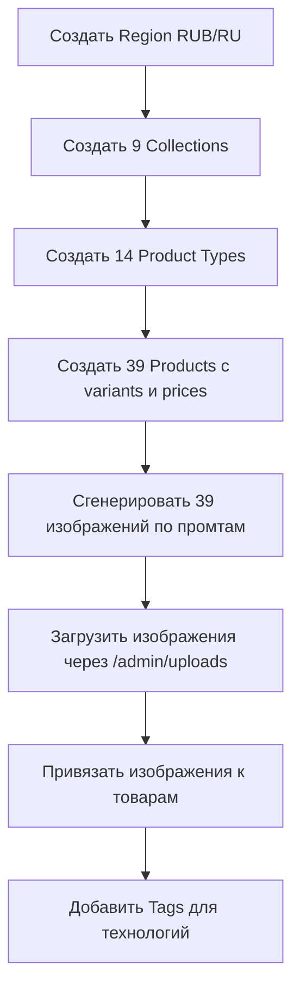

# План каталога IT-услуг для MedusaStore

> Дата: 2026-05-14
> Источник данных: `it_services_portfolio.md`
> Storefront: Next.js + Medusa v2

---

## A. Структура каталога

### Collections (категории в Medusa)

| # | handle | title |
|---|--------|-------|
| 1 | web-development | Разработка сайтов и веб-приложений |
| 2 | mobile-development | Мобильная разработка |
| 3 | chatbots-ai | Чат-боты и ИИ |
| 4 | integrations | Интеграции с учётными и российскими системами |
| 5 | devops-infrastructure | DevOps и серверная инфраструктура |
| 6 | security-qa | Безопасность и QA |
| 7 | analytics-seo-martech | Аналитика, SEO и MarTech |
| 8 | support-refactoring-ux | Поддержка, рефакторинг и UX |
| 9 | it-consulting | IT-консалтинг и аудит |

---

### Товары (Products)

#### Collection 1: Разработка сайтов и веб-приложений

##### Товар 1: Landing Page под ключ

- **handle:** `landing-page-pod-klyuch`
- **title:** Landing Page «под ключ» для лидогенерации
- **subtitle:** Одностраничный сайт с высокой конверсией под рекламу
- **type:** Веб-разработка
- **material:** JAMstack / Next.js 15 / Astro / Nuxt 3
- **metadata:**
  - `target_audience`: Запуск нового продукта, тестирование ниши, рекламные кампании
  - `tech_stack`: JAMstack, Next.js 15, Astro, Nuxt 3, headless-CMS
  - `integrations`: amoCRM, Bitrix24, RetailCRM, Яндекс Метрика, VK Реклама
  - `performance`: PageSpeed 90+, WebP/AVIF, Lazy Load
- **description (SEO-оптимизированный):**

> Закажите разработку лендинга с конверсией выше рынка. Индивидуальный дизайн Mobile First, мгновенная загрузка на JAMstack-стеке, интеграция с CRM и рекламными системами. Передача лидов в amoCRM, Bitrix24 или RetailCRM через API. Защита форм от ботов, оценки PageSpeed 90+. Идеально для запуска продукта, тестирования ниши и подготовки к рекламным кампаниям.

- **options:** `[{ title: "Пакет", values: ["Стандарт", "Премиум"] }]`
- **variants:**
  - Стандарт: 150 000 ₽
  - Премиум: 300 000 ₽

---

##### Товар 2: Корпоративный сайт

- **handle:** `korporativnyj-sajt`
- **title:** Корпоративный сайт (B2B/B2C портал)
- **subtitle:** Многостраничный сайт с CMS, блогом и личным кабинетом
- **type:** Веб-разработка
- **material:** Headless CMS / WordPress / 1С-Битрикс / Next.js
- **metadata:**
  - `target_audience`: Компании, формирующие репутацию и органический трафик
  - `tech_stack`: 1С-Битрикс, WordPress, Payload, Strapi, Directus, Next.js, Nuxt
  - `seo`: XML-карты, Schema.org JSON-LD, ЧПУ, hreflang, canonical
  - `security`: SSL, fail2ban, rate limiting, CSP
- **description (SEO-оптимизированный):**

> Разработка корпоративного сайта с продуманной информационной архитектурой. CMS с визуальным конструктором страниц, каталог услуг, блог, портфолио, личный кабинет. SEO-база из коробки: XML-карты, микроразметка Schema.org, шаблоны мета-тегов. Ролевая модель администрирования, аудит-журнал правок. Безопасность: SSL, защита от брутфорса, строгая CSP.

- **options:** `[{ title: "Масштаб", values: ["До 30 страниц", "До 100 страниц", "Безлимит"] }]`
- **variants:**
  - До 30 страниц: 350 000 ₽
  - До 100 страниц: 600 000 ₽
  - Безлимит: 1 000 000 ₽

---

##### Товар 3: Интернет-магазин Basic

- **handle:** `internet-magazin-basic`
- **title:** Интернет-магазин (E-commerce Basic)
- **subtitle:** Готовый магазин с каталогом, корзиной и онлайн-оплатой
- **type:** E-commerce
- **material:** Medusa.js / WooCommerce / 1С-Битрикс / InSales
- **metadata:**
  - `target_audience`: SMB с ассортиментом до 10 000 позиций
  - `tech_stack`: Medusa.js, 1С-Битрикс, WooCommerce, InSales
  - `payments`: ЮKassa, Т-Касса, CloudPayments, Robokassa, СБП
  - `logistics`: СДЭК, Почта России, Boxberry, Яндекс Доставка, DPD
- **description (SEO-оптимизированный):**

> Запуск интернет-магазина с полным циклом продаж: иерархический каталог с фильтрами, одностраничный чекаут, подключение ЮKassa, Т-Касса, СБП. Интеграция с СДЭК, Почтой России, Boxberry для автоматического расчёта доставки. Онлайн-касса по 54-ФЗ. Поиск с учётом морфологии русского языка. Email и SMS-уведомления клиентам и менеджерам.

- **options:** `[{ title: "Платформа", values: ["Medusa.js", "1С-Битрикс", "WooCommerce"] }]`
- **variants:**
  - Medusa.js: 400 000 ₽
  - 1С-Битрикс: 350 000 ₽
  - WooCommerce: 250 000 ₽

---

##### Товар 4: E-commerce Enterprise

- **handle:** `ecommerce-enterprise`
- **title:** E-commerce платформа Enterprise
- **subtitle:** Масштабируемый магазин для маркетплейсов и крупного ритейла
- **type:** E-commerce
- **material:** Микросервисы / Node.js / Go / Next.js / Kubernetes
- **metadata:**
  - `target_audience`: Маркетплейсы, крупные ритейлеры, B2B-платформы
  - `tech_stack`: Node.js, Go, Java, Python, Next.js, Nuxt, Remix
  - `infrastructure`: Docker, Kubernetes, Redis, Elasticsearch
  - `integrations`: 1С:ERP, SAP, Microsoft Dynamics
- **description (SEO-оптимизированный):**

> Enterprise-платформа электронной коммерции для высоконагруженных проектов. Микросервисная архитектура, кэширование Redis, полнотекстовый поиск Elasticsearch с учётом опечаток. Двусторонний обмен с 1С:ERP и SAP в реальном времени. Docker + Kubernetes с автомасштабированием. Промо-движок: программы лояльности, динамические промокоды, мультипрайсы.

- **options:** `[{ title: "Конфигурация", values: ["Стандарт", "Highload", "Маркетплейс"] }]`
- **variants:**
  - Стандарт: 2 000 000 ₽
  - Highload: 4 000 000 ₽
  - Маркетплейс: 6 000 000 ₽

---

##### Товар 5: Веб-приложение SPA/SaaS

- **handle:** `veb-prilozhenie-spa-saas`
- **title:** Веб-приложение (SPA / SaaS)
- **subtitle:** Интерактивный сервис уровня нативного приложения
- **type:** Веб-разработка
- **material:** React / Vue / Svelte / NestJS / FastAPI
- **metadata:**
  - `target_audience`: Продуктовые команды, SaaS-сервисы, кастомные CRM
  - `tech_stack`: React, Vue, Svelte, NestJS, Fastify, Go, FastAPI, Django
  - `auth`: JWT, OAuth 2.0, Яндекс ID, VK ID, T-ID, 2FA
  - `realtime`: WebSockets, Server-Sent Events
- **description (SEO-оптимизированный):**

> Разработка SPA и SaaS-приложений с логикой уровня нативного софта. React/Vue/Svelte на фронте, NestJS/FastAPI/Go на бэкенде. Аутентификация через Яндекс ID, VK ID, T-ID с двухфакторной защитой. Real-time обновления через WebSockets. Полное покрытие тестами: Unit, Integration, E2E. CI/CD-пайплайны для автоматического деплоя.

- **options:** `[{ title: "Сложность", values: ["MVP", "Продукт", "Enterprise"] }]`
- **variants:**
  - MVP: 800 000 ₽
  - Продукт: 2 500 000 ₽
  - Enterprise: 5 000 000 ₽

---

#### Collection 2: Мобильная разработка

##### Товар 6: Нативные iOS и Android приложения

- **handle:** `nativnye-ios-android`
- **title:** Нативные iOS и Android приложения
- **subtitle:** Премиальный UX с максимальной производительностью
- **type:** Мобильная разработка
- **material:** Swift / SwiftUI / Kotlin / Jetpack Compose
- **metadata:**
  - `target_audience`: Продукты с требованиями к производительности и аппаратным возможностям
  - `tech_stack`: Swift 5+, SwiftUI, Kotlin, Jetpack Compose, MVVM, TCA
  - `stores`: App Store, Google Play, RuStore, AppGallery
  - `push`: APNs, FCM, RuStore SDK, HMS Push
- **description (SEO-оптимизированный):**

> Нативная разработка мобильных приложений на Swift/SwiftUI для iOS и Kotlin/Jetpack Compose для Android. Архитектура MVVM/TCA, шифрование данных через Keychain/Keystore. Публикация в App Store, Google Play, RuStore и AppGallery с прохождением модерации. Push-уведомления, ASO-оптимизация страниц в сторах.

- **options:** `[{ title: "Платформа", values: ["iOS", "Android", "iOS + Android"] }]`
- **variants:**
  - iOS: 1 500 000 ₽
  - Android: 1 200 000 ₽
  - iOS + Android: 2 400 000 ₽

---

##### Товар 7: Кросс-платформенное приложение

- **handle:** `kross-platformennoe-prilozhenie`
- **title:** Кросс-платформенное приложение (React Native / Flutter)
- **subtitle:** Одно приложение для двух платформ с экономией 30-50%
- **type:** Мобильная разработка
- **material:** React Native / Flutter 3+ / Expo
- **metadata:**
  - `target_audience`: Стартапы и SMB для быстрого выхода на iOS и Android
  - `tech_stack`: React Native, Expo, Flutter 3+, Redux, Zustand, Riverpod, Bloc
  - `ci_cd`: Fastlane, EAS Build, Codemagic
  - `monitoring`: Sentry, AppMetrica, Firebase Crashlytics
- **description (SEO-оптимизированный):**

> Кросс-платформенная разработка на React Native или Flutter — одна кодовая база для iOS и Android. Экономия 30-50% бюджета при UX, близком к нативному. Нативные bridge-модули для сканеров, BLE, биометрии. CI/CD через Fastlane и EAS Build. Мониторинг через Sentry и AppMetrica.

- **options:** `[{ title: "Стек", values: ["React Native", "Flutter"] }]`
- **variants:**
  - React Native: 1 000 000 ₽
  - Flutter: 1 100 000 ₽

---

##### Товар 8: Публикация и ASO-оптимизация

- **handle:** `publikaciya-aso`
- **title:** Публикация, обновление и ASO-оптимизация
- **subtitle:** Сопровождение приложений в магазинах без привязки к разработке
- **type:** Мобильная разработка
- **material:** ASO / App Store Connect / Google Play Console
- **metadata:**
  - `target_audience`: Владельцы существующих приложений
  - `tools`: ASOdesk, AppFollow, AppTweak, AppMetrica, Firebase, AppsFlyer
  - `stores`: App Store, Google Play, RuStore, AppGallery
- **description (SEO-оптимизированный):**

> Профессиональная публикация и ASO-оптимизация мобильных приложений. Прохождение модерации App Store, Google Play, RuStore. Анализ ключевых запросов, A/B-тестирование иконок и скриншотов. Фазированная раскатка обновлений, атрибуция установок через AppsFlyer и AppMetrica.

- **options:** `[{ title: "Пакет", values: ["Разовая публикация", "Ежемесячное сопровождение"] }]`
- **variants:**
  - Разовая публикация: 50 000 ₽
  - Ежемесячное сопровождение: 80 000 ₽/мес

---

#### Collection 3: Чат-боты и ИИ

##### Товар 9: Чат-бот-лидогенератор

- **handle:** `chat-bot-lidogenerator`
- **title:** Чат-бот-лидогенератор
- **subtitle:** Бот для квалификации лидов и передачи в CRM
- **type:** Чат-боты
- **material:** Telegram Bot API / aiogram / grammY / PostgreSQL
- **metadata:**
  - `target_audience`: Компании, собирающие заявки в мессенджерах
  - `platforms`: Telegram, VK, WhatsApp, Max, Avito
  - `integrations`: amoCRM, Bitrix24, RetailCRM
- **description (SEO-оптимизированный):**

> Разработка чат-бота для лидогенерации в Telegram, VK, WhatsApp и Avito. Квиз-воронки с ветвлением, сбор контактов, мгновенная передача лидов в amoCRM или Bitrix24. Webhook-архитектура на VPS или облачных функциях Yandex Cloud.

- **options:** `[{ title: "Платформа", values: ["Telegram", "Мультиканальный"] }]`
- **variants:**
  - Telegram: 120 000 ₽
  - Мультиканальный: 250 000 ₽

---

##### Товар 10: Telegram Mini App

- **handle:** `telegram-mini-app`
- **title:** Telegram Mini App (магазин внутри мессенджера)
- **subtitle:** Каталог, корзина и платежи без выхода из Telegram
- **type:** Чат-боты
- **material:** Telegram Web Apps SDK / ЮKassa / Т-Касса
- **metadata:**
  - `target_audience`: Бренды, продающие через Telegram
  - `tech_stack`: Telegram Web Apps SDK, Telegram.WebApp API
  - `payments`: Telegram Payments, ЮKassa, Т-Касса, CloudPayments
- **description (SEO-оптимизированный):**

> Telegram Mini App — полноценный магазин внутри мессенджера. Каталог товаров, корзина, оплата через ЮKassa и Т-Касса без перехода в браузер. Криптографическая валидация initData, админ-панель для управления заказами. Адаптация под нативную тему Telegram.

- **options:** `[{ title: "Тип", values: ["Магазин", "Сервис бронирования"] }]`
- **variants:**
  - Магазин: 300 000 ₽
  - Сервис бронирования: 350 000 ₽

---

##### Товар 11: Бот-автоматизатор техподдержки

- **handle:** `bot-helpdesk`
- **title:** Бот-автоматизатор техподдержки (HelpDesk)
- **subtitle:** Первая линия поддержки с маршрутизацией тикетов
- **type:** Чат-боты
- **material:** Elasticsearch / Meilisearch / Qdrant / pgvector
- **metadata:**
  - `target_audience`: Компании с высоким потоком типовых обращений
  - `integrations`: Usedesk, Omnidesk, HappyFox, Jira Service Management
  - `analytics`: CSAT, FRT, среднее время решения
- **description (SEO-оптимизированный):**

> Бот первой линии техподдержки: нечёткий и семантический поиск по базе знаний, автоматическая генерация тикетов с SLA-таймерами. Интеграция с Usedesk, Jira Service Management. Эскалация по SLA, аналитика CSAT и FRT. Снижение нагрузки на операторов до 60%.

- **options:** `[{ title: "Масштаб", values: ["До 1000 обращений/мес", "Безлимит"] }]`
- **variants:**
  - До 1000 обращений/мес: 200 000 ₽
  - Безлимит: 450 000 ₽

---

##### Товар 12: ИИ-ассистент для бизнеса

- **handle:** `ii-assistent-llm-rag`
- **title:** ИИ-ассистент для бизнеса (LLM + RAG)
- **subtitle:** LLM-ассистент на корпоративных данных
- **type:** ИИ
- **material:** Claude / GPT-4o / YandexGPT / Qdrant / pgvector
- **metadata:**
  - `target_audience`: Компании с большой базой знаний
  - `models`: Claude Opus 4, GPT-4o, YandexGPT, GigaChat, Llama, Qwen, DeepSeek
  - `rag`: Qdrant, pgvector, Weaviate
  - `channels`: Виджет на сайте, Telegram, WhatsApp, VK
- **description (SEO-оптимизированный):**

> ИИ-ассистент на базе LLM с RAG-архитектурой: парсинг корпоративной базы знаний, генерация эмбеддингов, семантический поиск через Qdrant. Модели Claude, GPT-4o, YandexGPT или локальные open-source. Мультиканальность: сайт, Telegram, WhatsApp. Guardrails от prompt injection и галлюцинаций.

- **options:** `[{ title: "Модель", values: ["Облачная LLM", "Локальная модель"] }]`
- **variants:**
  - Облачная LLM: 500 000 ₽
  - Локальная модель: 800 000 ₽

---

##### Товар 13: Бот-букинг

- **handle:** `bot-buking`
- **title:** Бот-букинг (запись на услуги)
- **subtitle:** Автоматическая запись клиентов с синхронизацией расписания
- **type:** Чат-боты
- **material:** YClients / Altegio / Google Calendar / ЮKassa
- **metadata:**
  - `target_audience`: Салоны красоты, клиники, автосервисы, коворкинги
  - `integrations`: YClients, Altegio, Dikidi, Google Calendar, Яндекс Календарь
  - `payments`: СБП, ЮKassa, Т-Касса
- **description (SEO-оптимизированный):**

> Бот для автоматической записи клиентов на услуги. Синхронизация с YClients, Altegio, Google Calendar. Предотвращение overbooking, каскадные напоминания о визите, предоплата через СБП для снижения no-show. Сбор отзывов после визита.

- **options:** `[{ title: "Интеграция", values: ["YClients", "Собственная логика"] }]`
- **variants:**
  - YClients: 150 000 ₽
  - Собственная логика: 280 000 ₽

---

#### Collection 4: Интеграции с учётными и российскими системами

##### Товар 14: Внедрение CRM

- **handle:** `vnedrenie-crm`
- **title:** Внедрение CRM (amoCRM, Bitrix24, RetailCRM)
- **subtitle:** Настройка CRM «в одно окно» с автоматизацией рутины
- **type:** Интеграции
- **material:** amoCRM / Bitrix24 / RetailCRM / Mango Office
- **metadata:**
  - `target_audience`: Отделы продаж, теряющие лиды
  - `channels`: Email, Telegram, WhatsApp, VK, Авито
  - `telephony`: Mango Office, UIS, Телфин, Sipuni
- **description (SEO-оптимизированный):**

> Внедрение CRM-системы с нуля: проектирование воронок продаж, подключение всех каналов коммуникации в единый inbox. Интеграция телефонии Mango Office, UIS, Телфин. Digital-воронка с триггерами автосообщений. Ролевая модель доступа и аудит действий менеджеров.

- **options:** `[{ title: "CRM", values: ["amoCRM", "Bitrix24", "RetailCRM"] }]`
- **variants:**
  - amoCRM: 180 000 ₽
  - Bitrix24: 250 000 ₽
  - RetailCRM: 200 000 ₽

---

##### Товар 15: Корпоративный портал

- **handle:** `korporativnyj-portal`
- **title:** Корпоративный портал (Bitrix24, ELMA365, SimpleOne)
- **subtitle:** Единая платформа для проектов, задач и согласований
- **type:** Интеграции
- **material:** Bitrix24 / ELMA365 / SimpleOne
- **metadata:**
  - `target_audience`: Компании от 50 сотрудников
  - `integrations`: 1С:ЗУП, 1С:Бухгалтерия, SAP, Диадок, СБИС
- **description (SEO-оптимизированный):**

> Развёртывание корпоративного портала: визуальные маршруты согласования, экстранет для подрядчиков, интеграция с 1С:ЗУП и системами ЭДО. Автоматизация учёта активов, генерация договоров по шаблонам. Единая точка для коммуникации, задач и документов.

- **options:** `[{ title: "Платформа", values: ["Bitrix24", "ELMA365"] }]`
- **variants:**
  - Bitrix24: 400 000 ₽
  - ELMA365: 600 000 ₽

---

##### Товар 16: Интеграция с 1С и ERP

- **handle:** `integracija-1c-erp`
- **title:** Интеграция с 1С и ERP
- **subtitle:** Двусторонняя синхронизация 1С с сайтом и CRM
- **type:** Интеграции
- **material:** CommerceML / REST API 1С / RabbitMQ / Kafka
- **metadata:**
  - `target_audience`: Ритейл, оптовая торговля, производство
  - `protocols`: CommerceML, REST API, OData, SOAP
  - `optimization`: Дельта-обмен, очереди RabbitMQ/Kafka
- **description (SEO-оптимизированный):**

> Интеграция 1С с сайтом, CRM и маркетплейсами: двусторонний обмен каталогом, заказами, остатками и контрагентами. Поддержка CommerceML, REST API, OData. Дельта-обмен через RabbitMQ/Kafka для снижения нагрузки. Мониторинг расхождений и алерты.

- **options:** `[{ title: "Сложность", values: ["Базовая", "Расширенная"] }]`
- **variants:**
  - Базовая: 200 000 ₽
  - Расширенная: 500 000 ₽

---

##### Товар 17: Интеграция с маркетплейсами

- **handle:** `integracija-marketplejsy`
- **title:** Интеграция с маркетплейсами (WB, Ozon, Яндекс Маркет)
- **subtitle:** Централизованное управление товарами на всех площадках
- **type:** Интеграции
- **material:** API Wildberries / Ozon Seller / Яндекс Маркет Partner API
- **metadata:**
  - `target_audience`: Продавцы на нескольких площадках
  - `marketplaces`: Wildberries, Ozon, Яндекс Маркет, Мегамаркет, Lamoda
- **description (SEO-оптимизированный):**

> Интеграция с маркетплейсами Wildberries, Ozon, Яндекс Маркет и Мегамаркет через API. Массовая выгрузка карточек, синхронизация остатков и цен с 1С в реальном времени. Единый инбокс заказов, маршрутизация FBS/FBO, аналитика по площадкам.

- **options:** `[{ title: "Количество площадок", values: ["1-2", "3-5"] }]`
- **variants:**
  - 1-2 площадки: 180 000 ₽
  - 3-5 площадок: 400 000 ₽

---

##### Товар 18: API-шлюзы и middleware

- **handle:** `api-shlyuzy-middleware`
- **title:** API-шлюзы и middleware
- **subtitle:** Промежуточный слой для связи несовместимых систем
- **type:** Интеграции
- **material:** NestJS / Fastify / Go / RabbitMQ / Kafka
- **metadata:**
  - `target_audience`: Компании с разрозненным IT-ландшафтом
  - `tech_stack`: Node.js, NestJS, Fastify, Go, Python FastAPI
  - `security`: Rate Limiting, JSON Schema, OAuth 2.0, mTLS
- **description (SEO-оптимизированный):**

> Разработка API-шлюзов и middleware для связи несовместимых систем. Трансформация XML/JSON/CSV на лету, асинхронная обработка через RabbitMQ и Kafka. Rate Limiting, валидация схем, OAuth 2.0 и mTLS для безопасности внутренних интеграций.

- **options:** `[{ title: "Масштаб", values: ["До 5 интеграций", "Корпоративный"] }]`
- **variants:**
  - До 5 интеграций: 300 000 ₽
  - Корпоративный: 700 000 ₽

---

##### Товар 19: Платёжные интеграции и фискализация

- **handle:** `platezhnye-integracii`
- **title:** Платёжные интеграции и фискализация
- **subtitle:** Подключение платёжных систем и онлайн-касс по 54-ФЗ
- **type:** Интеграции
- **material:** ЮKassa / Т-Касса / CloudPayments / АТОЛ Онлайн
- **metadata:**
  - `target_audience`: Интернет-магазины, подписочные сервисы
  - `processors`: ЮKassa, Т-Касса, CloudPayments, Robokassa, Stripe
  - `fiscalization`: АТОЛ Онлайн, Orange Data, Ferma
- **description (SEO-оптимизированный):**

> Подключение российских платёжных систем: ЮKassa, Т-Касса, CloudPayments, СБП. Рекуррентные платежи с токенизацией по PCI DSS. Фискализация через АТОЛ Онлайн и Orange Data по 54-ФЗ. Безопасная обработка webhook-коллбеков с проверкой подписи.

- **options:** `[{ title: "Тип", values: ["Разовые платежи", "Подписки + рекуррент"] }]`
- **variants:**
  - Разовые платежи: 100 000 ₽
  - Подписки + рекуррент: 250 000 ₽

---

#### Collection 5: DevOps и серверная инфраструктура

##### Товар 20: Развёртывание серверов

- **handle:** `razvertyvanie-serverov`
- **title:** Развёртывание и тюнинг выделенных серверов
- **subtitle:** Подготовка VPS/Dedicated под production
- **type:** DevOps
- **material:** Docker / Nginx / PostgreSQL / Ubuntu LTS
- **metadata:**
  - `target_audience`: Проекты, выходящие с shared-хостинга
  - `providers`: Selectel, Yandex Cloud, VK Cloud, Hetzner
  - `security`: iptables, fail2ban, CrowdSec, SSH по ключам
- **description (SEO-оптимизированный):**

> Развёртывание и тюнинг серверов на Selectel, Yandex Cloud, VK Cloud или Hetzner. Настройка Nginx, PostgreSQL, Docker. Сетевая безопасность: iptables, fail2ban, SSH по ключам. Let's Encrypt SSL, HSTS. Автоматические бэкапы в S3 через restic/borg.

- **options:** `[{ title: "Тип", values: ["VPS", "Dedicated", "Kubernetes"] }]`
- **variants:**
  - VPS: 50 000 ₽
  - Dedicated: 100 000 ₽
  - Kubernetes: 250 000 ₽

---

##### Товар 21: CI/CD-конвейер

- **handle:** `ci-cd-konvejer`
- **title:** CI/CD-конвейер
- **subtitle:** Автоматизация сборки, тестирования и деплоя
- **type:** DevOps
- **material:** GitHub Actions / GitLab CI / Docker / ArgoCD
- **metadata:**
  - `target_audience`: Команды, деплоящие вручную
  - `tools`: GitLab CI, GitHub Actions, Jenkins, TeamCity
  - `strategies`: Blue-Green, Canary, Rolling, GitOps
- **description (SEO-оптимизированный):**

> Настройка CI/CD-конвейера: автоматическая сборка Docker-образов, статический анализ, unit/E2E тесты, Zero-Downtime деплой. GitHub Actions, GitLab CI или Jenkins. Стратегии Blue-Green и Canary. Уведомления о статусах в Telegram.

- **options:** `[{ title: "Платформа", values: ["GitHub Actions", "GitLab CI", "Jenkins"] }]`
- **variants:**
  - GitHub Actions: 80 000 ₽
  - GitLab CI: 100 000 ₽
  - Jenkins: 120 000 ₽

---

##### Товар 22: Масштабирование Highload

- **handle:** `masshtabirovanie-highload`
- **title:** Масштабирование Highload-систем
- **subtitle:** Подготовка архитектуры к тысячам RPS
- **type:** DevOps
- **material:** Nginx / Redis / PostgreSQL / CDN / Kubernetes
- **metadata:**
  - `target_audience`: Проекты с пиковыми нагрузками
  - `tech`: Nginx, HAProxy, Redis, Varnish, CDN, Citus, Vitess
- **description (SEO-оптимизированный):**

> Масштабирование highload-систем: балансировка через Nginx/HAProxy, кэширование Redis и Varnish, CDN для статики. Primary-Replica репликация PostgreSQL, шардирование через Citus. Подготовка к пиковым нагрузкам без деградации.

- **options:** `[{ title: "Масштаб", values: ["До 1000 RPS", "1000-10000 RPS", "10000+ RPS"] }]`
- **variants:**
  - До 1000 RPS: 200 000 ₽
  - 1000-10000 RPS: 500 000 ₽
  - 10000+ RPS: 1 200 000 ₽

---

##### Товар 23: Мониторинг и алертинг

- **handle:** `monitoring-alerting`
- **title:** Мониторинг и алертинг (Observability)
- **subtitle:** Метрики, логи, трейсы и система алертов
- **type:** DevOps
- **material:** Prometheus / Grafana / Loki / Sentry / OpenTelemetry
- **metadata:**
  - `target_audience`: Команды без системы мониторинга
  - `stack`: Prometheus, Grafana, VictoriaMetrics, Loki, Sentry, OpenTelemetry
- **description (SEO-оптимизированный):**

> Внедрение полного стека observability: Prometheus + Grafana для метрик, Loki для логов, Sentry + OpenTelemetry для трейсинга. Каскадные алерты в Telegram и SMS по степени критичности. Дашборды бизнес-метрик и SLA.

- **options:** `[{ title: "Стек", values: ["Базовый", "Полный observability"] }]`
- **variants:**
  - Базовый: 100 000 ₽
  - Полный observability: 300 000 ₽

---

#### Collection 6: Безопасность и QA

##### Товар 24: Информационная безопасность

- **handle:** `informacionnaya-bezopasnost`
- **title:** Информационная безопасность (DevSecOps и WAF)
- **subtitle:** Защита от взломов, DDoS и утечек ПДн
- **type:** Безопасность
- **material:** WAF / SAST / DAST / HashiCorp Vault
- **metadata:**
  - `target_audience`: Проекты с ПДн и платежами
  - `tools`: Semgrep, SonarQube, OWASP ZAP, Trivy, Snyk
  - `waf`: Qrator, DDoS-Guard, StormWall, Nemesida WAF
  - `compliance`: 152-ФЗ, Роскомнадзор
- **description (SEO-оптимизированный):**

> Комплексная информационная безопасность: аудит OWASP Top 10, SAST/DAST сканирование, WAF от Qrator и DDoS-Guard. Anti-DDoS L3/L4/L7, управление секретами через HashiCorp Vault. Соответствие 152-ФЗ, подготовка к проверкам Роскомнадзора.

- **options:** `[{ title: "Пакет", values: ["Аудит", "Аудит + внедрение защиты"] }]`
- **variants:**
  - Аудит: 150 000 ₽
  - Аудит + внедрение защиты: 400 000 ₽

---

##### Товар 25: QA — ручное тестирование

- **handle:** `qa-ruchnoe-testirovanie`
- **title:** QA — ручное тестирование и тест-менеджмент
- **subtitle:** Полный цикл ручного тестирования и приёмки релизов
- **type:** QA
- **material:** TestRail / Qase / Jira / YouTrack
- **metadata:**
  - `target_audience`: Команды без выделенного QA
  - `tools`: TestRail, Qase, Allure TestOps, Jira, YouTrack, Kaiten
- **description (SEO-оптимизированный):**

> Ручное тестирование полного цикла: тест-планы в TestRail/Qase, функциональное и регрессионное тестирование, smoke и usability. Баг-репорты в Jira с приоритизацией. UAT-сценарии и приёмка релизов со стейкхолдерами.

- **options:** `[{ title: "Формат", values: ["Разовый прогон", "Ежемесячная поддержка"] }]`
- **variants:**
  - Разовый прогон: 80 000 ₽
  - Ежемесячная поддержка: 150 000 ₽/мес

---

##### Товар 26: Автотестирование

- **handle:** `avtotestirovanie`
- **title:** Автотестирование (E2E, API, Mobile)
- **subtitle:** Автотесты в CI/CD для сокращения регрессии
- **type:** QA
- **material:** Playwright / Cypress / Appium / Allure Report
- **metadata:**
  - `target_audience`: Зрелые команды с длинной регрессией
  - `tools`: Playwright, Cypress, Selenium, Appium, Postman, Allure
- **description (SEO-оптимизированный):**

> Написание автотестов и интеграция в CI/CD: Playwright и Cypress для E2E, Postman/Newman для API, Appium для мобильных. Визуальная регрессия через Percy. Allure Report с историей запусков. Параллелизация и работа с flaky-тестами.

- **options:** `[{ title: "Тип", values: ["E2E Web", "API", "Mobile", "Комплекс"] }]`
- **variants:**
  - E2E Web: 150 000 ₽
  - API: 100 000 ₽
  - Mobile: 200 000 ₽
  - Комплекс: 400 000 ₽

---

##### Товар 27: Нагрузочное тестирование

- **handle:** `nagruzochnoe-testirovanie`
- **title:** Нагрузочное и стресс-тестирование
- **subtitle:** Симуляция трафика для выявления узких мест
- **type:** QA
- **material:** k6 / JMeter / Gatling / Яндекс.Танк
- **metadata:**
  - `target_audience`: Сервисы перед пиковыми событиями
  - `tools`: k6, JMeter, Gatling, Locust, Яндекс.Танк
  - `metrics`: RPS, p95/p99 latency, error rate
- **description (SEO-оптимизированный):**

> Нагрузочное тестирование через k6, JMeter или Яндекс.Танк: профили стабильной нагрузки, ramp-up, spike и soak. Метрики RPS, p95/p99 latency, error rate. Отчёт с выявлением узких мест и рекомендациями по тюнингу.

- **options:** `[{ title: "Сценарий", values: ["Базовый", "Комплексный с рекомендациями"] }]`
- **variants:**
  - Базовый: 100 000 ₽
  - Комплексный с рекомендациями: 250 000 ₽

---

#### Collection 7: Аналитика, SEO и MarTech

##### Товар 28: Техническое SEO

- **handle:** `tekhnicheskoe-seo`
- **title:** Техническое SEO
- **subtitle:** Настройка технической базы под Яндекс и Google
- **type:** SEO
- **material:** Schema.org / XML-sitemap / Яндекс.Вебмастер / GSC
- **metadata:**
  - `target_audience`: Сайты с амбициями на органический трафик
  - `tools`: Яндекс.Вебмастер, Google Search Console, Schema.org JSON-LD
- **description (SEO-оптимизированный):**

> Техническое SEO для Яндекса и Google: настройка robots.txt, генерация XML-sitemap, микроразметка Schema.org JSON-LD. Шаблоны мета-тегов, canonical, hreflang. Устранение битых ссылок, корректные редиректы, работа с дублями.

- **options:** `[{ title: "Объём", values: ["До 500 страниц", "500+ страниц"] }]`
- **variants:**
  - До 500 страниц: 80 000 ₽
  - 500+ страниц: 200 000 ₽

---

##### Товар 29: Сквозная бизнес-аналитика

- **handle:** `skvoznaya-biznes-analitika`
- **title:** Сквозная бизнес-аналитика
- **subtitle:** Связь рекламных расходов с выручкой в CRM
- **type:** Аналитика
- **material:** Roistat / ClickHouse / Yandex DataLens / Power BI
- **metadata:**
  - `target_audience`: Компании с несколькими рекламными каналами
  - `tools`: Roistat, Calltouch, CoMagic, ClickHouse, DataLens, Superset
- **description (SEO-оптимизированный):**

> Сквозная аналитика: агрегация данных из Яндекс Директ, VK Реклама, CRM в единый DWH на ClickHouse. Коллтрекинг с динамической подменой номеров. Дашборды в Yandex DataLens или Power BI с расчётом реального ROMI.

- **options:** `[{ title: "Масштаб", values: ["Базовая", "С коллтрекингом и DWH"] }]`
- **variants:**
  - Базовая: 150 000 ₽
  - С коллтрекингом и DWH: 400 000 ₽

---

##### Товар 30: Server-Side Tracking

- **handle:** `server-side-tracking`
- **title:** Server-Side Tracking
- **subtitle:** Серверный сбор аналитики без потерь от блокировщиков
- **type:** Аналитика
- **material:** Server-side GTM / First-party cookies / Measurement Protocol
- **metadata:**
  - `target_audience`: Проекты, теряющие до 30% данных из-за блокировщиков
- **description (SEO-оптимизированный):**

> Server-Side Tracking: перенос сбора событий на сервер. Server-side GTM на собственном поддомене, обход ITP/ETP. Обогащение данных бизнес-метриками. API-интеграции с Яндекс Метрикой и GA4 Measurement Protocol.

- **options:** `[{ title: "Тип", values: ["Базовый SST", "SST + обогащение данных"] }]`
- **variants:**
  - Базовый SST: 120 000 ₽
  - SST + обогащение данных: 280 000 ₽

---

##### Товар 31: Web Performance Optimization

- **handle:** `web-performance-optimization`
- **title:** Web Performance Optimization (Core Web Vitals)
- **subtitle:** Ускорение до топ-показателей Core Web Vitals
- **type:** SEO
- **material:** Vite / WebP / AVIF / Critical CSS / CDN
- **metadata:**
  - `target_audience`: Сайты с проблемами скорости
  - `metrics`: LCP, INP, CLS
- **description (SEO-оптимизированный):**

> Оптимизация Core Web Vitals: LCP, INP, CLS. Конвертация медиа в WebP/AVIF, responsive images, инлайнинг critical CSS. Code splitting через Vite/Turbopack, preload ключевых ресурсов. Локальный хостинг шрифтов.

- **options:** `[{ title: "Глубина", values: ["Аудит + quick wins", "Полная оптимизация"] }]`
- **variants:**
  - Аудит + quick wins: 60 000 ₽
  - Полная оптимизация: 180 000 ₽

---

#### Collection 8: Поддержка, рефакторинг и UX

##### Товар 32: Code Review и рефакторинг

- **handle:** `code-review-refaktoring`
- **title:** Code Review и рефакторинг
- **subtitle:** Аудит кода и модернизация для ускорения разработки
- **type:** Поддержка
- **material:** TypeScript / ESLint / Prettier / DDD / OpenAPI
- **metadata:**
  - `target_audience`: Проекты с накопленным техдолгом
- **description (SEO-оптимизированный):**

> Независимый аудит кода: выявление антипаттернов, узких мест, избыточных зависимостей. Внедрение линтеров и строгой типизации. Рефакторинг по DDD, оптимизация запросов к БД. OpenAPI-спецификации и ADR.

- **options:** `[{ title: "Формат", values: ["Аудит-отчёт", "Аудит + рефакторинг"] }]`
- **variants:**
  - Аудит-отчёт: 100 000 ₽
  - Аудит + рефакторинг: 350 000 ₽

---

##### Товар 33: SLA-поддержка IT-инфраструктуры

- **handle:** `sla-podderzhka`
- **title:** SLA-поддержка IT-инфраструктуры
- **subtitle:** Аутсорс поддержки с гарантированным Uptime
- **type:** Поддержка
- **material:** ITSM / Jira Service Management / DRP
- **metadata:**
  - `target_audience`: Бизнесы, для которых простой критичен
  - `sla`: 99.9% / 99.95% / 99.99% Uptime
- **description (SEO-оптимизированный):**

> SLA-поддержка с гарантированным Uptime 99.9-99.99%. Фиксированные сроки реакции P1-P4, Patch Management с тестированием на staging. Инцидент-менеджмент с Root Cause Analysis. Disaster Recovery учения.

- **options:** `[{ title: "SLA", values: ["99.9%", "99.95%", "99.99%"] }]`
- **variants:**
  - 99.9%: 80 000 ₽/мес
  - 99.95%: 150 000 ₽/мес
  - 99.99%: 300 000 ₽/мес

---

##### Товар 34: UX/UI аудит и редизайн

- **handle:** `ux-ui-audit-redizajn`
- **title:** UX/UI аудит и редизайн
- **subtitle:** Исследование UX на данных и проектирование нового интерфейса
- **type:** UX/UI
- **material:** Figma / Webvisor / Hotjar / A/B-тесты / WCAG 2.2
- **metadata:**
  - `target_audience`: Продукты с низкой конверсией
- **description (SEO-оптимизированный):**

> UX/UI аудит на данных: записи сессий Webvisor, тепловые карты, CJM. A/B-тесты через VWO и GrowthBook. Дизайн-система в Figma. Проверка доступности по WCAG 2.2 AA. Измеримый рост конверсии.

- **options:** `[{ title: "Глубина", values: ["Аудит", "Аудит + редизайн"] }]`
- **variants:**
  - Аудит: 120 000 ₽
  - Аудит + редизайн: 400 000 ₽

---

##### Товар 35: Восстановление после взлома

- **handle:** `vosstanovlenie-posle-vzloma`
- **title:** Восстановление после взлома и очистка сайта
- **subtitle:** Экстренная очистка, устранение уязвимостей, снятие санкций
- **type:** Безопасность
- **material:** AI-Bolit / ImunifyAV / access.log
- **metadata:**
  - `target_audience`: Экстренные случаи: заражение, санкции поисковиков
- **description (SEO-оптимизированный):**

> Экстренное восстановление после взлома: изоляция, поиск веб-шеллов и бэкдоров. Анализ access.log для определения вектора атаки. Снятие санкций в Яндекс.Вебмастере и Google Search Console. Усиление защиты.

- **options:** `[{ title: "Срочность", values: ["Стандарт 48ч", "Экстренный 4ч"] }]`
- **variants:**
  - Стандарт 48ч: 80 000 ₽
  - Экстренный 4ч: 200 000 ₽

---

##### Товар 36: HR- и обучающие чат-боты

- **handle:** `hr-obuchayushchie-boty`
- **title:** HR- и обучающие чат-боты
- **subtitle:** Автоматизация онбординга и тестирования знаний
- **type:** Чат-боты
- **material:** LDAP / 1С:ЗУП / iSpring / GetCourse
- **metadata:**
  - `target_audience`: Компании с активным наймом и обучением
- **description (SEO-оптимизированный):**

> HR-бот для автоматизации онбординга: drip-кампании с материалами по должности, интерактивное тестирование с геймификацией. Интеграция с 1С:ЗУП и LDAP. Автоматический отзыв прав при увольнении.

- **options:** `[{ title: "Функционал", values: ["Онбординг", "Онбординг + тестирование"] }]`
- **variants:**
  - Онбординг: 180 000 ₽
  - Онбординг + тестирование: 320 000 ₽

---

#### Collection 9: IT-консалтинг и аудит

##### Товар 37: Технический аудит перед разработкой

- **handle:** `tekhnicheskij-audit`
- **title:** Технический аудит перед разработкой
- **subtitle:** Независимая оценка задачи: стек, архитектура, бюджет, риски
- **type:** Консалтинг
- **material:** ТЗ / Декомпозиция / Архитектура
- **metadata:**
  - `target_audience`: Владельцы бизнеса перед выбором подрядчика
- **description (SEO-оптимизированный):**

> Технический аудит перед разработкой: перевод бизнес-целей в требования, рекомендации по стеку и архитектуре. Декомпозиция задач, оценка трудозатрат, анализ рисков. ТЗ в формате для тендера с критериями приёмки.

- **options:** `[{ title: "Глубина", values: ["Экспресс-аудит", "Полный аудит с ТЗ"] }]`
- **variants:**
  - Экспресс-аудит: 50 000 ₽
  - Полный аудит с ТЗ: 150 000 ₽

---

##### Товар 38: CTO as a Service

- **handle:** `cto-as-a-service`
- **title:** CTO as a Service
- **subtitle:** Выделенные часы технического директора в месяц
- **type:** Консалтинг
- **material:** Стратегия / Найм / Code Review / Архитектура
- **metadata:**
  - `target_audience`: Стартапы и SMB без штатного CTO
- **description (SEO-оптимизированный):**

> CTO as a Service: технологическая дорожная карта, помощь в найме и техническом интервью, ревью архитектурных решений. Аудит кода подрядчиков, участие в переговорах с инвесторами.

- **options:** `[{ title: "Пакет часов", values: ["20 ч/мес", "40 ч/мес"] }]`
- **variants:**
  - 20 ч/мес: 200 000 ₽/мес
  - 40 ч/мес: 350 000 ₽/мес

---

##### Товар 39: Импортозамещение ПО

- **handle:** `importozameshchenie-po`
- **title:** Импортозамещение ПО
- **subtitle:** Миграция с западного ПО на отечественные аналоги
- **type:** Консалтинг
- **material:** Astra Linux / PostgreSQL / МойОфис / 1С:ERP
- **metadata:**
  - `target_audience`: Госсектор, КИИ, компании под санкциями
  - `compliance`: Реестр Минцифры, 187-ФЗ, ФСТЭК, ФСБ
- **description (SEO-оптимизированный):**

> Импортозамещение ПО: миграция с Windows Server на Astra Linux, с Oracle на PostgreSQL, с SAP на 1С:ERP. Замена Microsoft 365 на МойОфис. Подбор ПО из реестра Минцифры, соответствие 187-ФЗ.

- **options:** `[{ title: "Масштаб", values: ["Частичное", "Полное"] }]`
- **variants:**
  - Частичное: 300 000 ₽
  - Полное: 1 500 000 ₽

---
---

## B. UX/UI анализ страницы товара

### Текущая структура страницы товара

Компоненты на странице товара (порядок рендеринга в `templates/index.tsx`):

```
LEFT COLUMN (lg:col-span-5, sticky):
  1. ProductInfo          — badges, title, description
  2. Request Consultation — варианты (options), кнопка add-to-cart
  3. ProductSupportHighlights — статичные highlights

RIGHT COLUMN (lg:col-span-7):
  4. ImageGallery         — изображения товара
  5. ProductNicheSelector — теги/категории как chips
  6. ProductOfferBenefits — статичные benefits из mockData

FULL WIDTH (below grid):
  7. ProductTabs          — Характеристики (material, weight, dimensions) + Доставка/Возврат
  8. StitchProductTechSpecs — статичный блок "Описание и характеристики"
  9. RelatedProducts      — похожие товары
```

### Выявленные дублирования и проблемы

| # | Проблема | Где дублируется | Рекомендация |
|---|----------|-----------------|--------------|
| 1 | **Description показывается дважды** | `ProductInfo` рендерит `product.description`, а `StitchProductTechSpecs` показывает статичный текст "System Overview" который по сути дублирует описание | Убрать `StitchProductTechSpecs` со страницы товара или заменить его на динамический контент из `product.metadata` |
| 2 | **Поле material нерелевантно для IT-услуг** | `ProductTabs > ProductInfoTab` показывает material, weight, dimensions, country_of_origin | Для IT-услуг: переименовать material → "Технологический стек", убрать weight/dimensions/country_of_origin, добавить metadata-поля |
| 3 | **ProductNicheSelector дублирует collection badge** | `ProductInfo` уже показывает `product.collection.title` как badge, а `ProductNicheSelector` показывает те же categories/tags | Оставить только `ProductNicheSelector` для тегов, убрать дублирование collection badge из ProductInfo если теги уже содержат эту информацию |
| 4 | **ProductOfferBenefits — статичный контент** | Данные из `mockData`, одинаковые для всех товаров | Перенести в metadata товара или убрать, заменив на динамические преимущества конкретной услуги |
| 5 | **ProductSupportHighlights — статичный контент** | Одинаковый для всех товаров | Аналогично — либо в metadata, либо убрать для IT-услуг |
| 6 | **Shipping/Returns tab нерелевантен для услуг** | `ShippingInfoTab` говорит о физической доставке | Для IT-услуг: заменить на "Процесс работы" или "Условия сотрудничества" |
| 7 | **Заголовок "Request Consultation" на английском** | Остальной UI на русском | Перевести: "Запросить консультацию" или "Оформить заявку" |
| 8 | **StitchProductTechSpecs заголовки на английском** | "System Overview", "Technical Specifications" | Перевести на русский или сделать динамическими |

### Рекомендации по исправлению

#### Что убрать:
- `StitchProductTechSpecs` — статичный блок, не несёт уникальной информации для каждого товара
- `ProductOfferBenefits` — статичные данные из mockData, не адаптированы под конкретную услугу
- Поля weight, dimensions, country_of_origin из `ProductInfoTab` — нерелевантны для IT-услуг

#### Что переименовать/адаптировать:
- "Request Consultation" → "Оформить заявку"
- "material" → "Технологический стек" (через `storefront-config`)
- Tab "Характеристики" → показывать metadata-поля: стек, интеграции, целевая аудитория
- Tab "Доставка и возврат" → "Условия и процесс работы"

#### Что добавить:
- Динамический блок "Для кого" из `metadata.target_audience`
- Блок "Технологии" из `metadata.tech_stack` вместо статичного material
- Блок "Интеграции" из `metadata.integrations`

### Идеальная структура страницы IT-услуги

```
LEFT COLUMN (sticky):
  1. ProductInfo
     - Collection badge (категория)
     - Type badge (тип услуги)
     - H1: title
     - Subtitle (краткое позиционирование)
     - Description (SEO-текст, 2-3 предложения)
  
  2. "Оформить заявку"
     - Option selector (пакет/платформа/масштаб)
     - Цена выбранного варианта
     - Кнопка "Оставить заявку"
  
  3. "Для кого" (из metadata.target_audience)
     - Краткое описание целевой аудитории

RIGHT COLUMN:
  4. ImageGallery (1 hero-изображение услуги)
  5. ProductNicheSelector (теги: технологии, платформы)

FULL WIDTH:
  6. ProductTabs:
     - Tab "Технологический стек" — из metadata (стек, интеграции)
     - Tab "Условия работы" — этапы, сроки, гарантии
  7. RelatedProducts — связанные услуги из той же collection
```

---
---

## C. Промты для генерации изображений

> Формат: 1024x1024, без текста на изображении. Стиль: профессиональный, минималистичный, деловой.

### Товар 1: Landing Page под ключ

> A clean, minimalist isometric illustration of a single-page website wireframe floating above a desk surface. Soft gradient background in muted teal and warm beige tones. Abstract conversion funnel elements — form fields, CTA button, analytics graph — subtly integrated. Professional corporate aesthetic, no text, no logos. Soft ambient lighting, slight depth of field. Square format 1024x1024.

### Товар 2: Корпоративный сайт

> A sophisticated isometric view of a multi-page corporate website architecture. Layered browser windows showing navigation structure, blog grid, team section, and service catalog. Color palette: deep navy, warm cream, accent teal. Clean geometric shapes, professional business atmosphere. No text on image. Soft shadows, premium feel. 1024x1024.

### Товар 3: Интернет-магазин Basic

> An elegant isometric e-commerce interface showing product grid, shopping cart icon, and payment terminal. Floating product cards with placeholder imagery. Warm neutral background with teal accent elements. Clean lines, modern retail aesthetic. Delivery box and credit card icons subtly placed. No text. 1024x1024.

### Товар 4: E-commerce Enterprise

> A complex isometric architecture diagram showing interconnected microservices: database clusters, load balancers, API gateways, and a storefront layer. Dark sophisticated background with glowing teal connection lines. Enterprise-grade visual language — server racks, Kubernetes pods, data flow arrows. No text. 1024x1024.

### Товар 5: Веб-приложение SPA/SaaS

> A modern isometric SaaS dashboard interface with real-time charts, data widgets, notification panels, and user avatars. Floating UI components in a clean workspace. Gradient from warm beige to soft white. Teal accent on interactive elements. Professional product design aesthetic. No text. 1024x1024.

### Товар 6: Нативные iOS и Android приложения

> Two smartphones — iPhone and Android — floating at slight angles, displaying abstract native app interfaces with smooth animations. Swift and Kotlin symbols subtly embedded as geometric shapes. Premium dark background with warm lighting. App Store and Play Store icons as abstract badges. No text. 1024x1024.

### Товар 7: Кросс-платформенное приложение

> A single codebase visualization splitting into two device screens — iOS and Android — connected by flowing gradient lines. React Native / Flutter abstract logo shapes as geometric elements. Clean white workspace, teal and blue accent colors. Professional tech aesthetic. No text. 1024x1024.

### Товар 8: Публикация и ASO-оптимизация

> An abstract app store page layout with star ratings, download graphs trending upward, and keyword cloud visualization. Multiple device mockups showing optimized screenshots. Warm professional tones, teal highlights on growth metrics. Clean, data-driven aesthetic. No text. 1024x1024.

### Товар 9: Чат-бот-лидогенератор

> An isometric chat interface with message bubbles forming a funnel shape — wide at top, narrow at bottom leading to a CRM icon. Messenger platform icons as abstract geometric shapes. Professional teal and warm beige palette. Lead qualification flow visualization. No text. 1024x1024.

### Товар 10: Telegram Mini App

> A Telegram-style interface frame containing a mini storefront with product cards, cart, and payment flow. The distinctive Telegram blue as accent, combined with warm professional tones. Floating inside a phone mockup with subtle depth. Clean e-commerce within messenger aesthetic. No text. 1024x1024.

### Товар 11: Бот-автоматизатор техподдержки

> An isometric helpdesk visualization: incoming ticket stream being sorted by an AI brain into categories — resolved automatically vs escalated to human agents. SLA timer icons, satisfaction meter. Professional teal and navy palette. Clean support workflow aesthetic. No text. 1024x1024.

### Товар 12: ИИ-ассистент для бизнеса

> A sophisticated neural network visualization connected to corporate knowledge sources — documents, databases, chat interfaces. RAG pipeline shown as flowing data streams through vector embeddings to a conversational AI interface. Deep navy background, glowing teal neural connections. No text. 1024x1024.

### Товар 13: Бот-букинг

> An isometric calendar interface with time slots being filled automatically. A chat bubble connects to the calendar, showing booking confirmation flow. Clock icons, specialist avatars, and payment symbols. Warm professional palette with teal scheduling highlights. No text. 1024x1024.

### Товар 14: Внедрение CRM

> An isometric CRM dashboard showing sales funnel stages, contact cards flowing through pipeline, and multi-channel inbox — email, phone, messenger icons converging. Professional navy and teal palette. Clean business workflow visualization. No text. 1024x1024.

### Товар 15: Корпоративный портал

> An isometric corporate intranet visualization: task boards, document approval workflows with checkmarks, team chat, and calendar. Connected office workers as abstract avatars. Warm professional tones, structured grid layout. Enterprise collaboration aesthetic. No text. 1024x1024.

### Товар 16: Интеграция с 1С и ERP

> Two large system blocks — a website/storefront and an ERP system — connected by bidirectional data flow arrows. Product catalogs, order documents, and inventory numbers flowing between them. Professional technical diagram style, teal connection lines on warm background. No text. 1024x1024.

### Товар 17: Интеграция с маркетплейсами

> Multiple marketplace platform icons as abstract storefronts connected to a central hub. Product cards, price tags, and inventory counters synchronizing through the hub. Clean isometric style, professional palette of navy, teal, and warm neutrals. No text. 1024x1024.

### Товар 18: API-шлюзы и middleware

> An isometric middleware layer visualization: multiple incompatible systems on left and right sides, connected through a central API gateway with data transformation happening in transit. JSON/XML symbols as abstract shapes. Technical professional aesthetic, dark background with teal data flows. No text. 1024x1024.

### Товар 19: Платёжные интеграции и фискализация

> An isometric payment processing flow: credit card and phone with QR code on one side, flowing through secure gateway to receipt printer and fiscal data operator. Lock icons for security, checkmarks for compliance. Professional fintech aesthetic, teal and navy. No text. 1024x1024.

### Товар 20: Развёртывание серверов

> An isometric server rack being configured: terminal windows, Docker containers stacking, SSL certificate shield, and backup arrows pointing to cloud storage. Professional DevOps aesthetic with dark background, teal terminal glow, warm accent lighting. No text. 1024x1024.

### Товар 21: CI/CD-конвейер

> An isometric pipeline visualization: code commit flowing through build, test, and deploy stages as connected conveyor belt segments. Green checkmarks at each stage, Docker whale, and rocket deploy icon. Professional DevOps blue and teal palette on clean background. No text. 1024x1024.

### Товар 22: Масштабирование Highload

> An isometric load balancer distributing traffic across multiple server instances. Traffic graph showing spike being handled smoothly. Redis cache layer, database replicas, CDN nodes. Professional infrastructure diagram, dark background with performance-green and teal accents. No text. 1024x1024.

### Товар 23: Мониторинг и алертинг

> An isometric observability dashboard: Grafana-style panels with metrics graphs, log streams, and trace waterfalls. Alert bell with cascading notification channels — phone, messenger, email. Professional dark dashboard aesthetic with teal and amber alert colors. No text. 1024x1024.

### Товар 24: Информационная безопасность

> An isometric security shield protecting a server infrastructure. WAF firewall layer, vulnerability scanner beams, encrypted data locks, and DDoS attack arrows being deflected. Professional cybersecurity aesthetic — dark background, teal shield glow, red threat indicators muted. No text. 1024x1024.

### Товар 25: QA — ручное тестирование

> An isometric QA workspace: test case checklist with checkmarks and X marks, bug report cards with priority labels, multiple device screens showing cross-browser testing. Professional quality assurance aesthetic, warm workspace tones with teal highlights. No text. 1024x1024.

### Товар 26: Автотестирование

> An isometric automated testing pipeline: Playwright/Cypress browser automation windows running in parallel, green passing test indicators, code coverage meter filling up. CI integration arrows. Professional tech aesthetic, dark IDE-style background with green/teal success indicators. No text. 1024x1024.

### Товар 27: Нагрузочное тестирование

> An isometric stress test visualization: virtual users multiplying and hitting a server, with real-time metrics dashboard showing RPS, latency percentiles, and error rates. Pressure gauge metaphor. Professional performance engineering aesthetic, dark background with amber/teal data visualizations. No text. 1024x1024.

### Товар 28: Техническое SEO

> An isometric search engine optimization visualization: XML sitemap tree structure, Schema.org markup brackets, search engine spider crawling pages, and SERP snippet preview. Professional digital marketing aesthetic, clean white background with teal and warm accents. No text. 1024x1024.

### Товар 29: Сквозная бизнес-аналитика

> An isometric end-to-end analytics funnel: ad platform icons at top, flowing through tracking pixels, CRM data, to a BI dashboard showing ROMI calculations. Call tracking phone icons, attribution paths. Professional data analytics aesthetic, dark background with colorful data visualization accents. No text. 1024x1024.

### Товар 30: Server-Side Tracking

> An isometric server-side tracking architecture: browser events bypassing ad blockers through a first-party server proxy to analytics endpoints. Data enrichment layer adding business metrics. Professional martech aesthetic, clean technical diagram with teal data flow lines. No text. 1024x1024.

### Товар 31: Web Performance Optimization

> An isometric Core Web Vitals dashboard: LCP, INP, CLS meters all in green zone. Image optimization pipeline, critical CSS extraction, and CDN distribution visualization. Lighthouse score gauge at 100. Professional web performance aesthetic, clean white with green/teal success indicators. No text. 1024x1024.

### Товар 32: Code Review и рефакторинг

> An isometric code refactoring visualization: tangled spaghetti code on left transforming into clean modular architecture on right. Magnifying glass for review, lint checkmarks, and architecture diagram. Professional software engineering aesthetic, dark IDE background with teal structure highlights. No text. 1024x1024.

### Товар 33: SLA-поддержка IT-инфраструктуры

> An isometric 24/7 support operations center: uptime gauge at 99.99%, incident timeline, patch management calendar, and disaster recovery backup arrows. Professional NOC aesthetic, dark monitoring background with green uptime indicators and teal accents. No text. 1024x1024.

### Товар 34: UX/UI аудит и редизайн

> An isometric UX research workspace: heatmap overlay on a website, user journey map, A/B test comparison panels, and Figma design system components. Professional design thinking aesthetic, warm creative workspace with teal interaction highlights. No text. 1024x1024.

### Товар 35: Восстановление после взлома

> An isometric incident response visualization: infected server being isolated, malware being extracted with tweezers, security patches being applied, and search engine sanctions being lifted. Professional cybersecurity aesthetic, dark background transitioning from red threat to green recovery. No text. 1024x1024.

### Товар 36: HR- и обучающие чат-боты

> An isometric HR automation visualization: onboarding checklist bot sending training materials to new employee avatars, quiz modules with gamification elements, and progress dashboards for managers. Professional corporate HR aesthetic, warm tones with teal engagement highlights. No text. 1024x1024.

### Товар 37: Технический аудит перед разработкой

> An isometric pre-development audit visualization: requirements document being analyzed with magnifying glass, architecture options being compared on a balance scale, risk matrix, and budget estimation calculator. Professional consulting aesthetic, warm neutral background with teal analytical highlights. No text. 1024x1024.

### Товар 38: CTO as a Service

> An isometric fractional CTO visualization: strategic roadmap board, technical interview scene, architecture review session, and investor presentation. Leadership figure connecting technology decisions to business outcomes. Professional executive aesthetic, premium dark background with teal strategic highlights. No text. 1024x1024.

### Товар 39: Импортозамещение ПО

> An isometric software migration visualization: Western software logos abstractly represented on left side fading out, Russian alternatives emerging on right side. Migration arrows, compliance checkmarks, and government registry badge. Professional enterprise aesthetic, patriotic blue-white-red subtle undertones with teal transition highlights. No text. 1024x1024.

---
---

## D. Seed-план

### Обзор Medusa Admin API вызовов

Для создания каталога из 39 товаров потребуются следующие API-вызовы (Medusa v2 Admin API):

#### 1. Создание Collections (9 штук)

```
POST /admin/collections
Body: { title, handle }
```

#### 2. Создание Product Types

```
POST /admin/product-types
Body: { value }
```

Типы: Веб-разработка, E-commerce, Мобильная разработка, Чат-боты, ИИ, Интеграции, DevOps, Безопасность, QA, SEO, Аналитика, Поддержка, UX/UI, Консалтинг

#### 3. Создание Products (39 штук)

```
POST /admin/products
Body: {
  title,
  handle,
  subtitle,
  description,
  status: "published",
  collection_id,
  type_id,
  material,
  metadata: { target_audience, tech_stack, integrations, ... },
  options: [{ title, values: [...] }],
  variants: [{
    title,
    options: { "Пакет": "Стандарт" },
    prices: [{ amount, currency_code: "rub", region_id }],
    manage_inventory: false
  }]
}
```

#### 4. Загрузка изображений

```
POST /admin/uploads
Body: FormData with file

POST /admin/products/:id
Body: { images: [{ url }] }
```

### Структура seed-скрипта

```typescript
// src/scripts/seed-it-services.ts

import Medusa from "@medusajs/js-sdk"

const main = async () => {
  const sdk = new Medusa({ baseUrl: "http://localhost:9000", apiKey: "..." })

  // Step 1: Create region (if not exists)
  // Валюта: RUB, страна: RU
  const region = await findOrCreateRegion(sdk, {
    name: "Россия",
    currency_code: "rub",
    countries: ["ru"],
  })

  // Step 2: Create collections
  const collections = await createCollections(sdk, [
    { title: "Разработка сайтов и веб-приложений", handle: "web-development" },
    { title: "Мобильная разработка", handle: "mobile-development" },
    { title: "Чат-боты и ИИ", handle: "chatbots-ai" },
    { title: "Интеграции с учётными и российскими системами", handle: "integrations" },
    { title: "DevOps и серверная инфраструктура", handle: "devops-infrastructure" },
    { title: "Безопасность и QA", handle: "security-qa" },
    { title: "Аналитика, SEO и MarTech", handle: "analytics-seo-martech" },
    { title: "Поддержка, рефакторинг и UX", handle: "support-refactoring-ux" },
    { title: "IT-консалтинг и аудит", handle: "it-consulting" },
  ])

  // Step 3: Create product types
  const types = await createProductTypes(sdk, [
    "Веб-разработка", "E-commerce", "Мобильная разработка",
    "Чат-боты", "ИИ", "Интеграции", "DevOps",
    "Безопасность", "QA", "SEO", "Аналитика",
    "Поддержка", "UX/UI", "Консалтинг",
  ])

  // Step 4: Create products with variants
  // Пример одного товара:
  await sdk.admin.product.create({
    title: "Landing Page «под ключ» для лидогенерации",
    handle: "landing-page-pod-klyuch",
    subtitle: "Одностраничный сайт с высокой конверсией под рекламу",
    description: "Закажите разработку лендинга с конверсией выше рынка...",
    status: "published",
    collection_id: collections["web-development"].id,
    type_id: types["Веб-разработка"].id,
    material: "JAMstack / Next.js 15 / Astro / Nuxt 3",
    metadata: {
      target_audience: "Запуск нового продукта, тестирование ниши",
      tech_stack: "JAMstack, Next.js 15, Astro, Nuxt 3",
      integrations: "amoCRM, Bitrix24, RetailCRM",
      performance: "PageSpeed 90+",
    },
    options: [{ title: "Пакет", values: ["Стандарт", "Премиум"] }],
    variants: [
      {
        title: "Стандарт",
        options: { "Пакет": "Стандарт" },
        prices: [{ amount: 15000000, currency_code: "rub", region_id: region.id }],
        manage_inventory: false,
      },
      {
        title: "Премиум",
        options: { "Пакет": "Премиум" },
        prices: [{ amount: 30000000, currency_code: "rub", region_id: region.id }],
        manage_inventory: false,
      },
    ],
  })

  // ... повторить для всех 39 товаров (данные из раздела A)

  // Step 5: Upload images (после генерации)
  // for each product: upload image, attach to product

  console.log("Seed completed: 9 collections, 14 types, 39 products")
}

main()
```

### Важные замечания по seed-скрипту

1. **Цены в Medusa хранятся в минимальных единицах валюты** — для RUB это копейки. 150 000 ₽ = `15000000` (amount).
2. **manage_inventory: false** — для услуг инвентарь не нужен.
3. **Region** должен существовать с `currency_code: "rub"` до создания товаров.
4. **Изображения** генерируются отдельно (раздел C), затем загружаются через `/admin/uploads` и привязываются к товарам.
5. **Tags** можно добавить для `ProductNicheSelector` — технологии из metadata.tech_stack как отдельные теги.

### Порядок выполнения seed



### Файловая структура seed-модуля

```
medusa-agency-boilerplate-backend/
  src/
    scripts/
      seed-it-services.ts        — основной seed-скрипт
      data/
        collections.ts           — массив collections
        product-types.ts         — массив типов
        products/
          web-development.ts     — товары 1-5
          mobile.ts              — товары 6-8
          chatbots-ai.ts         — товары 9-13
          integrations.ts        — товары 14-19
          devops.ts              — товары 20-23
          security-qa.ts         — товары 24-27
          analytics-seo.ts       — товары 28-31
          support-ux.ts          — товары 32-36
          consulting.ts          — товары 37-39
```

---

## Итого

- **9 collections** (категорий)
- **14 product types** (типов услуг)
- **39 products** с 2-4 вариантами каждый
- **~90 variants** с ценами в RUB
- **39 промтов** для генерации изображений
- **8 UX/UI рекомендаций** по исправлению страницы товара
