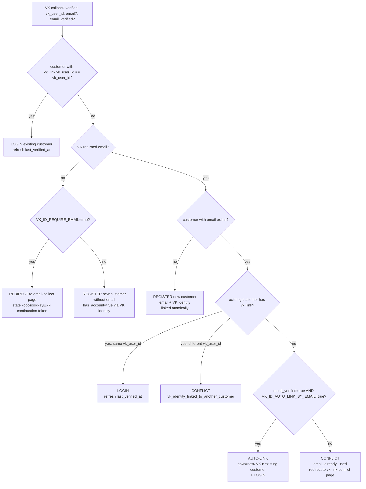
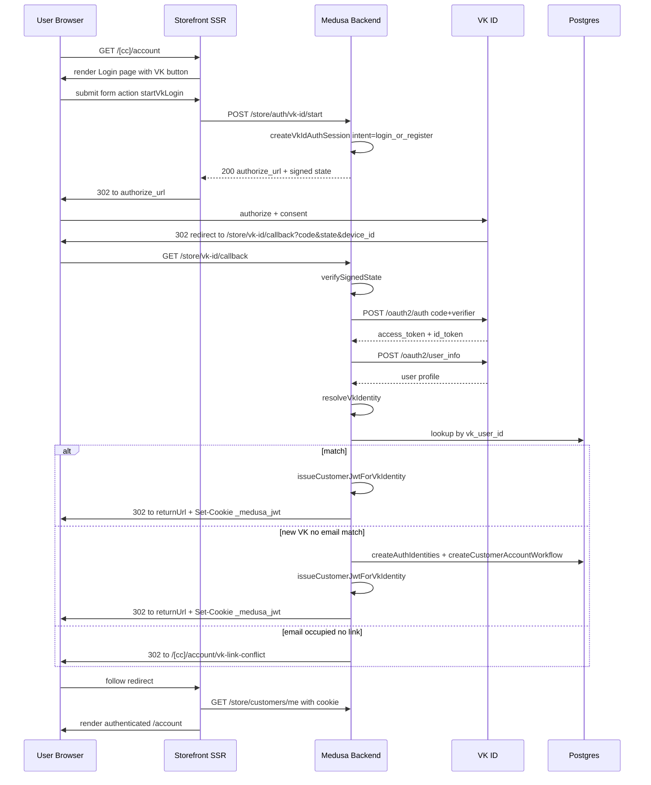

# VK ID Login & Registration Integration Plan

> **Скоуп**: расширить существующий VK ID linking foundation до полноценного customer login и registration flow в storefront. Linking (Phase 5.0) уже materialized; этот план описывает Phase 5.1–5.4.
>
> **Source-of-truth для текущей реализации**: [`vk-id.ts`](../medusa-agency-boilerplate/src/modules/vk-id.ts:1), 4 routes под [`/store/customers/me/vk-id/*`](../medusa-agency-boilerplate/src/api/store/customers/me/vk-id) и [`/store/vk-id/callback`](../medusa-agency-boilerplate/src/api/store/vk-id/callback/route.ts:1), storefront компонент [`profile-vk-link/index.tsx`](../medusa-agency-boilerplate-storefront/src/modules/account/components/profile-vk-link/index.tsx:1), env contract [`env_contract.md`](../Docs/env_contract.md:325) раздел `Implemented VK ID v1`.

---

## 1. Executive Summary

VK ID Phase 5.0 (linking авторизованного customer'а) полностью materialized: подписанный state + PKCE, allowlist redirect origins, ownership-guard через advisory lock и колоночное обновление `customer.metadata.vk_link`. Что отсутствует — публичный entrypoint без auth и логика выпуска customer JWT по результату VK callback. План вводит:

- публичный route `/store/auth/vk-id/start` для генерации authorize URL без active session,
- расширение `/store/vk-id/callback` поддержкой `intent: "link" | "login_or_register"` с обратной совместимостью,
- helper-функции в [`vk-id.ts`](../medusa-agency-boilerplate/src/modules/vk-id.ts:1) для identity matching (lookup → match by VK id → optional match by verified email → create), а также для генерации customer JWT через AuthModule + `generateJwtTokenForAuthIdentity`,
- две storefront действия (`startVkLogin`, `vkLoginCallbackHandler`), VK-кнопку на login и register экранах, conflict-страницу для случаев "email уже занят паролем",
- три новых опциональных env-флага: `VK_ID_LOGIN_ENABLED`, `VK_ID_AUTO_LINK_BY_EMAIL`, `VK_ID_REQUIRE_EMAIL`.

Архитектурно выбран **Вариант B (расширение текущего callback + AuthModule API)** — он минимален относительно уже materialized linking surface и не требует регистрации custom auth provider в [`medusa-config.ts`](../medusa-agency-boilerplate/medusa-config.ts:126).

Дополнительно: пользователь получил рабочий VK ID SDK snippet ([`plans/vk.html`](vk.html:1)) из VK Admin Panel (`app=54590239`, OneTap widget, `responseMode: Callback`). Это **другой** flow по сравнению с server-side OAuth redirect, описанным выше. Решение и трейд-оффы зафиксированы в §10. Краткий вывод: для Phase 5.1 / 5.2 используем server-side OAuth (текущий план), SDK widget как опциональный апгрейд оставляем на Phase 5.4 polish.

---

## 2. Текущее состояние (что уже есть)

### 2.1 Backend module [`vk-id.ts`](../medusa-agency-boilerplate/src/modules/vk-id.ts:1)

Уже реализовано:

- runtime resolver [`getVkIdRuntime()`](../medusa-agency-boilerplate/src/modules/vk-id.ts:333) с requested/configured/enabled semantics;
- signed state с HMAC-SHA256 поверх `VK_ID_SESSION_SECRET` ([`buildSignedState`](../medusa-agency-boilerplate/src/modules/vk-id.ts:288), [`verifySignedState`](../medusa-agency-boilerplate/src/modules/vk-id.ts:295));
- PKCE: [`createCodeChallenge`](../medusa-agency-boilerplate/src/modules/vk-id.ts:329), session с `codeVerifier`;
- allowlist redirect origins через [`resolveAllowedVkIdReturnUrl`](../medusa-agency-boilerplate/src/modules/vk-id.ts:357);
- VK OAuth endpoints: authorize `https://id.vk.ru/authorize`, token `https://id.vk.ru/oauth2/auth`, user_info `https://id.vk.ru/oauth2/user_info`;
- token exchange [`exchangeVkIdAuthorizationCode`](../medusa-agency-boilerplate/src/modules/vk-id.ts:492) и user_info fetch [`fetchVkIdUserInfo`](../medusa-agency-boilerplate/src/modules/vk-id.ts:538);
- identity normalization [`resolveVkIdentity`](../medusa-agency-boilerplate/src/modules/vk-id.ts:572);
- linking transaction с advisory lock [`persistVkIdCustomerLinkWithOwnershipGuard`](../medusa-agency-boilerplate/src/modules/vk-id.ts:959);
- pure planning helpers [`planVkIdLinkMutation`](../medusa-agency-boilerplate/src/modules/vk-id.ts:738) / [`planVkIdUnlinkMutation`](../medusa-agency-boilerplate/src/modules/vk-id.ts:792);
- conflict detection [`findVkIdentityConflict`](../medusa-agency-boilerplate/src/modules/vk-id.ts:714);
- result-URL builder [`buildVkIdResultReturnUrl`](../medusa-agency-boilerplate/src/modules/vk-id.ts:819).

### 2.2 Существующие routes

- `GET /store/customers/me/vk-id` — текущее состояние линка (auth required) [`route.ts`](../medusa-agency-boilerplate/src/api/store/customers/me/vk-id/route.ts:12);
- `POST /store/customers/me/vk-id/start` — старт linking (auth required) [`route.ts`](../medusa-agency-boilerplate/src/api/store/customers/me/vk-id/start/route.ts:23);
- `POST /store/customers/me/vk-id/unlink` — отвязка (auth required) [`route.ts`](../medusa-agency-boilerplate/src/api/store/customers/me/vk-id/unlink/route.ts:13);
- `GET /store/vk-id/callback` — единственный callback (без auth, читает state, выполняет linking) [`route.ts`](../medusa-agency-boilerplate/src/api/store/vk-id/callback/route.ts:57). State содержит `customerId`, поэтому identity жёстко связана с уже залогиненным юзером в момент `start`.

### 2.3 Storefront

- server actions [`startVkIdLink()`](../medusa-agency-boilerplate-storefront/src/lib/data/customer.ts:297), [`unlinkVkId()`](../medusa-agency-boilerplate-storefront/src/lib/data/customer.ts:329) в [`customer.ts`](../medusa-agency-boilerplate-storefront/src/lib/data/customer.ts:1);
- профильный UI [`profile-vk-link/index.tsx`](../medusa-agency-boilerplate-storefront/src/modules/account/components/profile-vk-link/index.tsx:1);
- email/password login [`login/index.tsx`](../medusa-agency-boilerplate-storefront/src/modules/account/components/login/index.tsx:14) и register [`register/index.tsx`](../medusa-agency-boilerplate-storefront/src/modules/account/components/register/index.tsx:15) сегодня вызывают [`sdk.auth.login`/`sdk.auth.register`](../medusa-agency-boilerplate-storefront/src/lib/data/customer.ts:62) для `emailpass` provider'а и сохраняют JWT через [`setAuthToken()`](../medusa-agency-boilerplate-storefront/src/lib/data/cookies.ts:52) в cookie `_medusa_jwt`;
- public env-флаг `NEXT_PUBLIC_VK_ID_ENABLED` через `VK_ID_ENABLED` импортируется в [`config.ts`](../medusa-agency-boilerplate-storefront/src/lib/config.ts).

### 2.4 Medusa Auth Module — что доступно для нашего сценария

Из [`auth-module.js`](../medusa-agency-boilerplate/node_modules/@medusajs/auth/dist/services/auth-module.js:1) и [`generate-jwt-token.js`](../medusa-agency-boilerplate/node_modules/@medusajs/medusa/dist/api/auth/utils/generate-jwt-token.js:1):

- `service.register(provider, authData)` создаёт `auth_identity` + `provider_identity` для указанного provider'а; для собственного провайдера потребуется регистрация в `medusa-config.ts`. Есть public method `service.createAuthIdentities(...)` который позволяет создавать identity напрямую без регистрации провайдера, передавая массив `provider_identities[*]`.
- `generateJwtTokenForAuthIdentity({ authIdentity, actorType: "customer", authProvider, container }, { secret, expiresIn, options })` — выпускает customer JWT в той же форме, что встроенный `/auth/customer/{provider}` route.
- `createCustomerAccountWorkflow` ([`create-customer-account.js`](../medusa-agency-boilerplate/node_modules/@medusajs/core-flows/dist/customer/workflows/create-customer-account.js:36)) принимает `authIdentityId` + `customerData` и сам устанавливает связь auth_identity ↔ customer через `setAuthAppMetadataStep`. Это и есть канонический способ создания customer-аккаунта.
- Validation guard в [`validate-customer-account-creation.js`](../medusa-agency-boilerplate/node_modules/@medusajs/core-flows/dist/customer/steps/validate-customer-account-creation.js:34) запрещает создавать `has_account` customer'а с email, у которого уже есть аккаунт. Это ключевая граница нашего identity matching — мы её не пытаемся обойти, а используем как сигнал для conflict.

---

## 3. Архитектурное решение (Variant A vs B)

### 3.1 Вариант A: Custom Medusa Auth Provider `vk-id`

- создать `src/auth-providers/vk-id.ts` как наследник `AbstractAuthModuleProvider`;
- зарегистрировать в [`medusa-config.ts`](../medusa-agency-boilerplate/medusa-config.ts:126) в составе `@medusajs/medusa/auth` модуля как provider;
- получить нативные routes `/auth/customer/vk-id`, `/auth/customer/vk-id/callback`, `/auth/customer/vk-id/register` бесплатно;
- `entity_id` provider_identity = `vkid:<vk_user_id>`.

Плюсы:

- идиоматично для Medusa;
- единая точка для `auth.login()` / `auth.register()` через storefront SDK;
- автоматический выпуск JWT, refresh, session validation идут через стандартный pipeline.

Минусы:

- надо регистрировать `auth/customer/vk-id` маршруты, которые backend пока не использует — потребуется убедиться, что Medusa native routes [`route.js`](../medusa-agency-boilerplate/node_modules/@medusajs/medusa/dist/api/auth/[actor_type]/[auth_provider]/route.js:6) правильно отрабатывают `location` redirect для OAuth (для обычного OAuth провайдера это работает, для нашего PKCE+state кастомного flow придётся повторить логику внутри `authenticate`/`validateCallback`);
- дублирование уже existing logic в [`vk-id.ts`](../medusa-agency-boilerplate/src/modules/vk-id.ts:1) (signed state, allowlist origins, advisory lock) внутри provider class, либо инжектить module через DI. AbstractAuthModuleProvider не получает Medusa container напрямую, только options;
- ломаем текущий callback `GET /store/vk-id/callback` (он не /auth/), либо вынуждены сделать redirect-bridge — две точки входа разной природы;
- AuthModule provider никак не оперирует записью `customer` rows: создание `customer` всё равно идёт через тот же `createCustomerAccountWorkflow`, поэтому большая часть логики останется на нашей стороне.

### 3.2 Вариант B: Custom callback route + AuthModule public API

- сохранить и расширить [`/store/vk-id/callback`](../medusa-agency-boilerplate/src/api/store/vk-id/callback/route.ts:1) с поддержкой `intent: "link" | "login_or_register"`;
- добавить публичный `/store/auth/vk-id/start` с `intent="login_or_register"`;
- внутри callback после `resolveVkIdentity()`:
  - lookup customer по `vk_link.vk_user_id`;
  - при отсутствии — optional lookup по verified email;
  - при необходимости — создать `auth_identity` через `service.createAuthIdentities()` + новый `customer` через `createCustomerAccountWorkflow({ authIdentityId, customerData })`;
  - выпустить JWT через `generateJwtTokenForAuthIdentity`.

Плюсы:

- максимально переиспользует existing [`vk-id.ts`](../medusa-agency-boilerplate/src/modules/vk-id.ts:1) helpers (signed state, PKCE, allowlist origins, identity matching), которые уже протестированы;
- одна точка входа `/store/vk-id/callback`, обратная совместимость с linking сохраняется через ветку `intent=link`;
- никаких изменений в [`medusa-config.ts`](../medusa-agency-boilerplate/medusa-config.ts:1) — нулевой риск регрессии других модулей;
- storefront остаётся на cookie `_medusa_jwt` — никаких изменений в auth boundary.

Минусы:

- мы сами выпускаем JWT и должны корректно скопировать форму payload как в встроенном [`generate-jwt-token.js`](../medusa-agency-boilerplate/node_modules/@medusajs/medusa/dist/api/auth/utils/generate-jwt-token.js:9) (используем тот же helper);
- при будущем добавлении OAuth refresh для `vk-id` придётся делать это руками или мигрировать на Variant A.

### 3.3 Рекомендация: **Вариант B**

Variant B даёт минимальный delta поверх уже работающего кода, не трогает [`medusa-config.ts`](../medusa-agency-boilerplate/medusa-config.ts:126) и не требует переписывать существующий callback с нуля. Вероятность регрессии Phase 5.0 linking минимальна, а тестировать поведение мы можем на уже проверенном transactional ownership-guard. Если в будущем потребуется token refresh / SSO surface — можно за один рефакторинг переехать на Variant A; план явно фиксирует точку миграции в Phase 5.4.

---

## 4. Identity Matching Policy

### 4.1 Decision Tree



### 4.2 Таблица решений

| state | существует по `vk_user_id` | существует по `email` | `email_verified` | `VK_ID_AUTO_LINK_BY_EMAIL` | результат |
|---|---|---|---|---|---|
| LOGIN-by-VK | yes | — | — | — | LOGIN existing customer (same VK identity) |
| REGISTER (no email) | no | — | — | — | REGISTER без email (если `VK_ID_REQUIRE_EMAIL=false`); иначе → email-collect page |
| REGISTER (new email) | no | no | — | — | REGISTER нового customer + auth_identity с VK provider_identity |
| CONFLICT-different-VK | no | yes (linked другим VK) | — | — | conflict redirect, reason=`vk_identity_linked_to_another_customer` |
| CONFLICT-email-occupied | no | yes (без VK link) | false / unknown | any | conflict redirect, reason=`email_already_used`, предложить login паролем для linking |
| CONFLICT-email-occupied (verified, no auto-link) | no | yes (без VK link) | true | false | conflict redirect, reason=`email_already_used` |
| AUTO-LINK | no | yes (без VK link) | true | true | привязать VK к existing customer, LOGIN |
| LOGIN-from-link | yes (existing link) | yes (того же customer) | — | — | LOGIN, обновить `last_verified_at` |

### 4.3 Безопасность auto-link

- единственный путь к auto-link — `email_verified === true` от VK ID **и** `VK_ID_AUTO_LINK_BY_EMAIL=true`;
- по умолчанию `VK_ID_AUTO_LINK_BY_EMAIL=false` — предпочитаем UX cost (пользователь должен войти паролем) против риска account takeover при VK email spoofing;
- при `email_verified=false` или его отсутствии auto-link **никогда** не происходит — независимо от env-флага.

### 4.4 Customer без email

Если VK не вернул email и `VK_ID_REQUIRE_EMAIL=false`, customer создаётся с `email=null` (или `vkid:<vk_user_id>@local.invalid` placeholder, если Medusa требует email — нужно проверить runtime). Phase 5.4 добавляет post-login UI "Введите email для заказов" с soft requirement до checkout, чтобы не блокировать первичную регистрацию. Phase 5.1/5.2 поведение по умолчанию — `VK_ID_REQUIRE_EMAIL=true` (более консервативный default).

---

## 5. Backend Changes

### 5.1 Файлы — изменить

| Файл | Что меняется |
|---|---|
| [`src/modules/vk-id.ts`](../medusa-agency-boilerplate/src/modules/vk-id.ts:1) | расширить `VkIdLinkSessionPayload` полем `intent: "link" \| "login_or_register"`; добавить `createVkIdLoginSession()`, `planVkIdLoginOrRegister()`, `persistVkIdLoginIdentityWithOwnershipGuard()`, `issueCustomerJwtForVkIdentity()`. Добавить `VkIdUserInfoResult.user.email_verified` extraction в `resolveVkIdentity()` (новое поле `email`, `emailVerified`, `firstName`, `lastName`). |
| [`src/api/store/vk-id/callback/route.ts`](../medusa-agency-boilerplate/src/api/store/vk-id/callback/route.ts:1) | dispatch по `session.intent`: ветка `link` остаётся как сейчас (regression-safe), ветка `login_or_register` идёт через новый flow (matching → create/link → JWT → redirect с токеном). |

### 5.2 Файлы — создать

| Файл | Что делает |
|---|---|
| `src/api/store/auth/vk-id/start/route.ts` | публичный POST: ratelimit-friendly endpoint без auth, generates session с `intent="login_or_register"` и возвращает `{ authorize_url, expires_at, state }`. Принимает `return_url` (validated через allowlist) и optional `link_source`. |
| `src/api/store/auth/vk-id/exchange/route.ts` | (опционально, Phase 5.2) POST для обмена короткоживущего session token на JWT, если callback не может redirect'ить с токеном напрямую (cookie cross-domain edge case). Защита: token одноразовый, TTL ≤ 60s. |
| `src/workflows/vk-login.ts` | (Phase 5.2) workflow с шагами: `verifyVkCodeStep` → `matchOrCreateCustomerStep` → `issueJwtStep` → `auditLogStep`. Обёртка над helper functions для testability и audit trail. |
| `src/workflows/__tests__/vk-login.unit.spec.ts` | unit suite по identity matching policy (см. §8). |

### 5.3 Расширения [`vk-id.ts`](../medusa-agency-boilerplate/src/modules/vk-id.ts:1)

#### Новые exported types

```text
VkIdAuthIntent = "link" | "login_or_register"

VkIdLinkSessionPayload (extended) {
  // existing fields
  intent: VkIdAuthIntent
  customerId?: string  // только для intent=link
}

VkIdAuthSessionPayload extends VkIdLinkSessionPayload (без customerId, intent="login_or_register")

VkResolvedIdentity (extended) {
  provider: "vkid"
  vkUserId: string
  vkPeerId: string
  email: string | null
  emailVerified: boolean
  firstName: string | null
  lastName: string | null
  avatarUrl: string | null
  phone: string | null
}

VkIdLoginMatchResult =
  | { kind: "login"; customerId: string }
  | { kind: "register"; emailToUse: string | null }
  | { kind: "auto_link"; customerId: string }
  | { kind: "conflict"; reason: "email_already_used" | "vk_identity_linked_to_another_customer"; conflictCustomerId: string | null }
  | { kind: "missing_email"; }
```

#### Новые exported functions

- `createVkIdAuthSession(input: { returnUrl: string; linkSource?: string; ttlSeconds?: number }): VkIdLinkSession`  
  Аналогично [`createVkIdLinkSession`](../medusa-agency-boilerplate/src/modules/vk-id.ts:387), но без `customerId` и с `intent="login_or_register"`.

- `planVkIdLoginOrRegister(input: { identity: VkResolvedIdentity; customers: VkLinkableCustomerRecord[]; customerByEmail: VkLinkableCustomerRecord | null; flags: { autoLinkByEmail: boolean; requireEmail: boolean } }): VkIdLoginMatchResult`  
  Pure function реализующая decision tree из §4. Не делает I/O.

- `persistVkIdLoginIdentityWithOwnershipGuard(pgConnection, container, input: { identity, verifiedAt, linkSource, flags, defaultCountryCode? }): Promise<{ result: VkIdLoginMatchResult; customerId: string | null; authIdentityId: string | null }>`  
  Транзакционная обёртка: advisory lock по `(provider, vkPeerId)`, lookup, создание customer через `createCustomerAccountWorkflow`, либо apply `planVkIdLinkMutation` для auto-link.

- `issueCustomerJwtForVkIdentity(container, input: { authIdentityId: string; customerId: string }): Promise<string>`  
  Resolve `Modules.AUTH`, получить `authIdentity` через `service.list({ id: authIdentityId })`, вызвать `generateJwtTokenForAuthIdentity({ authIdentity, actorType: "customer", authProvider: "vk-id", container }, { secret: http.jwtSecret, expiresIn: http.jwtExpiresIn, options: http.jwtOptions })`. Использует приватный helper из `@medusajs/medusa/api/auth/utils/generate-jwt-token` или повторяет его (~30 строк, безопасно дублировать).

- `createVkIdAuthIdentity(authModuleService, input: { entityId: string; provider: "vk-id"; userMetadata?: object; providerMetadata?: object }): Promise<AuthIdentityDTO>`  
  Wrapper над `service.createAuthIdentities({ provider_identities: [{ provider: "vk-id", entity_id, user_metadata, provider_metadata }] })`. `entity_id` = `vkid:<vk_user_id>` для уникальности.

- `lookupCustomerByVkUserId(query, vkUserId: string): Promise<VkLinkableCustomerRecord | null>`  
  Postgres lookup по `customer.metadata->'vk_link'->>'vk_user_id'`. Использует raw SQL аналогично [`listPotentialVkIdConflictCustomers`](../medusa-agency-boilerplate/src/modules/vk-id.ts:928).

- `lookupCustomerByEmail(query, email: string): Promise<VkLinkableCustomerRecord | null>`  
  Через QueryGraph: `entity: "customer", filters: { email, has_account: true }`.

#### Изменения existing functions

- [`buildSignedState`](../medusa-agency-boilerplate/src/modules/vk-id.ts:288) / [`verifySignedState`](../medusa-agency-boilerplate/src/modules/vk-id.ts:295) — без изменений (оперируют opaque payload).
- [`createVkIdLinkSession`](../medusa-agency-boilerplate/src/modules/vk-id.ts:387) — добавить `intent="link"` по умолчанию для backward-compat.
- [`readVkIdLinkSession`](../medusa-agency-boilerplate/src/modules/vk-id.ts:419) — без изменений сигнатуры (payload уже extensible через TS), но callsites должны проверять `payload.intent`.
- [`resolveVkIdentity`](../medusa-agency-boilerplate/src/modules/vk-id.ts:572) — extended return type с `email`, `emailVerified`, `firstName`, `lastName`, `avatarUrl`, `phone`. Источники: `tokenResult.id_token` (JWT decode без verify — уже подписан VK token endpoint) и `userInfo.user.email`. `email_verified` — из `id_token` `email_verified` claim или `userInfo.user.verified` (уточнить через VK docs во время реализации).

### 5.4 Расширение callback [`/store/vk-id/callback`](../medusa-agency-boilerplate/src/api/store/vk-id/callback/route.ts:1)

Псевдокод dispatch:

```text
GET /store/vk-id/callback?state=...&code=...&device_id=...
  session = readVkIdLinkSession(state)
  if !session: redirect "failed&reason=invalid_or_expired_state"
  intent = session.intent ?? "link"  // backward-compat fallback

  tokenResult = exchangeVkIdAuthorizationCode(...)
  identity   = resolveVkIdentity({ tokenResult, userInfo })
  if !identity: redirect "failed&reason=missing_vk_peer_id"

  if intent == "link":
      // existing flow (no changes), uses session.customerId
      mutation = persistVkIdCustomerLinkWithOwnershipGuard(...)
      redirect with result
      return

  if intent == "login_or_register":
      result = persistVkIdLoginIdentityWithOwnershipGuard(...)
      switch result.kind:
        case "login": case "auto_link":
          jwt = issueCustomerJwtForVkIdentity(authIdentityId, customerId)
          redirect to session.returnUrl + ?vk_id_result=logged_in&vk_id_token=<short_lived_exchange_token>
                                             OR set cookie if same-domain
        case "register":
          // customer was created inside transaction
          jwt = issueCustomerJwtForVkIdentity(authIdentityId, customerId)
          redirect ... vk_id_result=registered ...
        case "missing_email":
          redirect to /vk-id/email-required?continuation=<short_lived_token>
        case "conflict":
          redirect to /account/vk-link-conflict?reason=...&email=<masked>&vk_user_id=<vk_user_id>
```

#### Передача JWT обратно storefront

Поскольку backend (`studio.slavx.ru`) и storefront могут жить под одним origin (Caddy ingress), **предпочтительный путь** — установить cookie `_medusa_jwt` напрямую из callback route с теми же атрибутами, что [`setAuthToken()`](../medusa-agency-boilerplate-storefront/src/lib/data/cookies.ts:52): `httpOnly`, `sameSite: "lax"` (важно: не `strict`, иначе cookie не передастся при cross-origin redirect от VK), `secure`, `maxAge`. Такой cookie storefront увидит при следующем server-rendered request.

Если в будущем backend и storefront будут на разных origins (например, storefront — отдельный CDN), переходим на короткоживущий exchange token: callback redirect'ит на `/[countryCode]/auth/vk-id/return?token=<short_lived>`, эта route выполняет POST на `/store/auth/vk-id/exchange` и устанавливает cookie через server action. Этот fallback стоит держать в коде Phase 5.2 как option `VK_ID_TOKEN_EXCHANGE_MODE=cookie|exchange` (default `cookie`).

### 5.5 Обратная совместимость linking flow

- старые VK linking ссылки с `state` без `intent` (если такие в обороте от Phase 5.0) — попадают в ветку `intent="link"` через fallback и работают как раньше;
- `customerId` остаётся required для `intent="link"`; если он отсутствует — `failed&reason=invalid_state_payload`;
- `persistVkIdCustomerLinkWithOwnershipGuard` не трогаем.

---

## 6. Storefront Changes

### 6.1 Файлы — изменить

| Файл | Что меняется |
|---|---|
| [`src/lib/data/customer.ts`](../medusa-agency-boilerplate-storefront/src/lib/data/customer.ts:1) | Добавить server actions `startVkLogin(countryCode, redirectAfter?)`, `parseVkLoginResult()` (для callback page). |
| [`src/modules/account/components/login/index.tsx`](../medusa-agency-boilerplate-storefront/src/modules/account/components/login/index.tsx:14) | Под формой email/password добавить divider "или" и `<VkLoginButton mode="login">`. Скрыть button если `!VK_ID_ENABLED`. |
| [`src/modules/account/components/register/index.tsx`](../medusa-agency-boilerplate-storefront/src/modules/account/components/register/index.tsx:15) | Аналогичная VK кнопка, `<VkLoginButton mode="register">`. |
| [`src/lib/config.ts`](../medusa-agency-boilerplate-storefront/src/lib/config.ts) | export `VK_ID_LOGIN_ENABLED` (`NEXT_PUBLIC_VK_ID_ENABLED && NEXT_PUBLIC_VK_ID_LOGIN_ENABLED`). |

### 6.2 Файлы — создать

| Файл | Что делает |
|---|---|
| `src/modules/account/components/vk-login-button/index.tsx` | UI кнопка с VK иконкой, формой submit на server action `startVkLogin`. Props: `mode: "login" \| "register"`, `redirectAfter?`. |
| `src/app/[countryCode]/(main)/account/vk-link-conflict/page.tsx` | Страница "Email уже используется паролем — войдите паролем для связки". Читает `?email=<masked>&vk_user_id=...&reason=...`. Содержит prefilled login form. |
| `src/app/[countryCode]/(main)/account/vk-id/email-required/page.tsx` | (Phase 5.2) Страница "VK не вернул email, укажите его" — нужна только если `VK_ID_REQUIRE_EMAIL=true` и VK не вернул email. Использует short-lived continuation token. |
| `src/app/[countryCode]/(main)/account/vk-id/return/page.tsx` | (опционально для Phase 5.2 token-exchange mode) Принимает `?token=...`, обменивает на JWT, redirect в `/account` или `redirect_after`. |

### 6.3 Server actions — `startVkLogin`

Псевдокод:

```text
"use server"
export async function startVkLogin(countryCode: string, redirectAfter?: string) {
  const returnUrl = buildVkIdReturnUrl(countryCode, redirectAfter ?? "/account")
  const response = await fetch(`${MEDUSA_BACKEND_URL}/store/auth/vk-id/start`, {
    method: "POST",
    headers: { "content-type": "application/json", "x-publishable-api-key": ... },
    body: JSON.stringify({ return_url: returnUrl, link_source: "storefront.account.login" }),
    cache: "no-store",
  })
  const payload = await response.json()
  if (!response.ok || !payload.authorize_url) {
    redirect(`/${countryCode}/account?vk_id_result=failed&reason=${payload.code ?? "vk_id_start_failed"}`)
  }
  redirect(payload.authorize_url)
}
```

### 6.4 Login/Register UI

Обе формы получают одинаковую секцию:

```text
<form ...>...email/password...</form>

{VK_ID_LOGIN_ENABLED && (
  <>
    <Divider label="или" />
    <VkLoginButton mode="login" />
  </>
)}
```

Кнопка использует `<form action={startVkLogin.bind(null, countryCode)}>` чтобы оставаться внутри React Server Action pattern, без `useEffect`.

Важно: компонент **не загружает** `@vkid/sdk` (см. §10 — выбран Variant 1). Дизайн (VK логотип SVG, цвет `#0077FF`, hover state) копируется из VK Brand kit или из CSS-fragment'а, который VK Admin Panel мог отдать вместе с [`plans/vk.html`](vk.html:1). Это сохраняет JS bundle storefront чистым и обеспечивает progressive enhancement (button работает с отключённым JS — server action редиректит напрямую).

### 6.5 Conflict page UX

```text
/[countryCode]/account/vk-link-conflict?reason=email_already_used&email_masked=v***@gmail.com

<h1>Email уже используется</h1>
<p>Аккаунт {email_masked} уже зарегистрирован в магазине.</p>
<p>Войдите паролем — после успешного входа мы предложим связать аккаунт с VK ID.</p>

<LoginForm prefillEmail={email_masked_decoded_only_to_display} />

<p>Не помните пароль? <Link href="/account/forgot-password">Восстановить</Link></p>
```

После успешного login можно автоматически предложить linking — Phase 5.3 включает короткое окно "We've prepared VK link, confirm" через cookie hint от backend. Phase 5.1/5.2 ограничиваются ручным переходом в profile → "Привязать VK".

---

## 7. Env Contract

### 7.1 Существующие keys (не меняются)

- `VK_ID_ENABLED` — мастер-выключатель backend surface;
- `VK_ID_CLIENT_ID`, `VK_ID_CLIENT_SECRET`, `VK_ID_REDIRECT_URI` — VK app credentials;
- `VK_ID_SCOPES` (default `vkid.personal_info`);
- `VK_ID_SESSION_SECRET` — HMAC secret для signed state;
- `VK_ID_STOREFRONT_RETURN_ORIGINS` — allowlist для return_url;
- `NEXT_PUBLIC_VK_ID_ENABLED` — public флаг для UI surface (profile linking).

### 7.2 Новые keys

| Key | Default | Назначение |
|---|---|---|
| `VK_ID_LOGIN_ENABLED` | `false` | Backend gate для login/register flow. Когда `false`, public start endpoint возвращает 409 `vk_id_login_disabled` даже если linking surface включён. Позволяет включать linking без login. |
| `VK_ID_AUTO_LINK_BY_EMAIL` | `false` | Разрешает auto-link при `email_verified=true`. По умолчанию выключено по security. |
| `VK_ID_REQUIRE_EMAIL` | `true` | Если VK не вернул email и флаг true — redirect на email-required page. Если false — создаём customer без email. |
| `VK_ID_REGISTRATION_DEFAULT_COUNTRY_CODE` | `RU` | Country code для `customerData` при регистрации через VK. Используется в `createCustomerAccountWorkflow`. |
| `VK_ID_LOGIN_SCOPES` | `vkid.personal_info email phone` | (Phase 5.2) Расширенный scope для запроса email/phone. Отдельно от `VK_ID_SCOPES`, чтобы linking surface оставалась минимальной. |
| `VK_ID_TOKEN_EXCHANGE_MODE` | `cookie` | `cookie` (текущий; backend ставит `_medusa_jwt` cookie напрямую) или `exchange` (короткоживущий redirect token). Введём в Phase 5.2 если возникнет cross-origin edge case. |
| `NEXT_PUBLIC_VK_ID_LOGIN_ENABLED` | `false` | Public флаг для UI кнопки на login/register. Storefront не показывает кнопку без него. |

### 7.3 Документация

Обновить:

- [`Docs/env_contract.md`](../Docs/env_contract.md:325) раздел `Implemented VK ID v1` → переименовать в `VK ID v1.1: linking + login/register` или добавить новый раздел с этими ключами;
- [`.env.example`](../.env.example:1), [`.env.staging.example`](../.env.staging.example:1), [`medusa-agency-boilerplate/.env.template`](../medusa-agency-boilerplate/.env.template);
- [`scripts/env-sync.sh`](../scripts/env-sync.sh) — добавить новые keys в backend и storefront секции;
- [`Docs/master_repo_plan_v2.md`](../Docs/master_repo_plan_v2.md:504) — отметить, что `VK ID v1.1` reopened как новый workstream.

### 7.4 GitHub Secrets / Variables

Проверить наличие в GitHub:

- secrets: `VK_ID_CLIENT_SECRET`, `VK_ID_SESSION_SECRET` (уже должны быть);
- variables: `VK_ID_CLIENT_ID`, `VK_ID_REDIRECT_URI`, `VK_ID_ENABLED`, `VK_ID_STOREFRONT_RETURN_ORIGINS`, `NEXT_PUBLIC_VK_ID_ENABLED`;
- добавить новые **variables**: `VK_ID_LOGIN_ENABLED`, `VK_ID_AUTO_LINK_BY_EMAIL` (default `false`), `VK_ID_REQUIRE_EMAIL` (default `true`), `VK_ID_REGISTRATION_DEFAULT_COUNTRY_CODE` (default `RU`), `VK_ID_LOGIN_SCOPES`, `NEXT_PUBLIC_VK_ID_LOGIN_ENABLED`;
- VK Admin Panel: убедиться, что `https://studio.slavx.ru/store/vk-id/callback` в allowlist redirect_uri;
- redirect_uri единый для linking и login — backend различает по `intent` в state, а не по URI.

---

## 8. Tests / Smoke

### 8.1 Unit tests

Создать `medusa-agency-boilerplate/src/workflows/__tests__/vk-login.unit.spec.ts` с покрытием decision tree:

| # | Сценарий | Ожидание |
|---|---|---|
| 1 | identity matches existing `vk_link.vk_user_id` | `kind: "login"`, customerId совпадает |
| 2 | no VK match, no email returned, `requireEmail=true` | `kind: "missing_email"` |
| 3 | no VK match, no email returned, `requireEmail=false` | `kind: "register"`, `emailToUse: null` |
| 4 | no VK match, email new | `kind: "register"`, `emailToUse=<email>` |
| 5 | no VK match, email exists with different VK | `kind: "conflict"`, reason=`vk_identity_linked_to_another_customer` |
| 6 | no VK match, email exists no VK, `email_verified=false`, `autoLink=true` | `kind: "conflict"`, reason=`email_already_used` |
| 7 | no VK match, email exists no VK, `email_verified=true`, `autoLink=false` | `kind: "conflict"`, reason=`email_already_used` |
| 8 | no VK match, email exists no VK, `email_verified=true`, `autoLink=true` | `kind: "auto_link"`, customerId совпадает |
| 9 | invalid state in callback | redirect "failed&reason=invalid_or_expired_state" |
| 10 | linking intent (regression) | существующий behaviour не меняется |
| 11 | session.intent absent (legacy) | trated as `intent="link"` |
| 12 | concurrent two callbacks с тем же `vk_user_id` | один LOGIN, второй LOGIN (advisory lock + lookup) |

### 8.2 Integration smoke (manual + Playwright)

Phase 5.2 closure требует green smoke на:

- **VK Login (existing customer)**: linking уже сделан в profile, logout, нажать "Войти через VK" → redirect на VK → consent → callback → cookie выпущена → `/account` показывает залогиненного customer'а;
- **VK Register (новый customer)**: clean cookie state, нажать "Регистрация через VK" → consent → создаётся customer с email от VK → cookie → `/account` показывает new customer;
- **VK Conflict (email паролем)**: создать customer паролем, logout, нажать "Войти через VK" с тем же email от VK → redirect на `/account/vk-link-conflict?reason=email_already_used`;
- **VK Auto-link (verified email, флаг включён)**: только staging-дополнительный smoke с `VK_ID_AUTO_LINK_BY_EMAIL=true`;
- **Linking regression**: профильный "Привязать VK" продолжает работать.

Smoke evidence пишется в `Docs/vk_id_login_v1_smoke_evidence.md` (новый файл).

### 8.3 CI guards

- расширить `tsc --noEmit` для backend и storefront — обязательно для PR;
- `npm test -- vk-login.unit.spec.ts` в backend test suite;
- (опционально) добавить mock VK ID server (`msw` или nock) для end-to-end backend test без реального VK.

---

## 9. Security & Risks

### 9.1 Security considerations

- **CSRF (state)**: уже реализовано через signed state ([`buildSignedState`](../medusa-agency-boilerplate/src/modules/vk-id.ts:288)) — наследуется на login flow без изменений.
- **PKCE**: уже реализовано — code_verifier хранится в state payload, обмен на code_challenge через SHA256.
- **Email spoofing**: auto-link только при `email_verified=true` и `VK_ID_AUTO_LINK_BY_EMAIL=true`. Default — false. Документировать в `env_contract.md` как явный security trade-off.
- **VK token storage**: НЕ храним `access_token` / `refresh_token`. Только `vk_user_id` остаётся в `customer.metadata.vk_link.vk_user_id`. Если в будущем потребуется VK API для маркетинговых сообщений — отдельный design (vk-community-messaging уже использует свой `VK_COMMUNITY_ACCESS_TOKEN`, не пользовательский).
- **Rate limiting**: public `/store/auth/vk-id/start` — потенциальный вектор abuse (state generation cost low, но redirect URL построение может быть скриптуемо). Phase 5.1 — без rate limit, полагаемся на Caddy. Phase 5.4 — добавить per-IP throttle через storefront middleware или Caddy `rate_limit` directive.
- **Customer без password**: при VK-only registration `auth_identity` не имеет emailpass `provider_identity`. Если customer теряет доступ к VK, единственный recovery path — email с reset/claim password. Нужна Phase 5.3 task: автоматически отправлять customer'у "set password for backup login" email при первой VK-регистрации.
- **CORS**: `/store/auth/vk-id/start` принимает POST только с allowlisted origin (storefront), Medusa уже валидирует через `STORE_CORS`. Проверить, что storefront origin есть в `STORE_CORS` в production.
- **Cookie security**: установка `_medusa_jwt` из backend требует точно тех же атрибутов что и storefront server action: `httpOnly`, `secure` (на staging), `sameSite="lax"` (не strict — иначе cookie не выживет cross-origin redirect от VK на backend → storefront), `path="/"`, `maxAge` совпадает с JWT TTL.
- **Session fixation**: state cookie / token использует одноразовый `nonce` уже сейчас — login flow тоже не позволит reuse.
- **Audit logging**: каждое событие register/login/auto-link логировать через структурированный logger (без email/phone в plain text — маскируем).
- **VK SDK isolation (Variant 1)**: storefront **не загружает** `@vkid/sdk` (см. §10). Это исключает попадание VK `access_token` / `id_token` в storefront `localStorage` и `window` объекты, и оставляет client_secret-based exchange единственным path-ом валидации identity. Если в будущем переходим на Variant 2/3 (§10.4), security review должен явно покрыть JWKS-валидацию `id_token` и сейф-сторадж токенов.

### 9.2 Compliance

- GDPR / 152-ФЗ: на consent screen перед redirect VK / в политике конфиденциальности магазина указать, что мы получаем `first_name`, `last_name`, `email`, `phone` от VK при согласии пользователя;
- VK ID privacy policy alignment: явно прописать в storefront privacy URL;
- хранение avatar URL опционально (Phase 5.4).

### 9.3 Risks

| Risk | Митигация |
|---|---|
| Изменение callback ломает Phase 5.0 linking | Регрессионный test 11/12 покрывает legacy intent. Также сохранить linking flow без edits — изменения только в dispatch. |
| VK API breaking changes (id.vk.ru endpoints) | Endpoint URLs already exposed как constants — обновляются центрально. Контрактные тесты (mock) ловят shape change. |
| `id_token` shape от VK отличается от ожиданий | Phase 5.1 unit-test кладёт фиксированный JWT-fixture от VK; при первой live integration возможно потребуется adjust в `resolveVkIdentity()`. |
| `VK_ID_AUTO_LINK_BY_EMAIL=true` включат продакшн без понимания риска | Default `false`, документация явно предупреждает, prefer manual conflict UI. |
| Cross-origin cookie (storefront ≠ backend host) | Сейчас оба под `studio.slavx.ru` — same-origin. Если deploy split — введём `VK_ID_TOKEN_EXCHANGE_MODE=exchange`. |
| Email от VK совпадает с soft-deleted customer | Lookup учитывает `deleted_at IS NULL`; conflict policy не учитывает soft-deleted (треть стоит документировать). |
| Customer теряет VK access без password | Phase 5.3 task "send set-password email on VK-only registration". |

---

## 10. VK SDK widget integration ([`plans/vk.html`](vk.html:1))

### 10.1 Что предоставил VK Admin Panel

[`plans/vk.html`](vk.html:1) — это автогенерированный VK Admin Panel snippet для **VK ID Web SDK OneTap widget** (`@vkid/sdk@<3.0.0`), а не пример OAuth redirect button. Конфигурация:

- `app: 54590239` — публичный VK app id, совпадает с тем, что мы заведём в `VK_ID_CLIENT_ID`;
- `redirectUrl: 'https://studio.slavx.ru'` — root storefront, **не** наш `/store/vk-id/callback`;
- `responseMode: VKID.ConfigResponseMode.Callback` — payload (`code`, `device_id`) приходит **в JS callback**, без HTTP redirect;
- `source: VKID.ConfigSource.LOWCODE` — режим встраивания (визуально не критично);
- `scope: ''` — пустой, в коде помечено `Complete the necessary accesses as needed`;
- виджет — `new VKID.OneTap()`, рендерится в parent элемент скрипта;
- успешный обработчик: `oneTap.on(VKID.OneTapInternalEvents.LOGIN_SUCCESS, payload => VKID.Auth.exchangeCode(payload.code, payload.device_id).then(vkidOnSuccess))`.

### 10.2 Что делает SDK на самом деле

`VKID.Auth.exchangeCode(code, deviceId)` ([VK ID Web SDK docs](https://github.com/VKCOM/vkid-web-sdk)) — это **клиентский** обмен authorization code на токены. По умолчанию SDK сам:

1. посещает `https://id.vk.com/oauth2/auth` POST с `grant_type=authorization_code`,
2. передаёт PKCE `code_verifier`, который SDK сгенерировал и кэшировал в `localStorage`,
3. возвращает в `vkidOnSuccess(data)` объект `{ access_token, refresh_token, id_token, user_id, expires_in, token_type, scope }`.

Это значит:

- **CLIENT_SECRET в snippet не нужен** — SDK использует public PKCE flow без секрета (это безопасно для public app, потому что VK app id 54590239 — публичный идентификатор);
- **наш текущий backend code-exchange ([`exchangeVkIdAuthorizationCode`](../medusa-agency-boilerplate/src/modules/vk-id.ts:492)) ожидает `client_secret`** — это другой flow ("OAuth confidential client"), и он несовместим с тем кодом, что VK выдал в SDK widget.

Если `responseMode: Redirect` (вместо `Callback`), VK сам редиректит на `redirectUrl` и кладёт `code`+`state` в query, тогда работают обе логики — backend exchange и SDK exchange. Но в snippet выбран именно `Callback` mode.

### 10.3 Сравнение с текущим планом

| Аспект | Текущий план (§3 Variant B) | SDK snippet ([`plans/vk.html`](vk.html:1)) |
|---|---|---|
| Где выпускается authorize URL | backend генерирует через [`buildAuthorizeUrl`](../medusa-agency-boilerplate/src/modules/vk-id.ts:1) | SDK генерирует на клиенте |
| Где хранится PKCE `code_verifier` | в signed state (server) | в `localStorage` (client) |
| Где обменивается `code` на токены | backend, с `client_secret` | client SDK, без `client_secret`, public PKCE |
| Где валидируется `state` | backend HMAC | SDK сам, через random state в `Config.init` |
| Что попадает на storefront | `_medusa_jwt` cookie от backend через redirect | `access_token` + `id_token` JS объект, **storefront-managed** |
| Backend знает о юзере | да, через signed state и code exchange | только если storefront явно отправит токен на backend |
| Нужен ли `VK_ID_REDIRECT_URI=/store/vk-id/callback` | да | нет, `redirectUrl=https://studio.slavx.ru` |
| Прогрессивное улучшение (no-JS) | работает (HTML link на authorize URL) | не работает (требует JS) |
| Размер JS bundle storefront | 0 | +SDK (~30 KB gzipped) |

Critical: SDK snippet и наш backend flow **не совместимы as-is** — у них разные redirect URI, разный держатель PKCE verifier, разный получатель токенов.

### 10.4 Три варианта интеграции

#### Вариант 1 — игнорировать SDK, использовать существующий OAuth redirect (рекомендация)

Storefront рендерит обычный `<form action={startVkLogin}>` с VK иконкой/CSS, скопированными из дизайна VK button. При сабмите server action вызывает наш `/store/auth/vk-id/start`, backend возвращает authorize URL, происходит full-page redirect в `https://id.vk.com/authorize?...`, VK редиректит обратно на `/store/vk-id/callback`, backend меняет code на токены через `client_secret` и ставит `_medusa_jwt` cookie.

- **+** Полностью server-side, secrets живут на backend.
- **+** Работает без JS (progressive enhancement), совместим с SSR.
- **+** Никакого нового JS bundle, никаких `localStorage` token sinks.
- **+** Уже частично написан (Phase 5.0 linking использует тот же flow).
- **+** Один и тот же flow для linking и login — единая поверхность атаки, один audit trail.
- **−** Full-page redirect к VK (~1 секунда UX latency vs popup), но это стандарт для OAuth.
- **−** Дизайн VK button делаем сами по гайдлайнам VK (или копируем CSS из snippet).

`plans/vk.html` используется только как референс для CSS/SVG VK иконки.

#### Вариант 2 — SDK widget с client-side exchange и client-side JWT bridge

Storefront загружает `@vkid/sdk` через `<script>` или npm, рендерит OneTap widget. SDK возвращает `id_token` в JS. Storefront отправляет `id_token` на новый backend endpoint `POST /store/auth/vk-id/sdk-callback`, backend:

1. валидирует `id_token` подпись через JWKS с VK ID,
2. извлекает `sub` (vk_user_id) + `email` + `email_verified`,
3. прогоняет тот же identity matching pipeline (§4),
4. выпускает `_medusa_jwt`.

- **+** Snappy UX (popup, нет full-page redirect).
- **+** OneTap "автологин" если пользователь уже залогинен в VK ID на этом устройстве.
- **−** Требует JS, не работает с SSR-only.
- **−** Новый endpoint `/store/auth/vk-id/sdk-callback`, новый код для верификации `id_token` через VK JWKS, новая поверхность.
- **−** SDK кладёт токены в `localStorage` storefront origin — даже если мы их игнорируем, они там окажутся.
- **−** Bundle +30 KB на login/register pages.
- **−** SDK обновления — внешняя зависимость, security/breaking changes на нашей стороне.
- **−** Удвоенная backend поверхность — поддерживаем оба flow одновременно.

#### Вариант 3 — SDK для UI/launcher + наш backend exchange (гибрид)

SDK инициализируется с `responseMode: Redirect` и `redirectUrl: <storefront>/[cc]/auth/vk-id/return` или напрямую `<backend>/store/vk-id/callback`. SDK рендерит готовый OneTap widget, но при клике — full-page redirect, и дальше работает наш существующий backend flow.

- **+** Получаем VK-branded button и OneTap UX без своего CSS.
- **+** Backend flow остаётся прежним, secrets на backend.
- **−** Bundle +30 KB ради button.
- **−** Конфликт PKCE: если SDK сгенерил `code_verifier` на клиенте, а authorize URL делал backend — `code_challenge` не совпадёт. Нужно либо позволить SDK самому генерить authorize URL (тогда state у нас не подписан HMAC и теряется ownership-guard), либо передавать `codeChallenge` из backend в `Config.init` — это требует preflight backend call перед `Config.init`, что усложняет init order.
- **−** Хрупкий boundary — если SDK обновит формат state, наш HMAC-валидатор сломается.

### 10.5 Рекомендация: Вариант 1

Для Next.js storefront + Medusa backend с уже materialized linking flow выбираем **Вариант 1**:

1. **Безопасность**: токены и `client_secret` живут только на backend; storefront никогда не видит `access_token` / `id_token` от VK. Identity matching и JWT issuance — единая трансакция с advisory lock; нет client-side window для injection.
2. **Архитектурный consistency**: linking уже работает через redirect flow ([`/store/vk-id/callback`](../medusa-agency-boilerplate/src/api/store/vk-id/callback/route.ts:1)). Делать login через другой flow означало бы две стратегии валидации одной и той же VK identity.
3. **Прогрессивное улучшение**: VK button работает даже с отключённым JS — server action просто редиректит. Это важно для accessibility и для пользователей в условиях слабого мобильного коннекта.
4. **SSR-friendly**: Next.js server action возвращает `redirect()` напрямую, без client hydration ожидания.
5. **Минимальный bundle impact**: ноль новых JS зависимостей, ~50 строк JSX/TSX для button компонента.
6. **Audit governance**: весь VK identity lifecycle проходит через backend logger; client SDK логи нам недоступны.

`plans/vk.html` остаётся в репозитории как **референс для дизайна** VK кнопки (можно скопировать SVG VK логотип, цвет #0077FF, fonts) и как hint для будущей миграции на Вариант 2/3, если возникнут UX requirements (auto-login one-tap experience, например).

### 10.6 Что меняется в текущем плане после этой ревизии

- **§5 Backend Changes**: без изменений. `client_secret`-based exchange остаётся каноническим path-ом.
- **§6 Storefront Changes**: уточнить, что `<VkLoginButton>` — серверный компонент с `<form action={startVkLogin}>`, **не** загружает `@vkid/sdk`. Дизайн (icon, цвет, hover state) копируется из VK brand guidelines или из CSS, который VK Admin Panel мог отдать вместе с `vk.html` (если такого CSS нет — берём VK Brand kit).
- **§7 Env Contract**: без изменений; `VK_ID_CLIENT_ID=54590239` уже учтён.
- **§9.1 Security**: добавить пункт "не загружаем `@vkid/sdk` — токены не попадают в storefront `localStorage`".
- **Phase 5.4 (§11.4)**: добавить опциональную task "оценить миграцию на SDK widget (Variant 2) если product team захочет OneTap UX". Не блокирующая.
- **Open Questions**: добавить вопрос — нужен ли OneTap auto-login UX, или достаточно классической VK кнопки.

### 10.7 Совместимость с VK Admin Panel allowlist

В VK Admin Panel (app 54590239) добавлены два важных значения:

- `redirectUrl: https://studio.slavx.ru` (root) — нужен для SDK widget snippet, но мы его **не используем**;
- наш backend требует `https://studio.slavx.ru/store/vk-id/callback` в allowlist redirect_uri — нужно добавить отдельной строкой.

Действие для оператора (документировать в Phase 5.1 setup task): открыть VK Admin Panel app 54590239, в "Доверенные redirect URL" добавить `https://studio.slavx.ru/store/vk-id/callback` (если ещё не добавлен). Root `https://studio.slavx.ru` оставить — он не мешает и понадобится, если в будущем выберем Вариант 2/3.

---

## 11. Phase 5.1–5.4 Roadmap

### Phase 5.1 — MVP login (S, mostly backend)

**Definition**: уже привязанный VK customer может войти через "Войти через VK" на login странице.

Tasks:

- расширить `vk-id.ts` минимально: `intent`, `createVkIdAuthSession`, `lookupCustomerByVkUserId`, `issueCustomerJwtForVkIdentity`;
- создать `POST /store/auth/vk-id/start`;
- расширить callback: dispatch `intent`, ветка `login_or_register` поддерживает только `kind: "login"` (registration возвращает `failed&reason=registration_disabled`);
- storefront: `<VkLoginButton mode="login">` на login странице, server action `startVkLogin`;
- env: `VK_ID_LOGIN_ENABLED`, `NEXT_PUBLIC_VK_ID_LOGIN_ENABLED`;
- unit tests (1, 9, 10, 11, 12 из §8.1).

DoD: backend typecheck PASS, unit test 5/5 PASS, manual smoke 1/3 (VK Login existing customer) GREEN на staging.

### Phase 5.2 — Registration + scopes (M, backend + storefront)

**Definition**: новый VK пользователь может зарегистрироваться без email/password.

Tasks:

- расширить VK scope до `vkid.personal_info email phone` через `VK_ID_LOGIN_SCOPES`;
- `resolveVkIdentity` — добавить email/email_verified/first_name/last_name extraction из `id_token`;
- `planVkIdLoginOrRegister` — full decision tree;
- `persistVkIdLoginIdentityWithOwnershipGuard` — путь `kind: "register"` с `createCustomerAccountWorkflow`;
- workflow `vk-login.ts` с audit step;
- storefront: `<VkLoginButton mode="register">` на register странице;
- env: `VK_ID_REQUIRE_EMAIL`, `VK_ID_REGISTRATION_DEFAULT_COUNTRY_CODE`;
- email-required page (если `requireEmail=true`);
- unit tests (2, 3, 4 из §8.1).

DoD: backend typecheck PASS, full unit suite 12/12 PASS, manual smoke 2/3 GREEN.

### Phase 5.3 — Conflict resolution (M, primarily storefront)

**Definition**: при попытке войти через VK с email, занятым паролем, пользователь видит понятный flow для связывания.

Tasks:

- conflict page `/[countryCode]/account/vk-link-conflict`;
- post-login hint: после успешного login паролем при наличии cookie `_pending_vk_link` storefront предлагает "Связать VK ID";
- backend: при conflict callback ставит short-lived signed cookie `_pending_vk_link` (10 минут) с `vk_user_id`;
- post-login на storefront читает cookie и предлагает запустить linking flow;
- unit tests (5, 6, 7);
- (опционально) email-link verification path: backend отправляет email с одноразовой ссылкой `link_token`, нажатие связывает аккаунты без необходимости знать пароль.

DoD: smoke 3/3 GREEN, conflict UX user-tested.

### Phase 5.4 — Polish (S, mixed)

**Definition**: все edge cases закрыты, audit & UX hardening.

Tasks:

- profile UI: показывать "вошли через VK" badge в [`profile-vk-link/index.tsx`](../medusa-agency-boilerplate-storefront/src/modules/account/components/profile-vk-link/index.tsx:1) — отдельный subsection;
- "Set password for backup login" email при первой VK-only регистрации (без password);
- structured audit log в [`vk-id.ts`](../medusa-agency-boilerplate/src/modules/vk-id.ts:1): `vk_id_login_succeeded`, `vk_id_register_succeeded`, `vk_id_conflict`, `vk_id_auto_link` events с маскированными PII;
- rate-limit на `/store/auth/vk-id/start` (Caddy or middleware);
- (опционально) auto-link test 8 при `VK_ID_AUTO_LINK_BY_EMAIL=true`;
- (опционально) оценить миграцию на VK SDK widget (Variant 2 в §10.4) если product team хочет OneTap auto-login UX. Не блокирующая — Variant 1 остаётся production default. Если решено мигрировать — отдельный design doc, security review для JWKS validation `id_token`, и план обратной совместимости с уже materialized backend OAuth flow;
- update `env_contract.md`, `master_repo_plan_v2.md`, `current_work.md`;
- write `Docs/vk_id_login_v1_smoke_evidence.md`.

DoD: docs synced, audit logs визуально проверены, rate limit через Caddy подтверждён.

### Effort summary

| Phase | Effort |
|---|---|
| 5.1 | small |
| 5.2 | medium |
| 5.3 | medium |
| 5.4 | small |

---

## 12. Open Questions

1. **VK ID `id_token` vs `user_info`**: какой источник `email_verified` мы принимаем? VK ID OIDC `id_token` claim `email_verified`, или `userInfo.user.verified` (видимо это VK profile verification, не email). Уточнить в VK ID docs во время Phase 5.2 implementation.

2. **redirect_uri**: оставляем единый `https://studio.slavx.ru/store/vk-id/callback` для linking + login, или разделяем `/store/auth/vk-id/callback` для login? Единый проще для VK admin panel и для существующего allowlist; разделение даёт более чёткое разделение surface, но требует регистрации второго redirect_uri в VK admin. Рекомендация: оставить единый, различать через `intent` в state.

3. **Customer email при `VK_ID_REQUIRE_EMAIL=false` и VK не вернул email**: какой `email` записать в Medusa? Опции:
   - `null` — но Medusa/storefront в нескольких местах ожидают email truthy; нужна проверка кода;
   - placeholder `vkid+<vk_user_id>@invalid.local` — гарантия uniqueness, но загрязняет данные;
   - throw error и redirect на email-required (т. е. фактически `VK_ID_REQUIRE_EMAIL=true`).
   Рекомендация: Phase 5.2 ставит `VK_ID_REQUIRE_EMAIL=true` как default; `false` отложить до Phase 5.4 после изучения runtime.

4. **`createCustomerAccountWorkflow` and `auth_identity` precondition**: workflow требует `authIdentityId` в input. Создаём ли мы auth_identity **до** workflow (через `service.createAuthIdentities`), или включаем шаг создания auth_identity внутрь нашей транзакции? Workflow validation guard ([`validate-customer-account-creation.js`](../medusa-agency-boilerplate/node_modules/@medusajs/core-flows/dist/customer/steps/validate-customer-account-creation.js:34)) проверяет email uniqueness. Рекомендация: `service.createAuthIdentities` создаёт identity, потом workflow привязывает его к новому customer. Если workflow упадёт — нужна compensation/rollback identity (workflow-sdk handles это, если шаг создания identity внести в workflow).

5. **Variant A migration trigger**: какой сигнал нас заставит мигрировать на custom auth provider? Кандидаты: native SDK `sdk.auth.login("customer", "vk-id")` нужен на storefront; refresh token rotation; admin login через VK. До тех пор Variant B остаётся.

6. **Auto-link audit policy**: при включённом `VK_ID_AUTO_LINK_BY_EMAIL=true` отправлять ли пользователю notification "Ваш аккаунт связан с VK" по email? По умолчанию рекомендация — да (notify, без блокировки), даёт пользователю шанс заметить нежелательную привязку.

7. **GDPR consent screen**: показываем ли отдельный "Согласие на использование данных VK" экран **до** redirect на VK? VK сам показывает scope screen, но российская практика 152-ФЗ часто требует двойного opt-in. Опционально включаемое через env `VK_ID_REQUIRE_LOCAL_CONSENT_SCREEN`.

8. **Rate limit threshold**: какой числовой лимит `/store/auth/vk-id/start` приемлем? 10 req/min/IP консервативно; для семьи с общим IP может бить. Решить с product-owner.

9. **Storefront preset adjacent rollout**: если новый storefront preset (`market` / `atelier`) скрывает auth surface — как `<VkLoginButton>` integrate'ится в обе верхние формы? Проверить, что обе template-копии login/register используют один компонент.

10. **VK SDK widget vs OAuth redirect (см. §10)**: текущий план выбирает Variant 1 (server-side OAuth, без `@vkid/sdk`). Подтвердить с product team, что классическая VK button + full-page redirect достаточна, или хочется OneTap auto-login UX (Variant 2). Решение влияет на Phase 5.4 backlog, но не блокирует Phase 5.1/5.2.

11. **VK Admin Panel allowlist verification**: подтвердить, что в app `54590239` в "Доверенные redirect URL" добавлены оба значения — `https://studio.slavx.ru` (root, для возможного future SDK widget) и `https://studio.slavx.ru/store/vk-id/callback` (наш текущий backend callback). Проверка перед Phase 5.1 deploy на staging.

---

## 13. Mermaid: end-to-end login flow


